<p align="center">
  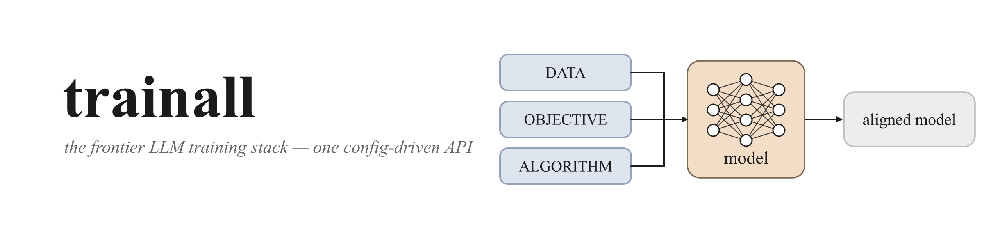
</p>

<h1 align="center">trainall</h1>

<p align="center">
  <a href="LICENSE"></a>
  
  
  
  
</p>

<p align="center">
  <b>One library for the entire frontier LLM training stack.</b><br>
  Pre-training · CPT/DAPT · SFT · DPO/IPO/KTO/ORPO/SimPO/CPO · RLHF · RLVR+GRPO · Agentic RL · Distillation · Self-play · LoRA/QLoRA<br>
  <i>— all behind one config-driven, registry-based API.</i>
</p>

<p align="center">
  <a href="#install">Install</a> ·
  <a href="#60-second-quickstart">Quickstart</a> ·
  <a href="#the-map-of-training-methods">Map</a> ·
  <a href="#the-frontier-pipeline">Pipeline</a> ·
  <a href="#deep-dive-every-training-method">Methods</a> ·
  <a href="#model-architectures">Architectures</a> ·
  <a href="#extending-trainall">Extend</a>
  <br>
  <b><a href="docs/methods/">📚 深度文档</a> · <a href="docs/GLOSSARY.md">术语词典</a></b>
</p>

---

## Why this exists

Modern LLM training is a soup of acronyms that get conflated. The cure is one sentence:

> **Data** decides *what* the model learns. **The objective** decides *what it is rewarded to become*. **The algorithm** decides *how its parameters update.*

LoRA is *how you update* (algorithm). DPO and GRPO are *what you optimize* (objective). Synthetic data is *where samples come from* (data). RAG usually changes no parameters at all. `trainall` makes those three axes **literal, orthogonal Python objects** — so you can swap "SFT → DPO → GRPO" by changing one string while data and optimizer stay put.

<p align="center">
  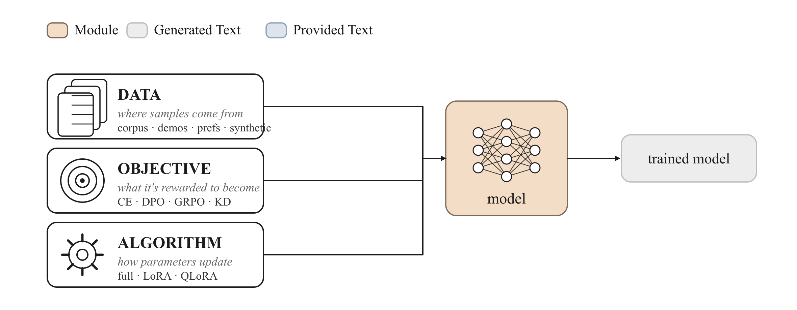
</p>

```python
import trainall

data      = trainall.build("jsonl", path="prefs.jsonl", category="datasource")  # WHERE samples come from
objective = trainall.build("dpo", beta=0.1)                                     # WHAT it's rewarded to become
algorithm = trainall.build("qlora", r=16)                                       # HOW parameters update
```

Everything heavy (`torch`, `transformers`, `peft`, `datasets`) is **lazily imported** — `import trainall` works on a laptop with no ML stack installed, so configs, verifiers, the registry and the pipeline DSL are always available.

---

## Install

```bash
# core only — registry, config, verifiers, pipeline DSL (no ML stack needed)
pip install -e .

# everything needed to actually train a model
pip install -e '.[train]'      # torch, transformers, peft, datasets, accelerate

# optional extras
pip install -e '.[verify]'     # sympy + jsonschema for the math/json verifiers
pip install -e '.[quant]'      # bitsandbytes for real 4-bit QLoRA (Linux)
pip install -e '.[all]'        # the lot
```

| Extra | Pulls in | Unlocks |
|------|----------|---------|
| *(core)* | `pyyaml` | registry, configs, verifiers, rewards, data flywheel, pipeline DSL |
| `train` | torch · transformers · peft · datasets · accelerate | real training of any objective |
| `verify` | sympy · jsonschema | symbolic math equality + JSON-Schema checks |
| `quant` | bitsandbytes | true 4-bit base for QLoRA |

---

## 60-second quickstart

A tiny **SFT run with a LoRA adapter**, end-to-end on CPU — copy-paste runnable:

```python
import trainall
from trainall.models import DecoderLM, ArchConfig
from trainall.data import InMemorySource
from trainall.training import Trainer, TrainerConfig

# 1. a model — a from-scratch tiny decoder-LM (or AutoModelForCausalLM.from_pretrained)
model = DecoderLM.from_config(ArchConfig(vocab_size=256, dim=64, n_layers=2, n_heads=4, n_kv_heads=2))

# 2. data — pre-tokenized SFT samples (prompt masked to -100 in labels)
data = InMemorySource([{"input_ids": [5,6,7,8,9,10], "labels": [-100,-100,7,8,9,10]}] * 8)

# 3. objective (what) + algorithm (how)
objective = trainall.build("sft")          # swap to "dpo", "grpo", "orpo", ...
algorithm = trainall.build("lora", r=8)    # swap to "full", "qlora"

# 4. train
Trainer(model, objective, algorithm=algorithm, data=data,
        config=TrainerConfig(max_steps=5, batch_size=4, device="cpu")).train()
```

Discover everything that's registered:

```python
>>> import trainall
>>> trainall.available()
{'algorithm': ['full', 'lora', 'qlora'],
 'objective': ['sft','dpo','ipo','kto','orpo','simpo','cpo','grpo','ppo','rloo','reward_model','prm','distill', ...],
 'verifier': ['math','code','sql','json','format','regex','citation','composite'],
 'reward': ['verifier','reward_model','shaped'],
 'datasource': ['jsonl','hf','memory'],
 'recipe': ['sft','dpo','rlvr','agentic_rlvr','distill','cpt','frontier'], ...}
```

> **Shared keys.** A few names (`cpt`, `sft`, `dpo`, `distill`) exist as both an objective and a recipe. An unscoped `build("dpo")` resolves by category priority (`objective` > `algorithm` > `verifier` > `reward` > `datasource` > `environment` > `recipe`) → it returns the **objective**. Reach the recipe with `build("dpo", category="recipe")` or `trainall.pipelines.dpo_recipe(...)`.

---

## The map of training methods

Pick a row by **the feedback you actually have**:

| You have… | Use | The model learns | Registry key(s) |
|---|---|---|---|
| Oceans of raw text / code | **Pre-training** | world knowledge, language | `pretrain` `clm` |
| A domain corpus, unlabeled | **CPT / DAPT** | domain vocabulary & distribution | `cpt` `dapt` |
| "question → ideal answer" demos | **SFT** | format, task behavior | `sft` |
| "A is better than B" pairs | **DPO & family** | human preference, tone, safety | `dpo` `ipo` `kto` `orpo` `simpo` `cpo` |
| A human/AI scorer | **RLHF / RLAIF** | hard-to-write reward | `reward_model` + `ppo` |
| An automatic verifier | **RLVR + GRPO** | math, code, logic, structure | `grpo` `ppo` `rloo` |
| A multi-step environment | **Agentic RL** | tools, browsing, coding, recovery | `rl` + `grpo` |
| A strong teacher model | **Distillation / RS / self-play** | the teacher's skill, cheaply | `distill` + `data` flywheel |
| Step-level correctness labels | **Process supervision (PRM)** | faithful reasoning, no shortcut-hacking | `prm` |
| Limited VRAM | **LoRA / QLoRA** | *any* of the above, cheaply | `lora` `qlora` |

<p align="center">
  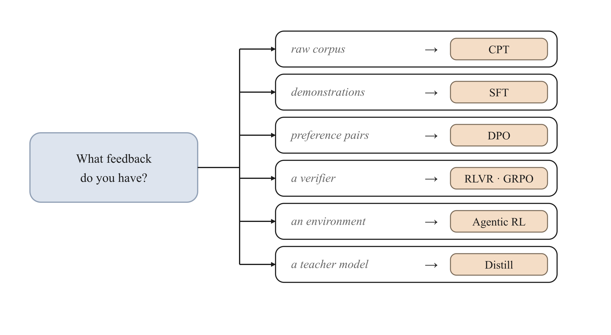
</p>

---

## The frontier pipeline

The most valuable thing in 2026 isn't a single algorithm — it's the **composed pipeline**. `trainall.pipelines.frontier_pipeline()` chains it as code:

<p align="center">
  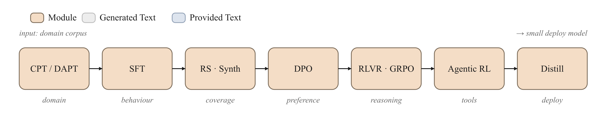
</p>


```python
from trainall.pipelines import frontier_pipeline
pipe = frontier_pipeline(tiny=True)         # tiny=True → runs on CPU with a toy model
result = pipe.run()                         # threads each stage's model into the next
```

> The hard-won lesson: what raises the ceiling is rarely "PPO vs GRPO" — it's **data quality, an eval set, a non-gameable verifier, and a crisp SFT task definition.** `trainall` gives you correct, composable building blocks so you can spend your time there.

---

# Deep dive: every training method

Each section below is a self-contained summary: the **idea**, the **architecture**, the **objective math**, the **flow**, **when (not) to use it**, and the **`trainall` one-liner**.

> 📚 **想要更深？** 每个方法都有一份独立的深度中文文档（推导、数据格式、可运行示例、常见陷阱、交叉链接）：
> **[docs/methods/](docs/methods/)** ([索引](docs/methods/README.md))。术语速查见 **[docs/GLOSSARY.md](docs/GLOSSARY.md)**（159 条，可 `#anchor` 直链）。
>
> [① Pre-training](docs/methods/01-pretraining.md) · [② CPT/DAPT](docs/methods/02-continued-pretraining.md) · [③ SFT](docs/methods/03-sft.md) · [④ Preference (DPO…)](docs/methods/04-preference-optimization.md) · [⑤ RLHF](docs/methods/05-rlhf.md) · [⑥ RLVR+GRPO](docs/methods/06-rlvr-grpo.md) · [⑦ Agentic RL](docs/methods/07-agentic-rl.md) · [⑧ Distill/Self-play](docs/methods/08-distillation-and-selfplay.md) · [⑨ Process supervision](docs/methods/09-process-supervision.md) · [⑩ LoRA/QLoRA](docs/methods/10-lora-qlora.md) · [⑪ Architectures](docs/methods/11-architectures.md)

---

## 1 · Pre-training — acquiring raw capability

<p align="center"></p>

**Idea.** No labels needed. The model reads an ocean of text/code and learns by predicting the next token. This is where language structure, world knowledge and latent reasoning are born.

**Architecture.** A causal decoder-LM (see [Model architectures](#model-architectures)) is trained with a shifted cross-entropy over *every* position. `trainall`'s `CausalLMObjective` does exactly this, reusing length-correct, masked log-prob plumbing from `utils.tensorops`.

**Objective.** Next-token negative log-likelihood:

$$\mathcal{L}_\text{PT} = -\sum_t \log P_\theta\big(x_t \mid x_{<t}\big)$$

```python
obj = trainall.build("pretrain")     # alias: "clm"
# data: InMemorySource of {"input_ids": [...], "labels": [...]} (labels == input_ids)
```

**When.** You're building a genuinely independent base model. **When not.** Almost always — for nearly everyone, continued pre-training on an open base is the realistic path (next section).

---

## 2 · Continued pre-training (CPT / DAPT) — teaching a domain

<p align="center"></p>

**Idea.** Take a model that already speaks fluent general language and keep pre-training it on *your* corpus — research reports, clinical guidelines, a dialect, an internal codebase — so it absorbs the domain's vocabulary, style and knowledge distribution.

**Architecture.** Same next-token objective as pre-training, but `ContinuedPretrainObjective` adds a **replay / domain-reweighting** knob so you can mix in general data and weight samples per domain — the standard guard against catastrophic forgetting.

$$\mathcal{L}_\text{CPT} = -\sum_i w_i \sum_t \log P_\theta\big(x^{(i)}_t \mid x^{(i)}_{<t}\big)$$

```python
obj = trainall.build("cpt", replay_weight=0.1)   # alias: "dapt"
```

**When.** The model doesn't *know* your field. **When not.** The model knows the field but won't follow your format — that's SFT. CPT rarely makes a model obey instructions on its own, so it's almost always followed by SFT.

---

## 3 · SFT — shaping behavior with demonstrations

<p align="center"></p>

**Idea.** Show the model "prompt → ideal response" pairs. SFT doesn't pour in new knowledge so much as **shape existing capability** into the behavior you want: answer style, output format, tool-call templates, classification rules, workflows.

**Architecture.** Cross-entropy on the **response tokens only** — the prompt is masked to `-100` so the model is graded purely on what it should generate. `SFTObjective` supports label smoothing and optional prompt training.

$$\mathcal{L}_\text{SFT} = -\sum_{t \in \text{response}} \log P_\theta\big(y_t \mid x, y_{<t}\big)$$

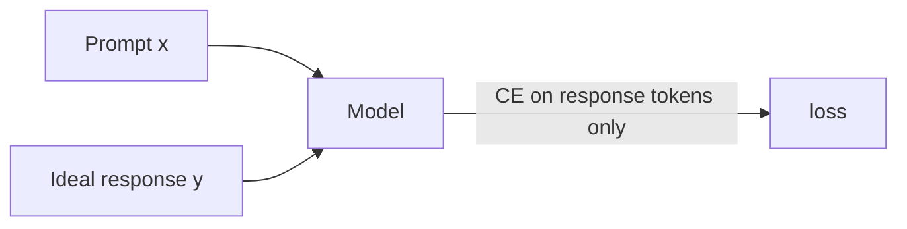

```python
obj = trainall.build("sft", label_smoothing=0.0)
```

**When.** You have high-quality demonstrations — the single most important step for most vertical models. **When not.** You can only say "A is better than B" but can't write the ideal answer → preference optimization.

> Most projects fail here, not at RL: SFT data that isn't real, clean, and close to the end task caps everything downstream.

---

## 4 · Preference optimization — learning "which answer is better"

<p align="center"></p>

**Idea.** When you can't write *the* answer but can judge that one response beats another, train on `chosen ≻ rejected` pairs. `trainall` ships the whole family — they share one goal (raise the relative likelihood of the preferred response) and differ in the link function and what they regularize against.

**DPO** (the workhorse) reparameterizes the RLHF reward as a log-ratio to a frozen reference and fits it with a simple classification loss — **no separate reward model, no online rollouts**:

$$\mathcal{L}_\text{DPO} = -\log \sigma\!\Big(\beta\big[\underbrace{(\log\pi_\theta(y_w|x) - \log\pi_\text{ref}(y_w|x))}_{\text{implicit reward of chosen}} - (\log\pi_\theta(y_l|x) - \log\pi_\text{ref}(y_l|x))\big]\Big)$$

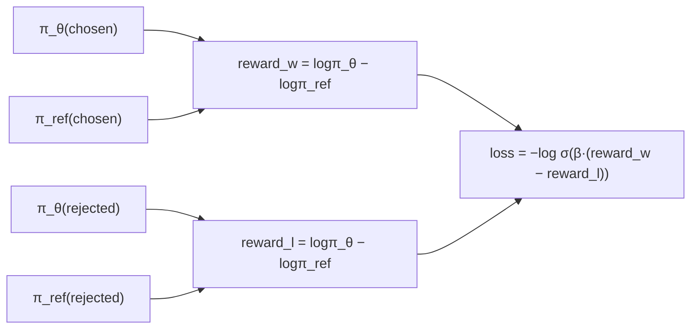

| Variant | Key | One-line difference | Needs ref model? |
|---|---|---|---|
| **DPO** | `dpo` | sigmoid of the β-scaled implicit-reward margin (+ cDPO smoothing, hinge) | ✅ |
| **IPO** | `ipo` | squared loss on the margin — less prone to over-fitting deterministic prefs | ✅ |
| **KTO** | `kto` | **unpaired** prospect-theory utility on single 👍/👎 labels | ✅ |
| **ORPO** | `orpo` | **reference-free**: SFT loss + an odds-ratio penalty in one shot | ❌ |
| **SimPO** | `simpo` | **reference-free**, length-normalized reward + target margin γ | ❌ |
| **CPO** | `cpo` | **reference-free** contrastive loss + an SFT anchor | ❌ |

```python
obj = trainall.build("dpo", beta=0.1)              # or ipo / kto / orpo / simpo / cpo
# batch carries chosen_*/rejected_* tensors; pass a frozen ref via batch.extra["ref_model"]
```

**When.** Email/writing tone, format & style control, safe refusals — anywhere experts can rank but not author. **When not.** You have a crisp verifier or unit tests → go straight to RLVR.

---

## 5 · RLHF — optimizing a learned reward

<p align="center"></p>

**Idea.** For goals too fuzzy to write as a rule — helpfulness, naturalness, overall satisfaction — learn a **reward model** from human rankings, then optimize the policy to maximize it with PPO.

**Architecture (3 stages).** ① collect preferences → ② train a Bradley–Terry reward model → ③ optimize the policy with the clipped PPO surrogate against that reward, with a KL leash to the reference.

$$\mathcal{L}_\text{RM} = -\log\sigma\big(r_\phi(x, y_w) - r_\phi(x, y_l)\big)
\qquad
\mathcal{L}_\text{PPO} = -\,\mathbb{E}\Big[\min\big(\rho_t A_t,\ \text{clip}(\rho_t, 1\!-\!\epsilon, 1\!+\!\epsilon)A_t\big)\Big],\ \ \rho_t = \tfrac{\pi_\theta}{\pi_{\theta_\text{old}}}$$

```python
rm  = trainall.build("reward_model")   # Bradley-Terry head; alias "bt"/"rm"
ppo = trainall.build("ppo", clip_range=0.2, kl_coef=0.1)   # ships compute_gae()
```

**When.** You have high-value preference data *and* a mature eval harness. **When not.** Smaller teams should usually prefer DPO — RLHF is powerful but complex, and the reward model is easy to game.

---

## 6 · RLVR + GRPO — the current frontier

<p align="center"></p>

**Idea.** **Reinforcement Learning with Verifiable Rewards.** The model samples several solutions; an automatic **verifier** says right/wrong; correct trajectories get reinforced. No learned reward model to hack — the reward is *ground truth*. This is the line DeepSeek-R1 made famous.

**GRPO** drops PPO's value network entirely: for a **group** of *k* responses to the same prompt, normalize rewards *within the group* to form the advantage, then apply the clipped policy-gradient surrogate over the response tokens (optionally with a KL penalty to a reference):

$$A_i = \frac{r_i - \text{mean}(\mathbf{r}_\text{group})}{\text{std}(\mathbf{r}_\text{group}) + \varepsilon}
\qquad
\mathcal{L}_\text{GRPO} = -\frac{1}{\sum |o_i|}\sum_i \sum_t \min\big(\rho_{i,t} A_i,\ \text{clip}(\rho_{i,t}, 1\!-\!\epsilon, 1\!+\!\epsilon)A_i\big) + \beta\,\mathrm{KL}[\pi_\theta \| \pi_\text{ref}]$$

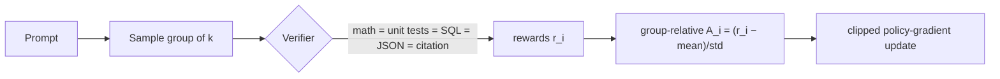

**Verifiers shipped** (`category="verifier"`): `math` (numeric/symbolic), `code` (runs unit tests in a sandboxed subprocess), `sql` (executes vs SQLite), `json` (validity + JSON-Schema), `format`/`regex` (structure), `citation` (quotes must exist in sources), and `composite` (weighted blend).

```python
grpo = trainall.build("grpo", clip_range=0.2, kl_coef=0.0)
check = trainall.build("code", category="verifier")            # reward = unit tests pass-rate
reward = trainall.build("verifier", category="reward", verifier=check)
```

**When.** Math, competitions, coding & bug-fixing, formal proofs, DB queries, tool calls, strict citation/format tasks — anything **auto-checkable**. **When not.** Open-ended goals ("warmer", "more insightful") with no reliable scorer. And note: RLVR mostly **amplifies success trajectories the base already samples rarely** — it doesn't conjure capability that isn't latent in pre-training.

---

## 7 · Agentic RL — multi-step action

<p align="center">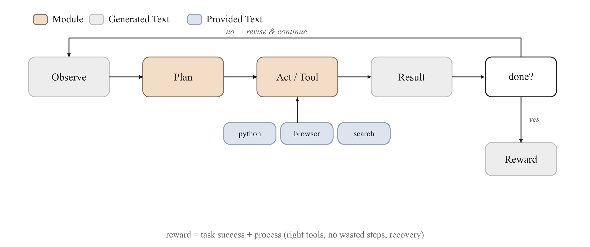</p>

**Idea.** The frontier is moving from single-turn answers to **multi-step action**: observe a webpage/file/tool result → plan → call a tool → read the result → revise → finish. Reward shifts from "is the answer right" to "did the task complete, were tools used correctly, were steps wasted, did it recover from errors, were sources cited."

**Architecture.** `trainall.rl` gives you an `Environment` ABC, a `MultiStepEnv` base wired to a `ToolRegistry` (`PythonTool`, `CalculatorTool`, …), and an `AgenticRunner` that drives a policy into scored `Episode`s, then folds them into `Trajectory`s for GRPO/PPO — so agentic training reuses the exact RLVR machinery, with outcome **+ process** rewards.

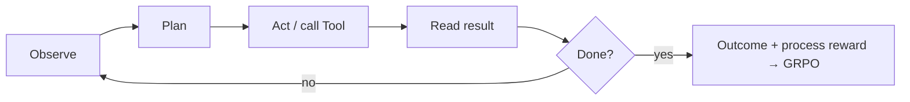

```python
from trainall.rl import AgenticRunner, MultiStepEnv
runner = AgenticRunner(env=MultiStepEnv(...), policy=my_policy, reward=reward)
trajectories = runner.collect(samples)     # ready for GRPO
```

**When.** Web/code/research/desktop agents and workflow automation. **The open hard parts** (and where research lives): sparse long-horizon reward, error propagation, reproducible environments, partial credit, failure-sample recycling, trustworthy verifiers.

---

## 8 · Distillation, synthetic data & self-play — the data flywheel

<p align="center"></p>

**Idea.** Stop depending on hand-labeled data; build a **flywheel**. A proposer makes tasks → a solver produces many traces → a verifier discards the wrong ones → the high-quality survivors train the model → a stronger model proposes harder tasks.

**Architecture.** Three composable, callable-friendly pieces (so they're testable with no model at all):
- **`DistillObjective`** — KD with forward/reverse KL, mixable with CE: $\ \mathcal{L} = \alpha T^2\,\mathrm{KL}\!\big(p_T^{(1/T)} \,\|\, p_S^{(1/T)}\big) + (1-\alpha)\,\mathcal{L}_\text{CE}$
- **`RejectionSampler`** — best-of-N, keep only verifier-passing traces as new SFT data (the "RS" / distillation data path).
- **`SyntheticDataEngine` + `SelfPlayLoop` + `Curriculum`** — the proposer→solver→verifier→keep loop with rising difficulty, diversity control, and **anti-collapse** guards.

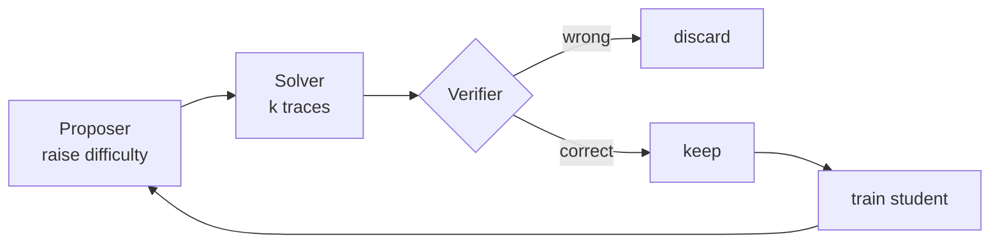

```python
from trainall.data import RejectionSampler, SyntheticDataEngine
rs   = RejectionSampler(solver=solve, verifier=check, n=8)      # → SFT samples
flyw = SyntheticDataEngine(proposer=propose, solver=solve, verifier=check, k=4)
new_data = flyw.generate(1000)
```

**When.** You have a strong teacher API but no labeling team; you want a small private/domain model. **The traps** (handled by the curriculum): difficulty must climb, diversity must hold, the verifier must be strong, and self-generated data must not collapse the distribution.

---

## 9 · Process supervision (PRM) — grading the reasoning, not just the answer

<p align="center"></p>

**Idea.** Outcome reward sees only the final answer (`1`/`0`). **Process supervision** scores *every step*: did it skip reasoning, call the right tool, ground each claim, avoid fabricating mid-chain, or game the reward? `ProcessRewardObjective` supervises per-step labels with BCE at step-delimiter positions.

$$\mathcal{L}_\text{PRM} = -\sum_{s \in \text{steps}} \Big[ y_s \log \sigma(z_s) + (1-y_s)\log(1-\sigma(z_s)) \Big]$$

```python
prm = trainall.build("prm")   # BCE over step_mask / step_labels
```

**When.** Agents and high-stakes tasks where *how* matters. **The caveat** (and an active safety question): directly penalizing "bad thoughts" can teach a model to **hide** them rather than fix them — over-pressuring hidden reasoning can erode monitorability.

---

## 10 · LoRA / QLoRA — the efficiency axis

<p align="center"></p>

**Idea.** Orthogonal to *what* you train: freeze the base and learn a small low-rank update. **QLoRA** additionally quantizes the frozen base to 4-bit, so a single GPU can fine-tune a large model. This is an *efficiency* choice — it carries any objective above.

**Architecture.** `LoRALinear` wraps a frozen `nn.Linear` with trainable rank-*r* matrices $A, B$ (with $B$ init 0), adding a scaled update; `prepare_model` swaps target projections, freezes the base, and exposes only the adapters; `merge_lora` folds them back for deployment.

$$W' = W_\text{frozen} + \frac{\alpha}{r}\,B A, \qquad B \in \mathbb{R}^{d\times r},\ A \in \mathbb{R}^{r\times k},\ r \ll d,k$$

```python
algo = trainall.build("lora", r=16, alpha=32,
                      target_modules=["q_proj","k_proj","v_proj","o_proj"])
algo = trainall.build("qlora", r=16, bits=4)     # 4-bit frozen base + LoRA
# ...later, for deployment:
from trainall.algorithms import merge_lora
merged = merge_lora(model)
```

**When.** Almost every individual/team fine-tune. **When not.** You truly need to move all weights (large-scale CPT, big distribution shifts) and have the hardware → `full`.

---

# Model architectures

`trainall.models` ships a modern, configurable decoder-LM from clean `nn.Module`s — so you can pre-train from scratch or study the components. Build any size with one `ArchConfig`.

<p align="center">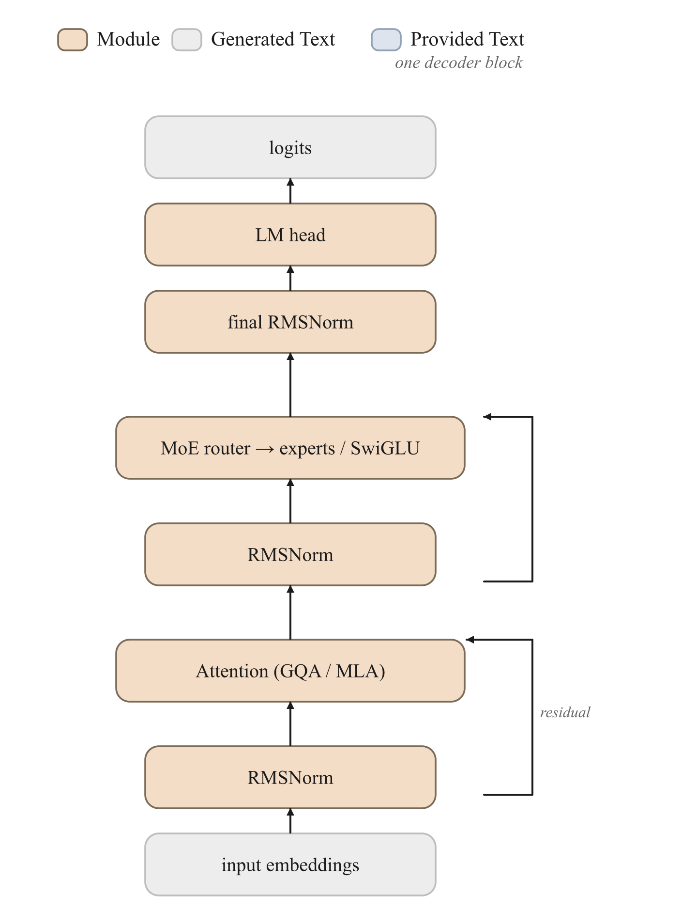</p>

| Component | Module | What & why |
|---|---|---|
| **RMSNorm** | `RMSNorm` | cheaper, stable pre-norm (Zhang & Sennrich 2019) |
| **RoPE** | `RotaryEmbedding` | rotary positions with linear / NTK / YaRN scaling (Su 2021) |
| **GQA / MQA** | `Attention` | query heads share fewer KV heads → smaller KV cache (Ainslie 2023) |
| **MLA** | `MultiHeadLatentAttention` | DeepSeek-style low-rank KV compression with decoupled RoPE |
| **SwiGLU / GeGLU** | `SwiGLU`, `GeGLU` | gated MLPs (Shazeer 2020) |
| **MoE** | `MoEFeedForward` | top-k routed experts + load-balancing aux loss (Mixtral-style) |
| **Block / LM** | `DecoderBlock`, `DecoderLM` | pre-norm residual block; full LM with tied embeddings |

<p align="center">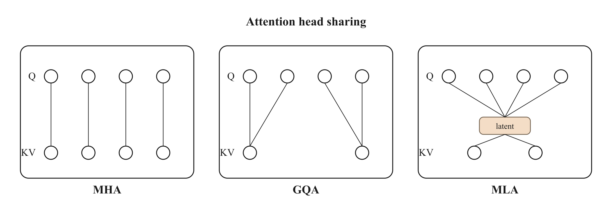</p>

```python
from trainall.models import DecoderLM, ArchConfig

cfg = ArchConfig(vocab_size=32000, dim=2048, n_layers=24, n_heads=16, n_kv_heads=4,  # GQA
                 ffn_dim=5632, use_moe=True, n_experts=8, n_experts_per_tok=2,        # MoE
                 rope_scaling={"type": "yarn", "factor": 2.0})
model = DecoderLM.from_config(cfg)
out = model(input_ids=ids)          # out.logits, out.aux_loss
```

---

## Config & CLI

Everything is one `RunConfig` (dict / YAML), so runs are reproducible and shareable:

```yaml
# run.yaml
name: qwen-grpo-math
model:     { pretrained: Qwen/Qwen2.5-0.5B }
data:      { source: jsonl, path: math.jsonl, max_seq_len: 4096 }
objective: { name: grpo, options: { clip_range: 0.2, kl_coef: 0.001 } }
algorithm: { name: qlora, options: { r: 16 } }
rl:        { group_size: 8, verifier: math, max_new_tokens: 2048 }
train:     { epochs: 1, batch_size: 8, output_dir: ./out }
```

```bash
trainall list                              # every registered component
trainall list --category verifier
trainall run run.yaml                       # launch the job
trainall run run.yaml --set train.epochs=2 objective.name=dpo
```

```python
import trainall
trainall.train("run.yaml")                  # same thing from Python
```

---

## Project layout

```
src/trainall/
├── types.py        base.py        registry.py     config.py     _optional.py
├── models/         RMSNorm · RoPE · GQA/MQA · MLA · SwiGLU/GeGLU · MoE · DecoderLM
├── objectives/     pretrain · cpt · sft · {dpo,ipo,kto,orpo,simpo,cpo} ·
│                   reward_model · ppo · rloo · grpo · prm · distill
├── algorithms/     full · lora · qlora (+ merge)
├── verifiers/      math · code · sql · json · format/regex · citation · composite
├── rewards/        verifier · reward_model · shaped
├── rl/             rollout (group sampling, group advantages) · environment · tools · agentic
├── data/           sources · templates · packing · synthetic · rejection_sampling · selfplay
├── training/       Trainer · callbacks
├── pipelines/      Pipeline/Stage DSL · recipes · frontier_pipeline
└── utils/          tensorops · seeding · logging
```

See [`docs/DESIGN.md`](docs/DESIGN.md) for the architecture rationale and [`docs/CONCEPTS.md`](docs/CONCEPTS.md) for the method cheat-sheet. Runnable end-to-end examples live in [`examples/`](examples/).

---

## Extending `trainall`

Add a new objective (or verifier, algorithm, reward) by implementing the ABC and registering a key — it's instantly reachable from `build()`, the CLI, and configs:

```python
import trainall
from trainall.base import Objective
from trainall.registry import register

@register("my_loss", category="objective")
class MyObjective(Objective):
    def __init__(self, beta: float = 0.1):
        self.beta = beta
    def compute_loss(self, model, batch):
        # ... return (scalar_loss, metrics_dict)
        ...

obj = trainall.build("my_loss", beta=0.2)     # done
```

**The one rule:** never import `torch`/`transformers` at module top level — pull them in lazily inside the method (`from trainall._optional import require`). That keeps `import trainall` instant and dependency-free.

---

## References

LoRA (Hu 2021) · QLoRA (Dettmers 2023) · DPO (Rafailov 2023) · IPO (Azar 2023) · KTO (Ethayarajh 2024) · ORPO (Hong 2024) · SimPO (Meng 2024) · CPO (Xu 2024) · PPO (Schulman 2017) · RLOO (Ahmadian 2024) · GRPO / DeepSeek-R1 (Shao 2024; DeepSeek 2025) · Process supervision (Lightman 2023) · KD (Hinton 2015) · RMSNorm (Zhang & Sennrich 2019) · RoPE (Su 2021) · GQA (Ainslie 2023) · MLA / MoE (DeepSeek-V2 2024; Mixtral 2024).

<p align="center"><i>All diagrams are hand-authored vector figures — SVG sources live in <code>docs/assets/</code>.</i></p>
