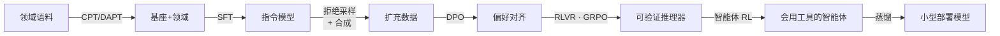
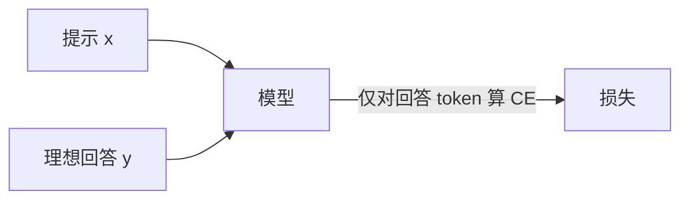
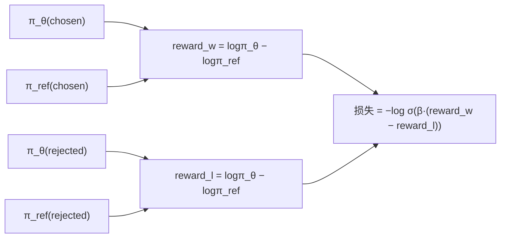
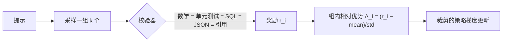
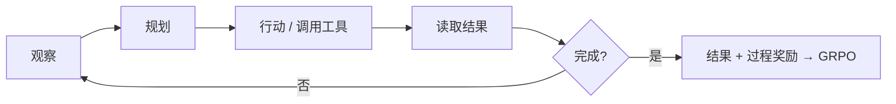
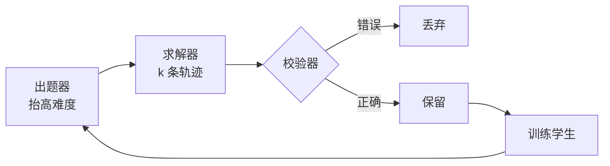

<p align="center">
  
</p>

<h1 align="center">trainall</h1>

<p align="center">
  <a href="LICENSE"></a>
  
  
  
  
</p>

<p align="center">
  <a href="README.md">English</a> · <b>中文</b>
</p>

<p align="center">
  <b>一个库，装下整个前沿 LLM 训练栈。</b><br>
  预训练 · CPT/DAPT · SFT · DPO/IPO/KTO/ORPO/SimPO/CPO · RLHF · RLVR+GRPO · 智能体 RL · 蒸馏 · 自博弈 · LoRA/QLoRA<br>
  <i>—— 全部收束在一套配置驱动、基于注册表的 API 之下。</i>
</p>

<p align="center">
  <a href="#安装">安装</a> ·
  <a href="#60-秒快速上手">快速上手</a> ·
  <a href="#训练方法地图">方法地图</a> ·
  <a href="#前沿流水线">流水线</a> ·
  <a href="#深入讲解每一种训练方法">方法详解</a> ·
  <a href="#模型架构">架构</a> ·
  <a href="#扩展-trainall">扩展</a>
  <br>
  <b><a href="docs/methods/">📚 深度文档</a> · <a href="docs/GLOSSARY.md">术语词典</a></b>
</p>

---

## 为什么需要它

现代 LLM 训练是一锅被混为一谈的缩写汤。解药只有一句话：

> **数据 (data)** 决定模型*学到什么*。**目标 (objective)** 决定*它被奖励成为什么*。**算法 (algorithm)** 决定*它的参数如何更新*。

LoRA 是*你如何更新*（算法）。DPO 和 GRPO 是*你优化什么*（目标）。合成数据是*样本从哪来*（数据）。RAG 通常根本不改任何参数。`trainall` 把这三条轴做成**字面意义上正交的 Python 对象**——于是你只需改一个字符串，就能把「SFT → DPO → GRPO」切换过去，而数据和优化器原地不动。

<p align="center">
  
</p>

```python
import trainall

data      = trainall.build("jsonl", path="prefs.jsonl", category="datasource")  # 样本从哪来
objective = trainall.build("dpo", beta=0.1)                                     # 被奖励成为什么
algorithm = trainall.build("qlora", r=16)                                       # 参数如何更新
```

所有重型依赖（`torch`、`transformers`、`peft`、`datasets`）都是**惰性导入**的——`import trainall` 在一台没装任何 ML 栈的笔记本上也能跑通，因此配置、校验器、注册表与流水线 DSL 始终可用。

---

## 安装

```bash
# 仅核心 —— 注册表、配置、校验器、流水线 DSL（无需 ML 栈）
pip install -e .

# 真正训练一个模型所需的一切
pip install -e '.[train]'      # torch, transformers, peft, datasets, accelerate

# 可选附加项
pip install -e '.[verify]'     # sympy + jsonschema，用于数学/JSON 校验器
pip install -e '.[quant]'      # bitsandbytes，用于真正的 4-bit QLoRA（Linux）
pip install -e '.[all]'        # 全部
```

| 附加项 | 引入 | 解锁 |
|------|----------|---------|
| *(核心)* | `pyyaml` | 注册表、配置、校验器、奖励、数据飞轮、流水线 DSL |
| `train` | torch · transformers · peft · datasets · accelerate | 任意目标的真实训练 |
| `verify` | sympy · jsonschema | 符号数学等价判定 + JSON-Schema 校验 |
| `quant` | bitsandbytes | QLoRA 的真 4-bit 基座 |

---

## 60 秒快速上手

一个极简的**带 LoRA 适配器的 SFT 训练**，在 CPU 上端到端跑通 —— 复制粘贴即可运行：

```python
import trainall
from trainall.models import DecoderLM, ArchConfig
from trainall.data import InMemorySource
from trainall.training import Trainer, TrainerConfig

# 1. 模型 —— 一个从零开始的微型 decoder-LM（或 AutoModelForCausalLM.from_pretrained）
model = DecoderLM.from_config(ArchConfig(vocab_size=256, dim=64, n_layers=2, n_heads=4, n_kv_heads=2))

# 2. 数据 —— 已分词的 SFT 样本（prompt 在 labels 中被掩码为 -100）
data = InMemorySource([{"input_ids": [5,6,7,8,9,10], "labels": [-100,-100,7,8,9,10]}] * 8)

# 3. 目标（学什么）+ 算法（怎么学）
objective = trainall.build("sft")          # 可换成 "dpo"、"grpo"、"orpo" ...
algorithm = trainall.build("lora", r=8)    # 可换成 "full"、"qlora"

# 4. 训练
Trainer(model, objective, algorithm=algorithm, data=data,
        config=TrainerConfig(max_steps=5, batch_size=4, device="cpu")).train()
```

查看所有已注册的组件：

```python
>>> import trainall
>>> trainall.available()
{'algorithm': ['full', 'lora', 'qlora'],
 'objective': ['sft','dpo','ipo','kto','orpo','simpo','cpo','grpo','ppo','rloo','reward_model','prm','distill', ...],
 'verifier': ['math','code','sql','json','format','regex','citation','composite'],
 'reward': ['verifier','reward_model','shaped'],
 'datasource': ['jsonl','hf','memory'],
 'recipe': ['sft','dpo','rlvr','agentic_rlvr','distill','cpt','frontier'], ...}
```

> **共享键名。** 少数名字（`cpt`、`sft`、`dpo`、`distill`）同时作为目标 (objective) 和配方 (recipe) 存在。未指定类别的 `build("dpo")` 会按类别优先级（`objective` > `algorithm` > `verifier` > `reward` > `datasource` > `environment` > `recipe`）解析 → 它返回的是**目标**。要拿到配方，用 `build("dpo", category="recipe")` 或 `trainall.pipelines.dpo_recipe(...)`。

---

## 训练方法地图

按**你手上真正拥有的反馈信号**选一行：

| 你拥有… | 用 | 模型学到 | 注册键 |
|---|---|---|---|
| 海量原始文本/代码 | **预训练** | 世界知识、语言 | `pretrain` `clm` |
| 一份无标注的领域语料 | **CPT / DAPT** | 领域词汇与分布 | `cpt` `dapt` |
| 「问题 → 理想答案」示范 | **SFT** | 格式、任务行为 | `sft` |
| 「A 比 B 好」的成对偏好 | **DPO 家族** | 人类偏好、语气、安全 | `dpo` `ipo` `kto` `orpo` `simpo` `cpo` |
| 一个人类/AI 打分器 | **RLHF / RLAIF** | 难以手写的奖励 | `reward_model` + `ppo` |
| 一个自动校验器 | **RLVR + GRPO** | 数学、代码、逻辑、结构 | `grpo` `ppo` `rloo` |
| 一个多步环境 | **智能体 RL** | 工具、浏览、编码、纠错 | `rl` + `grpo` |
| 一个强大的 teacher 模型 | **蒸馏 / 拒绝采样 / 自博弈** | 廉价复制 teacher 的能力 | `distill` + `data` 飞轮 |
| 步级正确性标注 | **过程监督 (PRM)** | 忠实推理、不走捷径作弊 | `prm` |
| 显存有限 | **LoRA / QLoRA** | 廉价地做*以上任意一种* | `lora` `qlora` |

<p align="center">
  
</p>

---

## 前沿流水线

2026 年最有价值的东西不是某一个算法 —— 而是**组合出来的流水线**。`trainall.pipelines.frontier_pipeline()` 把它写成了代码：

<p align="center">
  
</p>



```python
from trainall.pipelines import frontier_pipeline
pipe = frontier_pipeline(tiny=True)         # tiny=True → 用玩具模型在 CPU 上跑
result = pipe.run()                         # 把每个阶段的模型串进下一阶段
```

> 来之不易的教训：抬高上限的，很少是「PPO 还是 GRPO」—— 而是**数据质量、一套评测集、一个无法被钻空子的校验器，以及一个清晰的 SFT 任务定义。** `trainall` 给你正确、可组合的积木，好让你把时间花在这些真正重要的地方。

---

# 深入讲解每一种训练方法

下面每一节都是自包含的小结：**直觉**、**架构**、**目标函数（数学）**、**流程**、**何时（不）用**，以及 **`trainall` 一行代码**。

> 📚 **想要更深？** 每个方法都有一份独立的深度中文文档（推导、数据格式、可运行示例、常见陷阱、交叉链接）：
> **[docs/methods/](docs/methods/)** （[索引](docs/methods/README.md)）。术语速查见 **[docs/GLOSSARY.md](docs/GLOSSARY.md)**（159 条，可 `#anchor` 直链）。
>
> [① 预训练](docs/methods/01-pretraining.md) · [② CPT/DAPT](docs/methods/02-continued-pretraining.md) · [③ SFT](docs/methods/03-sft.md) · [④ 偏好优化 (DPO…)](docs/methods/04-preference-optimization.md) · [⑤ RLHF](docs/methods/05-rlhf.md) · [⑥ RLVR+GRPO](docs/methods/06-rlvr-grpo.md) · [⑦ 智能体 RL](docs/methods/07-agentic-rl.md) · [⑧ 蒸馏/自博弈](docs/methods/08-distillation-and-selfplay.md) · [⑨ 过程监督](docs/methods/09-process-supervision.md) · [⑩ LoRA/QLoRA](docs/methods/10-lora-qlora.md) · [⑪ 架构](docs/methods/11-architectures.md)

---

## 1 · 预训练 —— 获得原始能力

<p align="center"></p>

**直觉。** 无需任何标注。模型阅读海量文本/代码，靠预测下一个 token 来学习。语言结构、世界知识与隐式推理，都诞生于此。

**架构。** 一个因果 decoder-LM（见[模型架构](#模型架构)）用对*每个*位置做位移的交叉熵来训练。`trainall` 的 `CausalLMObjective` 做的正是这件事，并复用了 `utils.tensorops` 里长度正确、带掩码的对数概率管道。

**目标。** 下一个 token 的负对数似然：

$$\mathcal{L}_\text{PT} = -\sum_t \log P_\theta\big(x_t \mid x_{\lt t}\big)$$

```python
obj = trainall.build("pretrain")     # 别名："clm"
# 数据：InMemorySource，元素为 {"input_ids": [...], "labels": [...]}（labels == input_ids）
```

**何时用。** 你在打造一个真正独立的基座模型。**何时不用。** 几乎总是如此 —— 对绝大多数人而言，在开源基座上做继续预训练才是现实路径（见下一节）。

---

## 2 · 继续预训练 (CPT / DAPT) —— 教会一个领域

<p align="center"></p>

**直觉。** 拿一个已经能说流利通用语言的模型，在*你的*语料上继续预训练 —— 研究报告、临床指南、某种方言、一份内部代码库 —— 让它吸收该领域的词汇、风格与知识分布。

**架构。** 与预训练相同的下一个 token 目标，但 `ContinuedPretrainObjective` 加了一个**回放 / 领域重加权 (replay / domain-reweighting)** 旋钮，让你能掺入通用数据并按领域为样本加权 —— 这是对抗灾难性遗忘的标准防线。

$$\mathcal{L}_\text{CPT} = -\sum_i w_i \sum_t \log P_\theta\big(x^{(i)}_t \mid x^{(i)}_{\lt t}\big)$$

```python
obj = trainall.build("cpt", replay_weight=0.1)   # 别名："dapt"
```

**何时用。** 模型不*知道*你的领域。**何时不用。** 模型懂这个领域、却不肯按你的格式来 —— 那是 SFT 的活。CPT 很少能让模型自己学会听指令，所以它后面几乎总是跟着 SFT。

---

## 3 · SFT —— 用示范塑造行为

<p align="center"></p>

**直觉。** 给模型看「提示 → 理想回答」对。SFT 与其说是灌入新知识，不如说是把已有能力**塑造成**你想要的行为：回答风格、输出格式、工具调用模板、分类规则、工作流。

**架构。** 只在**回答 token** 上算交叉熵 —— prompt 被掩码为 `-100`，所以模型只为它该生成的内容负责。`SFTObjective` 支持标签平滑 (label smoothing) 与可选的 prompt 训练。

$$\mathcal{L}_\text{SFT} = -\sum_{t \in \text{response}} \log P_\theta\big(y_t \mid x, y_{\lt t}\big)$$



```python
obj = trainall.build("sft", label_smoothing=0.0)
```

**何时用。** 你有高质量示范 —— 对多数垂直模型而言这是最重要的一步。**何时不用。** 你只能说「A 比 B 好」却写不出理想答案 → 偏好优化。

> 多数项目栽在这里，而不是 RL：不真实、不干净、离最终任务太远的 SFT 数据，会为下游的一切封顶。

---

## 4 · 偏好优化 —— 学习「哪个答案更好」

<p align="center"></p>

**直觉。** 当你写不出*那个*答案、却能判断一个回答胜过另一个时，就在 `chosen ≻ rejected` 成对数据上训练。`trainall` 提供了一整个家族 —— 它们共享同一个目标（抬高被偏好回答的相对似然），区别在于链接函数 (link function) 以及拿什么做正则。

**DPO**（主力）把 RLHF 的奖励重参数化为对一个冻结参考模型的对数比，再用一个简单的分类损失去拟合 —— **不需要单独的奖励模型，也不需要在线 rollout**：

$$\mathcal{L}_\text{DPO} = -\log \sigma\!\Big(\beta\big[\underbrace{(\log\pi_\theta(y_w|x) - \log\pi_\text{ref}(y_w|x))}_{\text{chosen 的隐式奖励}} - (\log\pi_\theta(y_l|x) - \log\pi_\text{ref}(y_l|x))\big]\Big)$$



| 变体 | 键 | 一句话区别 | 需要参考模型？ |
|---|---|---|---|
| **DPO** | `dpo` | 对 β 缩放的隐式奖励间隔取 sigmoid（含 cDPO 平滑、hinge） | ✅ |
| **IPO** | `ipo` | 对间隔取平方损失 —— 更不易对确定性偏好过拟合 | ✅ |
| **KTO** | `kto` | **非成对**：在单个 👍/👎 标签上用前景理论效用 | ✅ |
| **ORPO** | `orpo` | **无参考**：SFT 损失 + 一个赔率比惩罚，一步到位 | ❌ |
| **SimPO** | `simpo` | **无参考**：长度归一化的奖励 + 目标间隔 γ | ❌ |
| **CPO** | `cpo` | **无参考**：对比损失 + 一个 SFT 锚 | ❌ |

```python
obj = trainall.build("dpo", beta=0.1)              # 或 ipo / kto / orpo / simpo / cpo
# batch 携带 chosen_*/rejected_* 张量；通过 batch.extra["ref_model"] 传入冻结参考模型
```

**何时用。** 邮件/写作语气、格式与风格控制、安全拒答 —— 任何专家能排序却写不出范文的地方。**何时不用。** 你有清晰的校验器或单元测试 → 直接上 RLVR。

---

## 5 · RLHF —— 优化一个学出来的奖励

<p align="center"></p>

**直觉。** 对那些太模糊、写不成规则的目标 —— 有用性、自然度、整体满意度 —— 从人类排序中**学一个奖励模型**，再用 PPO 优化策略去最大化它。

**架构（3 个阶段）。** ① 收集偏好 → ② 训练一个 Bradley–Terry 奖励模型 → ③ 用裁剪的 PPO 替代目标针对该奖励优化策略，并用一根 KL 缰绳拴住参考模型。

$$\mathcal{L}_\text{RM} = -\log\sigma\big(r_\phi(x, y_w) - r_\phi(x, y_l)\big)
\qquad
\mathcal{L}_\text{PPO} = -\,\mathbb{E}\Big[\min\big(\rho_t A_t,\ \text{clip}(\rho_t, 1\!-\!\epsilon, 1\!+\!\epsilon)A_t\big)\Big],\ \ \rho_t = \tfrac{\pi_\theta}{\pi_{\theta_\text{old}}}$$

```python
rm  = trainall.build("reward_model")   # Bradley-Terry 头；别名 "bt"/"rm"
ppo = trainall.build("ppo", clip_range=0.2, kl_coef=0.1)   # 自带 compute_gae()
```

**何时用。** 你有高价值偏好数据*且*有成熟的评测体系。**何时不用。** 小团队通常应优先选 DPO —— RLHF 强大但复杂，而且奖励模型很容易被钻空子。

---

## 6 · RLVR + GRPO —— 当下的前沿

<p align="center"></p>

**直觉。** **可验证奖励的强化学习 (Reinforcement Learning with Verifiable Rewards)。** 模型采样若干个解；一个自动**校验器**判定对/错；正确的轨迹被强化。没有可被钻空子的、学出来的奖励模型 —— 奖励就是*基本事实 (ground truth)*。这正是 DeepSeek-R1 让其声名大噪的路线。

**GRPO** 彻底丢掉 PPO 的价值网络：对同一个 prompt 的一**组** *k* 个回答，在*组内*归一化奖励来构成优势，再对回答 token 施加裁剪的策略梯度替代目标（可选地加一个对参考模型的 KL 惩罚）：

$$A_i = \frac{r_i - \text{mean}(\mathbf{r}_\text{group})}{\text{std}(\mathbf{r}_\text{group}) + \varepsilon}
\qquad
\mathcal{L}_\text{GRPO} = -\frac{1}{\sum |o_i|}\sum_i \sum_t \min\big(\rho_{i,t} A_i,\ \text{clip}(\rho_{i,t}, 1\!-\!\epsilon, 1\!+\!\epsilon)A_i\big) + \beta\,\mathrm{KL}[\pi_\theta \| \pi_\text{ref}]$$



**已内置的校验器**（`category="verifier"`）：`math`（数值/符号）、`code`（在沙箱子进程里跑单元测试）、`sql`（对 SQLite 执行）、`json`（合法性 + JSON-Schema）、`format`/`regex`（结构）、`citation`（引文必须在原文中存在），以及 `composite`（加权组合）。

```python
grpo = trainall.build("grpo", clip_range=0.2, kl_coef=0.0)
check = trainall.build("code", category="verifier")            # 奖励 = 单元测试通过率
reward = trainall.build("verifier", category="reward", verifier=check)
```

**何时用。** 数学、竞赛、编码与修 bug、形式化证明、数据库查询、工具调用、严格的引用/格式任务 —— 任何**可自动判定**的东西。**何时不用。** 没有可靠打分器的开放式目标（「更温暖」「更有洞见」）。另外请注意：RLVR 主要是**放大基座本就偶尔能采到的成功轨迹** —— 它变不出预训练里压根不存在的能力。

---

## 7 · 智能体 RL —— 多步行动

<p align="center"></p>

**直觉。** 前沿正从单轮回答转向**多步行动**：观察一个网页/文件/工具结果 → 规划 → 调用工具 → 读取结果 → 修正 → 收尾。奖励也从「答案对不对」转向「任务完成了吗、工具用对了吗、有没有浪费步骤、出错后能否恢复、是否标注了来源」。

**架构。** `trainall.rl` 给你一个 `Environment` 抽象基类、一个接好了 `ToolRegistry`（`PythonTool`、`CalculatorTool`……）的 `MultiStepEnv` 基类，以及一个把策略驱动成带评分 `Episode` 的 `AgenticRunner`，再把它们折叠成给 GRPO/PPO 用的 `Trajectory` —— 于是智能体训练复用了与 RLVR *完全相同*的机器，只是奖励变成了结果**加过程**。



```python
from trainall.rl import AgenticRunner, MultiStepEnv
runner = AgenticRunner(env=MultiStepEnv(...), policy=my_policy, reward=reward)
trajectories = runner.collect(samples)     # 可直接喂给 GRPO
```

**何时用。** Web/代码/研究/桌面智能体与工作流自动化。**仍然困难、也是研究所在之处**：稀疏的长程奖励、错误传播、可复现的环境、部分得分、失败样本的回收利用、可信赖的校验器。

---

## 8 · 蒸馏、合成数据与自博弈 —— 数据飞轮

<p align="center"></p>

**直觉。** 别再依赖人工标注数据；造一个**飞轮**。一个出题器造任务 → 一个求解器产出大量轨迹 → 一个校验器丢掉错误的 → 高质量的幸存者用来训练模型 → 更强的模型出更难的题。

**架构。** 三个可组合、对 callable 友好的部件（因此完全不用模型也能测）：
- **`DistillObjective`** —— 带前向/反向 KL 的知识蒸馏，可与 CE 混合：$\ \mathcal{L} = \alpha T^2\,\mathrm{KL}\!\big(p_T^{(1/T)} \,\|\, p_S^{(1/T)}\big) + (1-\alpha)\,\mathcal{L}_\text{CE}$
- **`RejectionSampler`** —— best-of-N，只保留通过校验器的轨迹作为新的 SFT 数据（即「RS」/ 蒸馏数据路径）。
- **`SyntheticDataEngine` + `SelfPlayLoop` + `Curriculum`** —— 出题→求解→校验→保留的循环，配合难度递增、多样性控制与**防坍缩 (anti-collapse)** 护栏。



```python
from trainall.data import RejectionSampler, SyntheticDataEngine
rs   = RejectionSampler(solver=solve, verifier=check, n=8)      # → SFT 样本
flyw = SyntheticDataEngine(proposer=propose, solver=solve, verifier=check, k=4)
new_data = flyw.generate(1000)
```

**何时用。** 你有一个强大的 teacher API，却没有标注团队；你想要一个小型的私有/领域模型。**陷阱**（由 curriculum 处理）：难度必须爬升、多样性必须保持、校验器必须够强，而且自生成数据不能把分布带坍缩。

---

## 9 · 过程监督 (PRM) —— 评判推理过程，而非只看答案

<p align="center"></p>

**直觉。** 结果奖励只看最终答案（`1`/`0`）。**过程监督**给*每一步*打分：有没有跳步、有没有调对工具、每个论断是否有依据、有没有中途编造、有没有钻奖励的空子？`ProcessRewardObjective` 在步骤分隔位置上用 BCE 监督每一步的标签。

$$\mathcal{L}_\text{PRM} = -\sum_{s \in \text{steps}} \Big[ y_s \log \sigma(z_s) + (1-y_s)\log(1-\sigma(z_s)) \Big]$$

```python
prm = trainall.build("prm")   # 在 step_mask / step_labels 上做 BCE
```

**何时用。** 智能体，以及*过程*很重要的高风险任务。**注意**（也是一个活跃的安全问题）：直接惩罚「坏念头」可能教会模型**藏起**它们，而不是改掉它们 —— 对隐藏推理施压过度，会削弱可监控性。

---

## 10 · LoRA / QLoRA —— 效率轴

<p align="center"></p>

**直觉。** 与你训练*什么*正交：冻结基座，学一个小小的低秩增量。**QLoRA** 额外把冻结的基座量化到 4-bit，于是单张 GPU 也能微调一个大模型。这是一个*效率*选择 —— 它能承载上面任意一个目标。

**架构。** `LoRALinear` 用可训练的秩-*r* 矩阵 $A, B$（其中 $B$ 初始化为 0）包住一个冻结的 `nn.Linear`，加上一个缩放过的增量；`prepare_model` 替换目标投影、冻结基座、只暴露适配器；`merge_lora` 把它们折回去以便部署。

$$W' = W_\text{frozen} + \frac{\alpha}{r}\,B A, \qquad B \in \mathbb{R}^{d\times r},\ A \in \mathbb{R}^{r\times k},\ r \ll d,k$$

```python
algo = trainall.build("lora", r=16, alpha=32,
                      target_modules=["q_proj","k_proj","v_proj","o_proj"])
algo = trainall.build("qlora", r=16, bits=4)     # 4-bit 冻结基座 + LoRA
# ……稍后，部署时：
from trainall.algorithms import merge_lora
merged = merge_lora(model)
```

**何时用。** 几乎每一次个人/团队的微调。**何时不用。** 你确实需要移动全部权重（大规模 CPT、巨大的分布漂移）并且有相应硬件 → `full`。

---

# 模型架构

`trainall.models` 用干净的 `nn.Module` 提供了一个现代、可配置的 decoder-LM —— 于是你能从零预训练，或者研究各个组件。用一份 `ArchConfig` 就能搭出任意规模。

<p align="center"></p>

| 组件 | 模块 | 是什么 & 为什么 |
|---|---|---|
| **RMSNorm** | `RMSNorm` | 更省、更稳的前置归一化（Zhang & Sennrich 2019） |
| **RoPE** | `RotaryEmbedding` | 旋转位置编码，支持 linear / NTK / YaRN 缩放（Su 2021） |
| **GQA / MQA** | `Attention` | 查询头共享更少的 KV 头 → 更小的 KV 缓存（Ainslie 2023） |
| **MLA** | `MultiHeadLatentAttention` | DeepSeek 式低秩 KV 压缩，配解耦 RoPE |
| **SwiGLU / GeGLU** | `SwiGLU`, `GeGLU` | 门控 MLP（Shazeer 2020） |
| **MoE** | `MoEFeedForward` | top-k 路由专家 + 负载均衡辅助损失（Mixtral 式） |
| **Block / LM** | `DecoderBlock`, `DecoderLM` | 前置归一化残差块；权重绑定嵌入的完整 LM |

<p align="center"></p>

```python
from trainall.models import DecoderLM, ArchConfig

cfg = ArchConfig(vocab_size=32000, dim=2048, n_layers=24, n_heads=16, n_kv_heads=4,  # GQA
                 ffn_dim=5632, use_moe=True, n_experts=8, n_experts_per_tok=2,        # MoE
                 rope_scaling={"type": "yarn", "factor": 2.0})
model = DecoderLM.from_config(cfg)
out = model(input_ids=ids)          # out.logits, out.aux_loss
```

---

## 配置与 CLI

一切都是一份 `RunConfig`（dict / YAML），所以每次运行都可复现、可分享：

```yaml
# run.yaml
name: qwen-grpo-math
model:     { pretrained: Qwen/Qwen2.5-0.5B }
data:      { source: jsonl, path: math.jsonl, max_seq_len: 4096 }
objective: { name: grpo, options: { clip_range: 0.2, kl_coef: 0.001 } }
algorithm: { name: qlora, options: { r: 16 } }
rl:        { group_size: 8, verifier: math, max_new_tokens: 2048 }
train:     { epochs: 1, batch_size: 8, output_dir: ./out }
```

```bash
trainall list                              # 所有已注册的组件
trainall list --category verifier
trainall run run.yaml                       # 启动任务
trainall run run.yaml --set train.epochs=2 objective.name=dpo
```

```python
import trainall
trainall.train("run.yaml")                  # 在 Python 里做同样的事
```

---

## 项目结构

```
src/trainall/
├── types.py        base.py        registry.py     config.py     _optional.py
├── models/         RMSNorm · RoPE · GQA/MQA · MLA · SwiGLU/GeGLU · MoE · DecoderLM
├── objectives/     pretrain · cpt · sft · {dpo,ipo,kto,orpo,simpo,cpo} ·
│                   reward_model · ppo · rloo · grpo · prm · distill
├── algorithms/     full · lora · qlora (+ merge)
├── verifiers/      math · code · sql · json · format/regex · citation · composite
├── rewards/        verifier · reward_model · shaped
├── rl/             rollout (组采样, 组优势) · environment · tools · agentic
├── data/           sources · templates · packing · synthetic · rejection_sampling · selfplay
├── training/       Trainer · callbacks
├── pipelines/      Pipeline/Stage DSL · recipes · frontier_pipeline
└── utils/          tensorops · seeding · logging
```

架构设计的来龙去脉见 [`docs/DESIGN.md`](docs/DESIGN.md)，方法速查见 [`docs/CONCEPTS.md`](docs/CONCEPTS.md)。可运行的端到端示例在 [`examples/`](examples/)。

---

## 扩展 trainall

实现 ABC 并注册一个键，就能新增一个目标（或校验器、算法、奖励）—— 它会立刻在 `build()`、CLI 和配置中可用：

```python
import trainall
from trainall.base import Objective
from trainall.registry import register

@register("my_loss", category="objective")
class MyObjective(Objective):
    def __init__(self, beta: float = 0.1):
        self.beta = beta
    def compute_loss(self, model, batch):
        # …… 返回 (scalar_loss, metrics_dict)
        ...

obj = trainall.build("my_loss", beta=0.2)     # 完成
```

**唯一的铁律：** 永远不要在模块顶层 import `torch`/`transformers` —— 在方法内部惰性引入（`from trainall._optional import require`）。这样才能让 `import trainall` 始终瞬时、零依赖。

---

## 参考文献

LoRA (Hu 2021) · QLoRA (Dettmers 2023) · DPO (Rafailov 2023) · IPO (Azar 2023) · KTO (Ethayarajh 2024) · ORPO (Hong 2024) · SimPO (Meng 2024) · CPO (Xu 2024) · PPO (Schulman 2017) · RLOO (Ahmadian 2024) · GRPO / DeepSeek-R1 (Shao 2024; DeepSeek 2025) · Process supervision (Lightman 2023) · KD (Hinton 2015) · RMSNorm (Zhang & Sennrich 2019) · RoPE (Su 2021) · GQA (Ainslie 2023) · MLA / MoE (DeepSeek-V2 2024; Mixtral 2024).

<p align="center"><i>所有图示均为手工绘制的矢量图 —— SVG 源文件位于 <code>docs/assets/</code>。</i></p>
