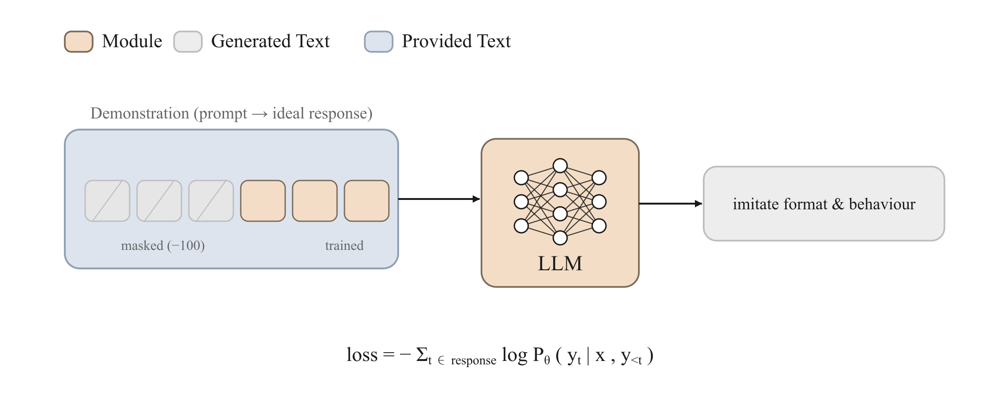

<!-- nav -->
<table width="100%"><tr><td align="left" width="30%"><a href="02-continued-pretraining.md">← 持续预训练 CPT</a></td><td align="center" width="40%"><a href="README.md">📑 索引</a> · <a href="../GLOSSARY.md">📖 术语词典</a> · <a href="en/03-sft.md">🌐 English</a></td><td align="right" width="30%"><a href="04-preference-optimization.md">偏好优化 →</a></td></tr></table>
<!-- /nav -->

# 监督微调 (Supervised Fine-Tuning, SFT)

> **在「提示 → 回答」配对上做交叉熵，但只对回答 token 计损失——SFT 不是灌输新知识，而是把预训练模型的知识塑形成「听指令、按格式作答」的行为。**



## 直觉：它到底在做什么

预训练 (pretraining) 出来的基座模型本质上是一个「续写引擎」：给它一段文本，它续写最可能的下文。它读过海量语料，**知道**很多东西，但它不知道你给它的输入是一个「需要被回答的指令」——它同样可能把你的问题续写成另一个问题、续写成一段离题的网页文本。

SFT 做的事情非常朴素：拿一批高质量的「指令 → 理想回答」配对 `(prompt, response)`，让模型在 `prompt` 之后**生成出 `response`**，用标准的语言模型交叉熵损失去拟合。关键的一个细节是——**只在 `response` 的 token 上算损失，`prompt` 的 token 被屏蔽掉 (设为 `-100`)**。模型不需要学会「生成问题」，它只需要学会「在给定问题后生成好的答案」。

经过几千到几十万条这样的样本，模型就从「续写引擎」变成了「对话/指令助手」：它学会了对话的格式（轮次、角色标记）、学会了「该停下来」（生成结束符）、学会了回答的语气与结构。这就是 InstructGPT (Ouyang et al. 2022) 流水线的第一步，也是几乎所有 chat 模型的起点。

## 原理与架构（深度讲解）

**数据 → 目标 → 算法** 三段式来看 SFT：

- **数据 (data)**：一条样本是 `(prompt, response)`。`prompt` 通常已经被**聊天模板 (chat template)** 包装——加上 `<|im_start|>user ... <|im_end|>` 这类角色标记，并在末尾接上 assistant 的起始标记（详见下文 `apply_template`）。然后整条 `prompt + response` 被 tokenizer 切成 token id，response 段以外的位置在 `labels` 里被填成 `-100`。
- **目标 (objective)**：就是 causal LM 的负对数似然 (NLL)，但**带掩码**。下一节给出公式。`trainall` 里就是 `SFTObjective`。
- **算法 (algorithm)**：全参微调 `full`，或参数高效的 `lora` / `qlora`（见 [LoRA / QLoRA](10-lora-qlora.md)）。算法决定「更新哪些权重」，与目标函数正交。

**它到底在调整什么？** 一个值得反复强调的认知是：**SFT 主要在「塑形行为 (shaping behaviour)」，而不是「注入知识 (injecting knowledge)」**。原因在于 SFT 的数据量（通常 10³–10⁵ 量级）相对于预训练（10¹²+ token）微不足道，几个 epoch 的梯度根本不足以往模型里压进大量新事实。它真正改变的是模型的**条件分布的「入口」**：在看到指令格式后，模型把概率质量重新分配到「直接作答」这条轨迹上，而把「续写成另一个问题」「跑题」「不停地说」这些轨迹的概率压低。换句话说，SFT 是在**激活并对齐预训练已经学到的能力**，让它们在「助手」这个角色下被可靠地触发。

这也解释了一个反复被验证的经验律：**SFT 的数据质量远比数量重要**。LIMA (Zhou et al. 2023, "Less Is More for Alignment") 用仅 1000 条精心挑选的样本就训出了很强的指令遵循能力，正是因为 SFT 学的是「风格与格式的映射」，而风格只需要少量高质量示范就能稳定建立。反过来，混入低质、自相矛盾或格式混乱的样本，会直接教会模型坏习惯——模型会忠实地模仿你给它看的任何东西，包括错误。

**为什么只在 response 上算损失？** 如果不屏蔽 prompt，模型会花一部分容量去学「如何生成用户的提问」，这既浪费、又会让损失被冗长的 prompt 稀释，削弱对 response 的拟合信号。屏蔽后，每一份梯度都精准地用在「给定这个 prompt，下一个该生成的答案 token 是什么」上。（`SFTObjective` 提供了 `train_on_prompt=True` 来关掉这个行为，用于「整段都要学」的少数场景，比如纯续写式的 domain 适配。）

**与下游方法的衔接**：SFT 给出的是「一个还不错的策略」，但它只学了**模仿单一示范**，无法表达「A 比 B 好多少」这种相对偏好。要进一步对齐人类偏好，需要在 SFT 模型的基础上做 [偏好优化 (preference optimization)](04-preference-optimization.md)（DPO 等）或 [RLHF](05-rlhf.md)。SFT 几乎总是这些方法的**初始化与参照点 (reference model)**。

## 目标函数（数学）

设一条样本拼接后的 token 序列为 $x = (x_1, \dots, x_T)$，其中 response 段的下标集合为 $\mathcal{R}$（prompt 段被屏蔽，不在 $\mathcal{R}$ 内）。模型 $p_\theta$ 是自回归的，token $t$ 的 logits 预测 token $t{+}1$。SFT 的损失是 response token 上的平均负对数似然：

$$
\mathcal{L}_{\text{SFT}}(\theta) = -\frac{1}{|\mathcal{R}|} \sum_{t \in \mathcal{R}} \log p_\theta\!\left(x_t \mid x_{\lt t}\right)
$$

- $x_t$：第 $t$ 个 gold token（监督目标）。
- $x_{\lt t}$：它前面的全部 token（含 prompt），作为条件。
- $\mathcal{R}$：response token 的下标集合；$|\mathcal{R}|$ 是其大小，用于按有效 token 数归一化。
- $p_\theta(x_t \mid x_{\lt t})$：模型在位置 $t$ 对 gold token 的预测概率，由 `log_softmax(logits)` 后 gather 得到。

加上 **label smoothing**（系数 $\varepsilon$，Szegedy et al. 2016）后，每个 token 的损失变为：

$$
\ell_t = (1-\varepsilon)\,\big(\!-\log p_\theta(x_t \mid x_{\lt t})\big) \;+\; \varepsilon \cdot \Big(\!-\tfrac{1}{V}\textstyle\sum_{v=1}^{V} \log p_\theta(v \mid x_{\lt t})\Big)
$$

其中 $V$ 是词表大小。$\varepsilon=0$ 退化为纯 NLL。平滑项把一点概率质量分给所有 token，缓解过自信、提升泛化与校准。`trainall` 里上报的 `ppl` 始终基于未平滑的 NLL：$\text{ppl} = \exp\big(\tfrac{1}{|\mathcal{R}|}\sum_{t\in\mathcal{R}} -\log p_\theta(x_t\mid x_{\lt t})\big)$。

## 数据长什么样

`SFTObjective.compute_loss(model, batch)` 消费的是一个 `trainall.types.Batch`，含以下张量（形状 `(B, T)`）：

- `input_ids`：拼接后的 `prompt + response` token id。
- `attention_mask`：1 表示真实 token，0 表示 padding。
- `labels`：监督目标。**prompt 段与 padding 段填 `-100`（被忽略），只有 response 段是真实 token id。**

最直接的构造方式是把每条样本写成预 tokenize 的 dict `{'input_ids': [...], 'labels': [...]}`，交给 `InMemorySource`——`Trainer` 的默认 collate 会自动右 padding、补 `attention_mask`、把 padding 处的 label 补成 `-100`。`mask_prompt(prompt_ids, response_ids)` 是构造这种 `labels` 的工具：

```python
from trainall.data import mask_prompt

input_ids, labels = mask_prompt([1, 2, 3], [4, 5])
assert input_ids == [1, 2, 3, 4, 5]
assert labels    == [-100, -100, -100, 4, 5]   # 前 3 个 prompt token 被屏蔽
```

而 `prompt` 文本本身一般先经过 `apply_template(messages, "chatml")` 渲染成带角色标记的字符串，再 tokenize。

## 在 trainall 中怎么用

下面的例子完整可跑（CPU、极小模型）：用聊天模板渲染一条对话、用 `mask_prompt` 构造 prompt-masked 的 `labels`、`InMemorySource` + `SFTObjective` + CPU `Trainer` 跑几步，并单独对一个 `Batch` 调 `compute_loss` 验证损失为有限标量。

```python
import torch
from trainall.data import InMemorySource, mask_prompt, apply_template
from trainall.models import ArchConfig, DecoderLM
from trainall.training import Trainer, TrainerConfig
import trainall

# 1) 用聊天模板把一条对话渲染成训练字符串（仅演示，token 用占位整数）
msgs = [{"role": "user", "content": "2+2 等于几?"},
        {"role": "assistant", "content": "等于 4。"}]
print(apply_template(msgs, "chatml"))

# 2) 构造 prompt-only-masked 的样本：prompt 段 labels=-100，只在 response 上算损失
def make_sample(prompt_ids, response_ids):
    input_ids, labels = mask_prompt(prompt_ids, response_ids)
    return {"input_ids": input_ids, "labels": labels}

V = 64
samples = [make_sample([3, 4, 5], [10, 11, 12]),
           make_sample([6, 7], [20, 21, 22, 23])]
print("labels[0] =", samples[0]["labels"])  # 前 3 个应为 -100
data = InMemorySource(samples)

# 3) 极小模型 + SFTObjective + CPU Trainer
cfg = ArchConfig(vocab_size=V, dim=32, n_layers=2, n_heads=4, n_kv_heads=2,
                 ffn_dim=64, max_seq_len=64)
model = DecoderLM.from_config(cfg)
sft = trainall.build("sft", category="objective")  # SFTObjective(label_smoothing=0.0)

trainer = Trainer(
    model, sft, data=data,
    config=TrainerConfig(device="cpu", batch_size=2, max_steps=3,
                         lr=1e-3, log_every=1, bf16=False),
)
trainer.train()

# 4) 也可直接对一个 Batch 调 compute_loss，确认是有限标量
from trainall.types import Batch
ids = torch.randint(0, V, (2, 8))
labels = ids.clone(); labels[:, :4] = -100  # 屏蔽 prompt 段
batch = Batch.of(input_ids=ids, attention_mask=torch.ones_like(ids), labels=labels)
loss, metrics = sft.compute_loss(model, batch)
print("loss =", float(loss.detach()), "ppl =", metrics["ppl"])
assert torch.isfinite(loss)
```

运行输出（节选）：训练三步 loss 从 ~4.11 缓慢下降，`compute_loss` 打印出有限的 `loss` 与 `ppl`，`labels[0]` 的前 3 个值确为 `-100`，确认 prompt 被正确屏蔽。

想开 label smoothing 就 `trainall.build("sft", category="objective", label_smoothing=0.1)`；想整段都学（不屏蔽 prompt）就传 `train_on_prompt=True`。

## 何时用 / 何时不用

**该用 SFT：**
- 你有一个基座模型（或刚做完 [继续预训练 (CPT)](02-continued-pretraining.md)），想把它变成会听指令、按指定格式作答的助手。
- 你能拿到（或能造出）一批高质量的「指令 → 理想回答」示范数据。
- 作为 DPO / RLHF / RLVR 的**初始化策略和参照模型**——几乎所有对齐流水线的第一步。

**别（只）用 SFT：**
- 你想往模型里**灌大量新事实/新领域知识**——那是 [预训练](01-pretraining.md) / [CPT](02-continued-pretraining.md) 的活，SFT 的数据量塑不动知识。
- 你只有「A 比 B 好」这类**相对偏好**信号，而没有单一的「理想答案」——用 [偏好优化](04-preference-optimization.md)（DPO 系）。
- 任务有**可自动判定对错的验证器**（数学、代码、SQL），想直接优化「答对率」——用 [RLVR / GRPO](06-rlvr-grpo.md)，它能探索出超越示范的解法，而 SFT 只能模仿示范的上限。

## 常见陷阱与实践要点

- **忘记屏蔽 prompt**：最常见的 bug。`labels` 的 prompt 段没设 `-100`，模型会去学习生成用户提问，浪费容量、稀释信号。务必确认 `labels` 前缀是 `-100`（本文例子里特意打印验证）。
- **模板必须和推理时一致**：训练用的 `apply_template` 风格（chatml / llama3 / plain）、角色标记、是否带 `add_generation_prompt`，必须与你部署推理时完全对齐。模板错位是「训练好好的、上线就胡言乱语」的头号原因。
- **数据质量 > 数量**：见 LIMA。宁要 1k 条干净、一致、风格统一的样本，不要 100k 条夹带错误与矛盾的样本——模型会忠实模仿你给它的一切，包括坏例子。
- **别过训**：SFT 通常只跑 1–3 个 epoch。epoch 太多会过拟合到示范的表面措辞、损失多样性、甚至开始遗忘预训练知识（灾难性遗忘）。盯着验证集，而不是训练 loss。
- **学习率与算法**：全参 SFT 的 lr 远低于预训练（典型 1e-5 ~ 2e-5）。显存吃紧就上 [LoRA / QLoRA](10-lora-qlora.md)，效果通常接近全参而成本低得多。
- **EOS / 停止 token**：确保 response 末尾带上模型的结束标记，否则模型学不会「该停下来」，推理时会停不下来地往下生成。
- **padding 不参与损失**：默认 collate 已把 padding 处 label 补成 `-100`，无需手动处理；但若你自定义 collate，别忘了这一步。

## 相关

- [预训练 (Pretraining)](01-pretraining.md) —— SFT 的起点：先有续写能力，才谈得上塑形。
- [继续预训练 (Continued Pretraining / DAPT)](02-continued-pretraining.md) —— 注入领域知识，常排在 SFT 之前。
- [偏好优化 (Preference Optimization / DPO)](04-preference-optimization.md) —— SFT 之后的下一步，学相对偏好。
- [RLHF (PPO)](05-rlhf.md) —— 用奖励模型做强化对齐，SFT 模型是其初始化与参照。
- [RLVR / GRPO](06-rlvr-grpo.md) —— 有可验证奖励时超越示范上限。
- [LoRA / QLoRA](10-lora-qlora.md) —— SFT 的参数高效算法选择。
- 术语表：[SFT](../GLOSSARY.md#sft) · [DPO](../GLOSSARY.md#dpo) · [LoRA](../GLOSSARY.md#lora)
- 返回 [方法索引](README.md)
