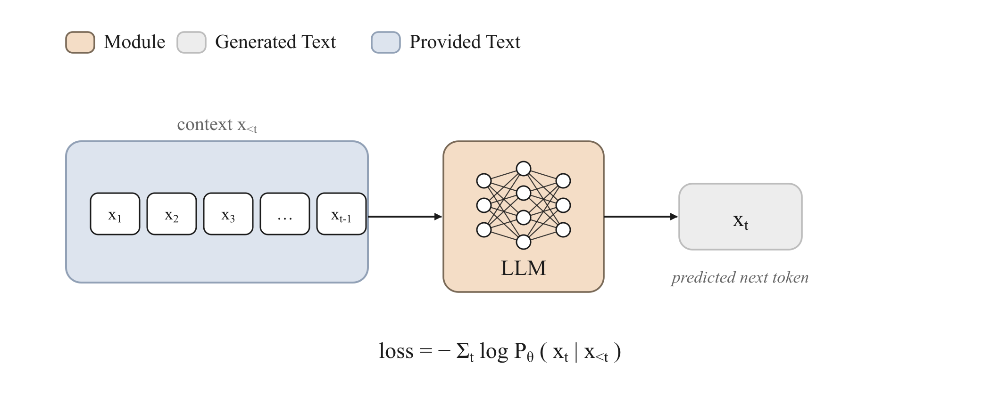

<!-- nav -->
<table width="100%"><tr><td align="left" width="30%"><sub>&nbsp;</sub></td><td align="center" width="40%"><a href="README.md">📑 Index</a> · <a href="../../GLOSSARY.md">📖 Glossary</a> · <a href="../01-pretraining.md">🌐 中文</a></td><td align="right" width="30%"><a href="02-continued-pretraining.md">Continued pre-training →</a></td></tr></table>
<!-- /nav -->

# Pre-training

> **Use a massive amount of unlabeled text to do "next-token prediction," compressing the statistical regularities of the entire world into one set of weights — this is the bedrock of every capability a large model has.**



## Intuition

Picture a fill-in-the-blank game: you are given the start of a sentence, "Paris is the capital of," and asked to guess the next word. To guess well, you can't just memorize grammar — you have to "know" that Paris is a capital, that France is a country, that the concept of a "capital" exists. Now scale this game up to internet-scale text, to every position in every sentence, and force a neural network to play it over and over again — to guess the "next token" more accurately, it is compelled to build an internal, implicit model of language, facts, common sense, and even shallow reasoning.

That is the entire secret of pre-training: **the objective is extremely simple (predict the next token), but because "predicting accurately" itself requires understanding the world, the model — while chasing this simple objective — passively learns everything.** It is **self-supervised**: the supervision signal (the label) does not come from human annotation but directly from the text itself: the "correct answer" for the $t$-th token is simply the $t+1$-th token in the text. As a result, the amount of usable data equals all the text humans have ever written, unconstrained by any annotation budget. This is precisely the premise that makes scaling possible.

What pre-training produces is a **base model**: it "continues" text rather than "converses," and it does not yet follow instructions. The subsequent SFT, preference optimization, and RLHF are all refinements built on top of this base — the base sets the ceiling of capability, and the refinements determine how that capability is released.

## How it works (deep dive)

### The three-part structure: data → objective → algorithm

trainall decomposes every training paradigm into three orthogonal things, and pre-training is the purest example:

- **data**: a big pile of token-id sequences. There is no prompt/response distinction, no human preference — just continuous text that has been tokenized into `input_ids`. In trainall, for pure pre-training the `labels` are simply equal to `input_ids` (every position is a supervised target).
- **objective**: `CausalLMObjective` (registered name `pretrain`, alias `clm`). It does just one thing — for every token position, compute the cross-entropy of "predict the next token," then average over all tokens.
- **algorithm**: usually `full` (full-parameter training), because pre-training is meant to shape all of the model's knowledge, and there is no reason to freeze any parameter.

This decoupling lets you apply the same objective to different algorithms and different data with almost no code changes.

### "Autoregression" and the causal mask: why it can parallelize without cheating

The model is a **decoder-only Transformer**, modeling sequence probability **autoregressively**:

Viewing a span of text as a token sequence $x = (x_1, x_2, \dots, x_T)$, the joint probability of the whole sequence is decomposed by the chain rule into

$$ p_\theta(x) = \prod_{t=1}^{T} p_\theta(x_t \mid x_{<t}) $$

Each conditional probability $p_\theta(x_t \mid x_{<t})$ depends only on the context to the **left**. In the implementation, this is guaranteed by the **causal attention mask**: the attention at position $t$ is forbidden from seeing any token after $t$. This is the key engineering trick — the mask lets the model **compute predictions for all $T$ positions in parallel within a single forward pass** (training is efficient), while each position still "cannot see the future" (no cheating, no information leakage). This is also why training can use teacher forcing (feeding in the true prefix), while inference can only generate one token at a time.

For the implementation details of attention itself (multi-head, GQA, RoPE, MoE, etc.), see the architecture doc [11-architectures.md](11-architectures.md).

### Why "predict the next token" can give rise to knowledge and reasoning

Many people, hearing for the first time that "the model is just predicting the next word," feel this is too shallow to ever produce intelligence. But to grasp its power, the key is this: **perfectly compressing text is equivalent to understanding text.**

- **world knowledge**: to correctly fill in "the speed of light is about ___ kilometers per second" with "300,000," the model must store this fact in its weights. Facts that recur repeatedly across a huge corpus get compressed into the parameter space.
- **latent reasoning**: to continue "if today is Wednesday, then three days later it is ___," the model has to perform an addition / table lookup internally. To lower the loss, it learns reusable computational "circuits."
- **pragmatics and style**: continuing text requires maintaining consistent tone, format, and characters, which forces the model to model long-range dependencies.

From an information-theoretic standpoint, the cross-entropy loss is precisely the **compression rate** measured in nats (or bits): the lower the loss, the more certain the model is about predicting the text, which is equivalent to encoding that text with fewer bits. Scaling laws (Kaplan 2020; Hoffmann 2022, "Chinchilla") empirically show that the loss decreases smoothly as a power law with parameter count, data volume, and compute — it is exactly this predictability of "simple objective + scale" that makes pre-training the core engine of large models. Capabilities are not explicitly designed; they **emerge** under compression pressure.

The theoretical roots trace back to the neural language model of Bengio et al. (2003), and to GPT from Radford et al. (2018) ("Improving Language Understanding by Generative Pre-Training").

## Objective (the math)

Pre-training minimizes the average negative log-likelihood (NLL) over all tokens, i.e., the cross-entropy of the next token:

$$ \mathcal{L}(\theta) = -\frac{1}{N} \sum_{t} \mathbb{1}[y_t \neq -100] \cdot \log p_\theta(y_t \mid x_{<t}) $$

where:

- $x_{<t}$ — all tokens before position $t$ (the left context / prefix).
- $y_t$ — the supervised target at position $t$, i.e., the "next token." In pure pre-training $y_t = x_{t+1}$, so in the code `labels` equals `input_ids` (a **causal shift** is performed internally to align the logits with the next position).
- $p_\theta(y_t \mid x_{<t})$ — the probability the model assigns to the correct token $y_t$ after applying softmax over the vocabulary at that position.
- $\mathbb{1}[y_t \neq -100]$ — the masking indicator function: positions labeled `-100` (such as padding) do not count toward the loss.
- $N = \sum_t \mathbb{1}[y_t \neq -100]$ — the total number of tokens actually participating in the computation, used as the normalization denominator.

The loss at a single position is just the $-\log$ probability of the correct class after softmax:

$$ \ell_t = -\log \frac{\exp(z_{t,\,y_t})}{\sum_{v=1}^{|V|} \exp(z_{t,\,v})} $$

where $z_{t,v}$ is the logit of the $v$-th token in the vocabulary at position $t$, and $|V|$ is the vocabulary size.

An intuitive derived quantity is **perplexity (PPL)**, i.e., the exponential of the loss:

$$ \mathrm{PPL} = \exp(\mathcal{L}) $$

It can be understood as "on average, how many equally probable candidates the model has to hesitate among at each position." The closer PPL is to 1, the better; at random initialization it is roughly equal to the vocabulary size $|V|$. In trainall, the `metrics` dictionary returned by `compute_loss` carries the `ppl` key.

## Data format

`CausalLMObjective` consumes a `trainall.types.Batch`, and pre-training uses only three tensors:

- `input_ids` — `(B, T)`, long-typed token ids.
- `attention_mask` — `(B, T)`, where 1 marks a real token and 0 marks padding.
- `labels` — `(B, T)`, the supervised targets. **In pure pre-training, `labels == input_ids`** (every token is predicted); positions marked `-100` are ignored.

If you don't pass `labels`, the objective defaults to using `input_ids` as `labels`, so in pure LM training the two are identical to begin with.

When feeding the `Trainer`, the simplest approach is `InMemorySource`, where each record is an **already-tokenized** dict `{"input_ids": [...], "labels": [...]}`, and the default collate pads them into the batch of tensors above. A single record looks like this:

```python
{"input_ids": [12, 7, 40, 3, 21, ...], "labels": [12, 7, 40, 3, 21, ...]}  # labels == input_ids
```

In practice, the raw corpus is first **packed**: `trainall.data.pack_sequences` concatenates many short documents and slices them into equal-length blocks so that each block is filled with tokens, wasting almost no compute on padding.

## Using it in trainall

Below is a minimal pre-training loop that runs on CPU: a tiny `DecoderLM`, an `InMemorySource`, `build("pretrain")` to obtain the objective, and 3 steps.

```python
import torch, trainall
from trainall.models import DecoderLM, ArchConfig
from trainall.data import InMemorySource
from trainall.training import Trainer, TrainerConfig
from trainall.types import Batch

# 1) A tiny decoder-only LM (CPU-friendly).
cfg = ArchConfig(vocab_size=64, dim=32, n_layers=2, n_heads=4,
                 n_kv_heads=2, ffn_dim=64, max_seq_len=64)
model = DecoderLM.from_config(cfg)

# 2) Pre-tokenised corpus. For pure next-token pretraining, labels == input_ids:
#    every token is a supervised target predicted from its left context.
torch.manual_seed(0)
items = [{"input_ids": (ids := torch.randint(0, 64, (16,)).tolist()),
          "labels": list(ids)} for _ in range(8)]
data = InMemorySource(items)

# 3) The next-token cross-entropy objective ("clm" is an alias).
objective = trainall.build("pretrain", category="objective")

# 4) Train 3 CPU steps.
tcfg = TrainerConfig(lr=1e-3, batch_size=4, max_steps=3,
                     device="cpu", bf16=False, log_every=1)
trained = Trainer(model, objective, data=data, config=tcfg).train()

# 5) Inspect the loss directly via compute_loss on one batch.
ids = torch.randint(0, 64, (2, 16))
batch = Batch.of(input_ids=ids, attention_mask=torch.ones_like(ids), labels=ids.clone())
loss, metrics = objective.compute_loss(trained, batch)
print("loss:", round(float(loss.detach()), 4), "| ppl:", round(metrics["ppl"], 3))
```

Actual run output (the loss decreases over the 3 training steps, ending at a finite value on a single batch):

```
step 1 | loss=4.1715 ppl=64.8107 n_tokens=60.0000
step 2 | loss=4.1567 ppl=63.8614 n_tokens=60.0000
step 3 | loss=4.0940 ppl=59.9802 n_tokens=60.0000
loss: 4.1197 | ppl: 61.541
```

At random initialization PPL is roughly equal to the vocabulary size (64 here), which matches the ~60 value above — a nice "sanity check."

## When to use / when not

**Scenarios where pre-training is a good fit:**

- You want to **build a base model from scratch**, and you have a general-purpose corpus with token counts in the billions/trillions.
- You want to introduce a brand-new language, modality, or symbol system that an existing tokenizer/model has never seen at all.

**Not a good fit (don't use full pre-training here):**

- You just want the model to adapt to a certain **domain** (medical, legal, code) — use **continued pre-training (CPT/DAPT)**, see [02-continued-pretraining.md](02-continued-pretraining.md), which takes small steps on an existing base and is much cheaper.
- You want the model to **understand instructions and answer in a given format** — that's **SFT**'s job, see [03-sft.md](03-sft.md). A base model from pre-training only continues text.
- You want to align with human preferences or improve accuracy on a specific task — use preference optimization [04-preference-optimization.md](04-preference-optimization.md) or RLVR [06-rlvr-grpo.md](06-rlvr-grpo.md).
- You have little data and limited compute: pre-training from scratch is all but guaranteed to underfit, and is far worse than taking an open-source base and refining it.

In a sentence: **pre-training is "laying the foundation," but what the vast majority of people need is "interior decoration."**

## Pitfalls & practical notes

- **Data quality ≫ data quantity**: dirty data and duplicate documents directly compress noise into the weights. Dedup, quality filtering, and PII removal are standard. Duplicate samples also make the model "recite" rather than generalize.
- **Always do sequence packing**: without packing you waste a lot of compute on padding, and the gradient signal from short samples gets diluted. Use `pack_sequences`.
- **Don't misalign the labels**: in pure pre-training `labels == input_ids`; the causal shift is done internally by the objective, so **do not** manually shift right by one yourself — otherwise you'd "predict the current token" rather than the next, with an abnormally low loss while learning nothing.
- **Use PPL as a sanity check**: at the start of training, PPL should be close to the vocabulary size; if it starts out far below the vocabulary size, it's most likely label leakage (the model peeked at the answer).
- **Learning rate and warmup**: pre-training is sensitive to large learning rates and needs warmup for a smooth start, otherwise the early gradients explode. `TrainerConfig.warmup_ratio` defaults to 0.03.
- **Numerical precision**: large-scale training uses `bf16`; the small CPU example in this doc uses `bf16=False` to guarantee reproducibility with no precision warnings.
- **`-100` is the ignore marker**: to skip certain positions (such as padding), set the corresponding `labels` to `-100`, rather than deleting them or setting them to 0.
- **base model ≠ chat model**: taking the pre-training output straight to conversation will disappoint — it continues your question instead of answering it. Be sure to follow up with SFT.

## Related

- [Continued pre-training / CPT-DAPT](02-continued-pretraining.md) — domain adaptation on an existing base, a "lightweight sequel" to pre-training.
- [SFT (supervised fine-tuning)](03-sft.md) — teaching the model to follow instructions on top of the base; in essence the same cross-entropy with a prompt mask.
- [Preference optimization](04-preference-optimization.md) and [RLHF](05-rlhf.md) — aligning with human preferences.
- [Architecture deep dive](11-architectures.md) — decoder-only Transformer, attention variants, RoPE, MoE.
- For vocabulary / terminology, see the [Glossary](../../GLOSSARY.md): [perplexity](../../GLOSSARY.md#perplexity), [cross-entropy](../../GLOSSARY.md#cross-entropy), [self-supervised](../../GLOSSARY.md#self-supervised).
- Back to the [methods overview README](README.md).
