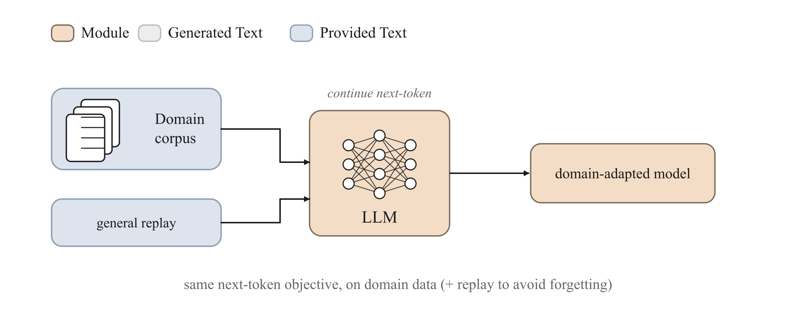

<!-- nav -->
<table width="100%"><tr><td align="left" width="30%"><a href="01-pretraining.md">← Pre-training</a></td><td align="center" width="40%"><a href="README.md">📑 Index</a> · <a href="../../GLOSSARY.md">📖 Glossary</a> · <a href="../02-continued-pretraining.md">🌐 中文</a></td><td align="right" width="30%"><a href="03-sft.md">SFT →</a></td></tr></table>
<!-- /nav -->

# Continued Pre-training / Domain-Adaptive Pre-training (CPT / DAPT)

> **"Keep training" on domain corpora with exactly the same next-token objective as pre-training — at heart it's a data problem, not a loss-function problem. The hard part is letting the model learn the new distribution without forgetting the old (catastrophic forgetting), which you mitigate by mixing in the original distribution via replay.**



## Intuition

After a base model has been pre-trained on general web pages, books, and code, it is already very good at "the general regularities of language," but it may have seen very little of some **narrow distribution** — say, legal judgments, clinical records, the work-order logs of a particular chip production line, or a niche programming language. The idea behind CPT is so plain it barely looks like a "method": **just keep doing pre-training, only swap the corpus for the text of this domain**. The loss function stays exactly as it was — next-token cross-entropy — and the optimizer and data pipeline are unchanged; all that shifts is the data distribution.

Gururangan et al. (2020, *Don't Stop Pretraining*) systematically validated this: running one more round of pre-training on domain corpora (which they call **DAPT, domain-adaptive pre-training**), then doing downstream fine-tuning, beats fine-tuning the base model directly on nearly every domain/task. The intuition is that the model first "reads itself fluent" in the domain's vocabulary, terminology collocations, stylistic rhythm, and factual distribution through the self-supervised signal, compressing this knowledge into the weights — so downstream tasks then get more done with less effort.

But there is no free lunch. When you feed only domain text and keep pushing the gradients toward "legalese," the model gradually **forgets** what it used to know — general question answering, common sense, other languages. This is **catastrophic forgetting**. The engineering core of CPT is less about "how to learn the new" than about "how to forget less of the old while learning the new." The most common remedy is **replay**: mix a small handful of samples from the original pre-training distribution into the domain corpus, so the gradients are always "tugged" a bit by the old distribution and the weights don't drift too far.

## How it works (deep dive)

Under the three-layer **data → objective → algorithm** framework, CPT changes almost only the first layer:

- **Data**: goes from a "general grab-bag" to "domain corpus + a small amount of replay samples." This is the only thing CPT does that is truly special, and it is the key to whether it succeeds or fails.
- **Objective**: completely unchanged — still the causal-LM loss of [pre-training](01-pretraining.md): predict the next token at every position and minimize the negative log-likelihood (NLL). In trainall, `ContinuedPretrainObjective` directly **inherits** `CausalLMObjective`; by default it does not change a single line of computation and follows the parent class's fast path.
- **Algorithm**: also unchanged — ordinary AdamW + cosine/linear annealing. The difference lies more in the **hyperparameters**: CPT usually uses a **smaller learning rate** and shorter warmup than the initial pre-training, because you are making a small transfer near an already-converged point rather than starting from random initialization — too large a learning rate is tantamount to smashing the general abilities you worked so hard to learn.

**What does the model actually learn?** The self-supervised next-token objective forces the model to model $P(\text{next token} \mid \text{preceding text})$. When the statistics of the preceding text shift from "general English" to "legal judgments," the model must redistribute probability mass onto the continuations that are frequent in the domain — "the defendant" is more likely to be followed by "shall bear," and `SELECT` is more likely to be followed by a specific table name. This redistribution rewrites how attention aggregates context and how the FFN stores and retrieves factual memory. In other words, CPT writes the **domain's distributional prior** into the weights, and that is something no prompt engineering or retrieval augmentation (RAG) can replace — the latter two can only "prompt" the model at inference time and cannot change the model's internal probabilistic beliefs about token sequences.

**Mechanistically, how does forgetting happen?** A neural network's knowledge is distributed and encoded across shared weights. When the gradients of the new data keep pushing certain weights in one direction, the "circuits" that originally relied on those weights to express old knowledge get overwritten. The severity of forgetting is roughly proportional to: the divergence between the new and old distributions, the learning rate, and the number of training steps. **Replay** works by continuously retaining a share of "the old distribution's gradient signal" in the loss — as long as each batch contains a certain proportion of original samples, the optimization direction is constrained to a compromise that "lowers the domain NLL while not significantly raising the general NLL." Empirically, the replay proportion is often anywhere from 1% to 25%: the further the domain is from the base model and the more you worry about forgetting, the more you mix in.

**The replay-weighting mechanism in trainall.** Physically mixing replay samples into the corpus so they appear at a certain frequency is the most direct form of replay. On top of that, `ContinuedPretrainObjective` adds an **optional per-sample weighting knob** that lets the collator apply different weights to domain / replay samples **within the same batch**, without having to touch the data pipeline itself. It resolves the weights by priority:

1. `batch.extra["weights"]` — explicitly give a `(B,)` weight vector; the most flexible;
2. `batch.extra[domain_field]` (default field name `"domain"`) together with `replay_weight` — domain samples (marked true) get weight `1.0`, replay samples (marked false) get weight `replay_weight`;
3. neither present → uniform weights, in which case CPT degenerates to being **position-by-position equivalent to ordinary pre-training** (follows the parent class's fast path, zero extra overhead).

Note that `replay_weight=0.0` (the default) also follows the fast path — it means "do not do any within-batch reweighting" and is **not** "set the replay samples' weight to zero." To enable weighting, `replay_weight` must be nonzero and the batch must carry the `domain` marker (or directly provide `weights`).

## Objective (the math)

The basis is the causal-LM negative log-likelihood. For a sequence $x = (x_1, \dots, x_T)$ of length $T$:

$$
\mathcal{L}_{\text{CLM}}(x) = -\frac{1}{|\mathcal{M}|}\sum_{t \in \mathcal{M}} \log P_\theta\!\left(x_{t} \mid x_{<t}\right)
$$

where $\theta$ are the model parameters, $P_\theta(x_t \mid x_{<t})$ is the model's predicted probability for the true token at position $t$, $\mathcal{M}$ is the set of positions that contribute to the loss (positions labeled `-100` are ignored; CPT usually has **all tokens contribute to the loss**), and $|\mathcal{M}|$ is the number of valid tokens. This is exactly the loss of [pre-training](01-pretraining.md).

When within-batch weighting is enabled, trainall first computes the **per-token average NLL** for each sample, then takes a weighted average over the sample weights. Suppose a batch has $B$ samples, where the $i$-th sample has per-token average NLL $\ell_i$ and weight $w_i$:

$$
\ell_i = -\frac{1}{n_i}\sum_{t \in \mathcal{M}_i} \log P_\theta\!\left(x^{(i)}_{t} \mid x^{(i)}_{<t}\right), \qquad
\mathcal{L}_{\text{CPT}} = \frac{\sum_{i=1}^{B} w_i\, \ell_i}{\sum_{i=1}^{B} w_i}
$$

- $n_i = |\mathcal{M}_i|$: the number of loss-contributing tokens in the $i$-th sample (`clamp(min=1)` prevents division by zero);
- $w_i$: the weight of the $i$-th sample. Domain samples take $1.0$, replay samples take `replay_weight` (denoted $\rho$);
- the denominator $\sum_i w_i$ normalizes so that the overall loss scale is **comparable** to the unweighted case (it does not shrink overall just because low-weight samples were mixed in).

Intuition: turning $\rho$ down is like telling the optimizer that "replay samples are only there to **tether** the old distribution and provide a bit of regularizing gradient — don't let them dominate the update direction"; turning it up emphasizes retaining general abilities more. If a MoE architecture returns an `aux_loss` (the load-balancing term), it is added to $\mathcal{L}$ but does not count toward perplexity.

## Data format

CPT consumes the standard causal/SFT-shaped `Batch` (`trainall.types.Batch`), with the core tensors:

- `input_ids`: `(B, T)`, token ids;
- `attention_mask`: `(B, T)`, usually all 1s;
- `labels`: `(B, T)`, **which for CPT generally equals `input_ids`** (pure self-supervision, every token is predicted). Positions of `-100` are ignored — rarely used in CPT, since there is no such thing as "the prompt does not contribute to the loss."

Optional replay-weighting information goes in `batch.extra` (not part of the tensor pipeline):

- `batch.extra["domain"]`: a length-`B` boolean/0-1 list marking whether each sample is domain (true) or replay (false). Used together with `replay_weight`;
- or `batch.extra["weights"]`: a length-`B` float list giving each sample's weight directly, with the highest priority.

As for the data source, domain corpora are usually first loaded as raw text with `JsonlSource` / `HFDatasetSource` and then tokenized + packed (see `pack_sequences`), or, as in the example below, fed pre-tokenized `{"input_ids": [...], "labels": [...]}` dicts via `InMemorySource` — such pre-tokenized samples are passed straight through to the Trainer's default collate.

## Using it in trainall

The snippet below runs as-is on CPU: first use `compute_loss` to peek at a single-step loss with replay weighting, then chain a 3-step mini training loop.

```python
import torch
import trainall
from trainall.models import DecoderLM, ArchConfig
from trainall.types import Batch
from trainall.data import InMemorySource
from trainall.training import Trainer, TrainerConfig

# 1) A mini decoder-only LM (CPU is fine)
cfg = ArchConfig(vocab_size=64, dim=32, n_layers=2, n_heads=4,
                 n_kv_heads=2, ffn_dim=64, max_seq_len=64)
model = DecoderLM.from_config(cfg)

# 2) CPT objective: replay samples get weight 0.1, domain samples get weight 1.0
obj = trainall.build("cpt", replay_weight=0.1)     # equivalent to build("dapt", ...)
print("objective:", type(obj).__name__)

# 3) Look at the loss once: one domain doc + one replay doc mixed in the same batch
ids = torch.randint(0, 64, (2, 16))
batch = Batch.of(input_ids=ids,
                 attention_mask=torch.ones_like(ids),
                 labels=ids.clone())               # pure next-token: predict every next token
batch.extra["domain"] = [1, 0]                     # row 0 = domain, row 1 = replay
loss, metrics = obj.compute_loss(model, batch)
print("loss:", round(float(loss.detach()), 4), "ppl:", round(metrics["ppl"], 2))

# 4) Chain a tiny training loop (domain corpus pre-tokenized)
toks = [torch.randint(0, 64, (16,)).tolist() for _ in range(8)]
data = InMemorySource([{"input_ids": t, "labels": t} for t in toks])
trainer = Trainer(model, obj, data=data,
                  config=TrainerConfig(device="cpu", max_steps=3, batch_size=4,
                                       lr=1e-3, bf16=False, log_every=1))
trainer.train()
print("done")
```

Actual run output (excerpt):

```
objective: ContinuedPretrainObjective
... step 1 | loss=4.1664 ppl=64.4851 ...
... step 3 | loss=4.0921 ppl=59.8627 ...
loss: 4.1398 ppl: 62.79
done
```

Key point: `replay_weight=0.1` + `batch.extra["domain"]` is what triggers within-batch weighting; if either is missing, CPT automatically falls back to the fast path that is position-by-position equivalent to ordinary pre-training. More common in production is **physical replay** (directly mixing samples from the original distribution into the corpus by proportion), while the weighting knob is used for finer ratio control within a single batch.

## When to use / when not

**Good fits for CPT:**

- The target domain **differs greatly** from the base pre-training distribution, and you **have a large amount of unlabeled domain text** (on the order of a million tokens or more) — law, medicine, finance, a specific codebase, low-resource languages.
- You want to inject **domain knowledge/terminology/facts** into the weights, not merely teach the model "the format of its answers."
- You plan to do [SFT](03-sft.md) afterward: first do CPT to build a solid domain foundation, then SFT to teach the interaction format; the two stacked together usually beat SFT directly.

**Poor fits / don't reach for CPT:**

- You only want to change **behavior/style/format** (e.g., "answer in bullet points," "follow a certain template") — that is [SFT](03-sft.md)'s job; CPT cannot teach alignment, only distribution.
- The domain data is very scarce (a few thousand items) — CPT's payoff comes from scaled-up self-supervision; on small data, going straight to SFT is more cost-effective, and forcing CPT instead tends to cause overfitting + forgetting.
- What you need is **alignment to human preferences** — that calls for [preference optimization](04-preference-optimization.md) or [RLHF](05-rlhf.md).

**Why does CPT usually come before SFT?** The typical order of a training pipeline is *pre-training → CPT → SFT → preference optimization*. CPT is **self-supervised** and changes the model's **probabilistic beliefs** about domain text (the "knowledge layer"); SFT is **supervised** and changes the **input-to-output mapping/behavior** (the "skill layer"). By first pouring knowledge into the weights with massive unlabeled domain text, the model can learn "how to use" that knowledge during SFT with fewer labeled samples; conversely, if you do SFT first and then CPT, CPT's self-supervised gradients would dilute the instruction-following ability just learned (forgetting, once again). So CPT before SFT is the natural order of knowledge first, skills second.

## Pitfalls & practical notes

- **Forgetting happens by default; it is not an occasional bug.** Before going live, be sure to run a regression evaluation on **general benchmarks** (not just domain metrics); watching only domain perplexity drop will blind you to the collapse of general abilities.
- **Always configure replay.** Pure domain corpus with zero replay is the recipe for the most severe forgetting. Start by mixing in 5%–15% of the original distribution and adjust based on how much the general metrics drop. The `replay_weight` knob can fine-tune within a batch, but **physical mixing** is the main means.
- **The learning rate should be smaller than the initial pre-training's** (commonly an order of magnitude lower), with a short warmup. You are transferring near a converged point, not training from scratch; too large a learning rate = directly smashing the existing general abilities.
- **Don't train too long.** CPT's marginal payoff diminishes with steps, while forgetting accumulates with steps. Keep your eye on the compromise point of "domain gain vs. general loss," stop when you reach it, and don't chase the last bit of domain perplexity drop.
- **Don't accidentally set `labels` to `-100`.** CPT is pure self-supervision; `labels` should equal `input_ids` (everyone contributes to the loss). If you reuse a collator from an SFT pipeline, be careful not to mistakenly mask out the prompt segment.
- **Data quality > data quantity.** CPT writes the corpus's distribution directly into the weights, and dirty data (garbled text, duplicates, PII, low-quality templates) gets faithfully learned in. Deduplicating, cleaning, and de-PII-ing the domain corpus matters even more than for general pre-training.
- **`replay_weight=0.0` does not mean "discard replay."** It means "do not do within-batch reweighting" and follows the fast path; what truly controls the replay proportion is the ratio you mix into the corpus.

## Related

- [Pre-training](01-pretraining.md) — the same next-token objective CPT reuses; start here.
- [SFT (Supervised Fine-Tuning)](03-sft.md) — the next step after CPT that teaches behavior/format.
- [Preference Optimization](04-preference-optimization.md) / [RLHF](05-rlhf.md) — the alignment stages further down the line.
- [LoRA / QLoRA](10-lora-qlora.md) — do CPT/SFT in a parameter-efficient way and save memory.
- [Architectures](11-architectures.md) — the details of `ArchConfig` / `DecoderLM`.
- Glossary: [CPT/DAPT](../../GLOSSARY.md#cpt), [catastrophic forgetting](../../GLOSSARY.md#catastrophic-forgetting), [replay](../../GLOSSARY.md#replay).
- Back to the [Methods Index](README.md).
