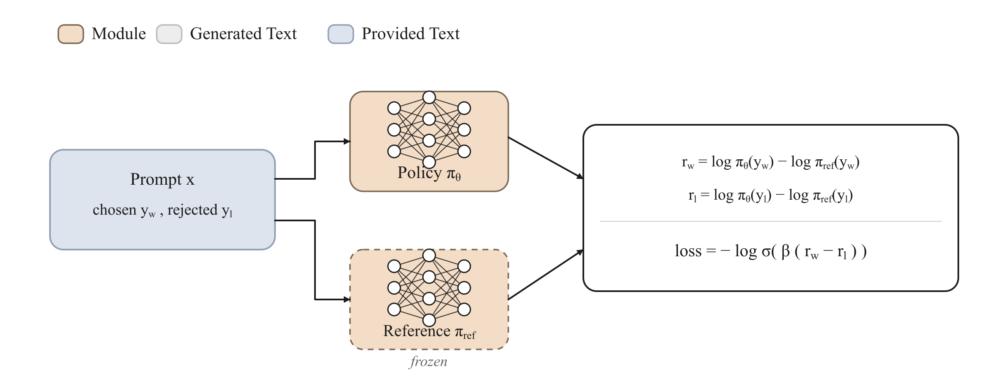

<!-- nav -->
<table width="100%"><tr><td align="left" width="30%"><a href="03-sft.md">← SFT</a></td><td align="center" width="40%"><a href="README.md">📑 Index</a> · <a href="../../GLOSSARY.md">📖 Glossary</a> · <a href="../04-preference-optimization.md">🌐 中文</a></td><td align="right" width="30%"><a href="05-rlhf.md">RLHF →</a></td></tr></table>
<!-- /nav -->

# Offline Preference Optimization

> **No reward model to train, no online sampling to run: treat the "pairwise preference" directly as a classification/regression objective and let the policy itself become an implicit reward model.**



## Intuition

Classic RLHF (see [05-rlhf.md](05-rlhf.md)) is a three-stage pipeline: first train a reward model on preference data, then use PPO to sample online and run reinforcement learning against the reward signal. This chain is long and brittle—the reward model gets gamed by reward hacking, PPO is hard to tune, and you have to keep four networks in memory at once: policy, reference, reward, and value.

The core insight of **offline preference optimization** is this: in the optimal solution of RLHF's "maximize reward subject to a KL constraint that keeps you from drifting too far from the reference model," **the reward itself can be reparameterized as the policy's log-probability ratio relative to the reference model**. In other words, the reward need not be trained separately—it is already hidden inside the policy. The entire PPO stage then collapses into a process of **supervised learning over a fixed batch of (chosen, rejected) data**: no sampling, no reward model, no value network, just an ordinary backward pass.

The one-line intuition: show the model a pair of responses, tell it "this one is good, that one is bad," and what the model has to do is **raise the probability of the good response and lower the probability of the bad one**—but not mindlessly, rather raising/lowering *relative to a starting point* (a reference model or a length-normalized baseline) so the model doesn't push the whole distribution off into space. The 6 members covered in this article are different implementations of this same idea: DPO, IPO, KTO, ORPO, SimPO, CPO.

## How it works (deep dive)

### From RLHF's optimum to DPO's reparameterization

The optimization problem RLHF solves is (where $r$ is the reward, $\pi_{\text{ref}}$ is the post-SFT reference model, and $\beta$ is the KL strength):

$$\max_{\pi}\ \mathbb{E}_{x,\,y\sim\pi}\big[r(x,y)\big]\ -\ \beta\,\mathrm{KL}\big(\pi(\cdot\mid x)\,\|\,\pi_{\text{ref}}(\cdot\mid x)\big)$$

This KL-regularized maximization has a **closed-form optimum**:

$$\pi^{*}(y\mid x)=\frac{1}{Z(x)}\,\pi_{\text{ref}}(y\mid x)\,\exp\!\Big(\tfrac{1}{\beta}r(x,y)\Big)$$

Solving it back for $r$:

$$r(x,y)=\beta\log\frac{\pi^{*}(y\mid x)}{\pi_{\text{ref}}(y\mid x)}+\beta\log Z(x)$$

The key point: DPO (Rafailov et al. 2023) uses the **Bradley-Terry preference model** (for reward model and Bradley-Terry, see [05-rlhf.md](05-rlhf.md)) to write the preference probability as $P(y_c\succ y_r)=\sigma\big(r(x,y_c)-r(x,y_r)\big)$. **When you subtract, the partition function $Z(x)$ cancels out**—it depends only on $x$, so it is the same value for chosen and rejected. The hard-to-compute normalization term in the reward thus disappears, leaving only the difference of the policy-vs-reference log-ratios. This is why DPO needs no reward model: **the reward difference = the implicit reward margin**, which can be computed directly from a policy forward pass.

### What the model actually learns

Define the implicit reward $\hat r(x,y)=\beta\log\frac{\pi_\theta(y\mid x)}{\pi_{\text{ref}}(y\mid x)}$. DPO's gradient (derived from the sigmoid loss) has the form:

$$\nabla_\theta\mathcal{L}_{\text{DPO}}\ \propto\ -\,\underbrace{\sigma\!\big(\hat r_r-\hat r_c\big)}_{\text{degree to which the model still thinks rejected is better}}\ \Big[\nabla_\theta\log\pi_\theta(y_c)-\nabla_\theta\log\pi_\theta(y_r)\Big]$$

Two mechanisms worth remembering:

1. **Adaptive weighting**: that $\sigma(\hat r_r - \hat r_c)$ is a soft weight. When the model has already ranked chosen ahead, the weight approaches 0 and almost no update happens; the gradient is large only when the model **gets it wrong** (still favors rejected). This is implicit hard-example mining.
2. **Relative to the reference, not absolute**: what gets updated is the log-ratio $\log\frac{\pi_\theta}{\pi_{\text{ref}}}$, with the reference model acting as an "anchor." This is exactly the KL constraint at work—it stops the model from pushing the entire language distribution off into space just to widen the chosen/rejected gap (otherwise it would degenerate, repeat itself, and lose general capability).

### The data → objective → algorithm split

In trainall's three-part abstraction, preference optimization lives entirely at the **objective** layer:

- **data**: a batch of `(prompt, chosen, rejected)` triples—offline, static, reusable. No sampler, no environment. That is the entire meaning of the word "offline."
- **objective**: the 6 losses in this article. They differ only in **how they define the implicit reward** and **how they turn "chosen should win" into a differentiable scalar**.
- **algorithm**: `full` / `lora` / `qlora` (see [10-lora-qlora.md](10-lora-qlora.md)). Preference optimization is orthogonal to parameter-efficient fine-tuning—DPO + LoRA is the most common low-cost alignment recipe.

### The design tensions across the six variants

All variants answer two questions, and their trade-offs make up the full picture of this family:

**Question 1: do we want a reference model?** The reference model provides KL anchoring and prevents degeneration, but it costs an extra frozen copy of weights in memory and an extra forward pass. DPO/IPO/KTO keep it; ORPO/SimPO/CPO eliminate it with their respective "proxies" (an odds-ratio that brings its own regularization / length normalization / an NLL anchor), trading it away for half the memory and a shorter pipeline.

**Question 2: what link turns the margin into a loss?** DPO uses logistic (sigmoid), which saturates on easily separable samples; IPO uses a squared loss to **regress** the margin to a finite target value, avoiding pushing the margin to infinity on deterministic preferences (DPO's overfitting pathology); KTO abandons the pairwise assumption altogether and uses a prospect-theory utility function to handle **individual** labeled samples.

The math for each follows below.

## Objective (the math)

Write $\log\pi(y)=\sum_t\log\pi(y_t\mid y_{<t},x)$ for the sequence log-probability (computed in trainall by `sequence_logps(..., average=False)`); let $\overline{\log\pi}(y)$ be its **length-normalized** version (`average=True`, i.e. divided by the token count). $y_c,y_r$ are chosen / rejected respectively.

### Comparison table

| key | implicit reward / core quantity | link / form | needs reference model? |
|---|---|---|---|
| `dpo` | $\beta\big(\log\tfrac{\pi}{\pi_{\text{ref}}}\big)$, take chosen−rejected margin | logistic (optional cDPO smoothing / hinge) | yes |
| `ipo` | same as DPO, but with **length-normalized** log-ratio | squared loss, regress to $\tfrac{1}{2\beta}$ | yes |
| `kto` | $\log\pi-\log\pi_{\text{ref}}$ relative to KL baseline $z$ | prospect-theory utility (**non-pairwise**) | yes |
| `orpo` | odds ratio $\log\tfrac{\text{odds}(y_c)}{\text{odds}(y_r)}$ | logistic + SFT, reference-free | no |
| `simpo` | $\beta\,\overline{\log\pi}$ (**reference-free**) | logistic, minus target margin $\gamma$ | no |
| `cpo` | $\beta\big(\log\pi(y_c)-\log\pi(y_r)\big)$ | logistic + NLL anchor, reference-free | no |

> Note: in trainall's implementation `kto` has `requires_reference_model = True` (it still needs reference log-probabilities to build the log-ratio), which differs from some "KTO is reference-free" framings—this article follows the repository implementation.

### DPO (Direct Preference Optimization)

Let the implicit reward margin be

$$\Delta=\Big(\log\pi_\theta(y_c)-\log\pi_{\text{ref}}(y_c)\Big)-\Big(\log\pi_\theta(y_r)-\log\pi_{\text{ref}}(y_r)\Big)$$

The default **sigmoid** loss (with conservative-DPO label smoothing $\varepsilon$; $\varepsilon=0$ is standard DPO):

$$\mathcal{L}_{\text{DPO}}=-(1-\varepsilon)\,\log\sigma(\beta\Delta)\;-\;\varepsilon\,\log\sigma(-\beta\Delta)$$

Optional **hinge** loss (SLiC style): $\ \mathcal{L}=\max\!\big(0,\ 1-\beta\Delta\big)$.

- $\beta$: temperature, controls how strongly you deviate from the reference model (smaller is more conservative). Typically $0.1$.
- $\sigma$: logistic sigmoid; $\varepsilon$: the cDPO smoothing coefficient, which acknowledges that preference labels are noisy and prevents the margin from being pushed to infinity.

### IPO (Identity Preference Optimization)

Using the **length-normalized** log-ratio $h=\big(\overline{\log\pi_\theta}(y_c)-\overline{\log\pi_{\text{ref}}}(y_c)\big)-\big(\overline{\log\pi_\theta}(y_r)-\overline{\log\pi_{\text{ref}}}(y_r)\big)$, the loss is

$$\mathcal{L}_{\text{IPO}}=\Big(h-\tfrac{1}{2\beta}\Big)^{2}$$

The squared loss **regresses** the margin to the finite target $\tfrac{1}{2\beta}$, curing DPO's overfitting where $\Delta\to\infty$ on deterministic/noise-free preferences (Azar et al. 2023).

### KTO (Kahneman-Tversky Optimization)

Abandons the pairwise assumption: each sample carries its own desirable/undesirable label. Let the log-ratio be $r=\log\pi_\theta-\log\pi_{\text{ref}}$, with a shared KL baseline $z$ (trainall's simplified implementation: $z=\mathrm{clip}_{\ge 0}\big(\overline{r}\big).\text{detach}()$):

$$\mathcal{L}_{\text{KTO}}=
\begin{cases}
w_d\,\big(1-\sigma(\beta(r-z))\big), & \text{desirable}\\[4pt]
w_u\,\big(1-\sigma(\beta(z-r))\big), & \text{undesirable}
\end{cases}$$

$w_d,w_u$ are the desirable/undesirable weights, which can correct an imbalance between positive and negative samples. The shape comes from prospect theory: gains/losses are measured relative to a reference point $z$ (Ethayarajh et al. 2024).

### ORPO (Odds Ratio Preference Optimization)

**Reference-free.** Let the length-normalized log-probabilities be $\ell_c=\overline{\log\pi_\theta}(y_c),\ \ell_r=\overline{\log\pi_\theta}(y_r)$; the odds-ratio term is

$$\log\text{OR}=\Big(\ell_c-\log\big(1-e^{\ell_c}\big)\Big)-\Big(\ell_r-\log\big(1-e^{\ell_r}\big)\Big)$$

Total loss = SFT negative log-likelihood + odds-ratio penalty:

$$\mathcal{L}_{\text{ORPO}}=\underbrace{-\,\overline{\log\pi_\theta}(y_c)}_{\text{SFT}}\;+\;\lambda\,\big(-\log\sigma(\log\text{OR})\big)$$

The SFT term makes the model learn the content of chosen, the odds-ratio term pushes rejected away; $\log(1-e^{\ell})$ is computed with the numerically stable `log1mexp` (Hong et al. 2024).

### SimPO (Simple Preference Optimization)

**Reference-free**: the implicit reward is simply the length-normalized average log-probability $r(y)=\beta\,\overline{\log\pi_\theta}(y)$, and a target margin $\gamma$ is introduced:

$$\mathcal{L}_{\text{SimPO}}=-\log\sigma\big(\beta\,\overline{\log\pi_\theta}(y_c)-\beta\,\overline{\log\pi_\theta}(y_r)-\gamma\big)$$

Length normalization naturally removes DPO's length bias of favoring longer responses; $\gamma>0$ requires chosen to lead by at least a safety margin (Meng et al. 2024). Note that the defaults here are $\beta=2.0,\ \gamma=0.5$.

### CPO (Contrastive Preference Optimization)

**Reference-free**, replacing the reference KL with an NLL anchor. Based on the **unnormalized** sequence log-probabilities:

$$\mathcal{L}_{\text{CPO}}=\underbrace{-\log\sigma\big(\beta(\log\pi_\theta(y_c)-\log\pi_\theta(y_r))\big)}_{\text{contrastive}}\;+\;\lambda\,\underbrace{\big(-\,\overline{\log\pi_\theta}(y_c)\big)}_{\text{NLL anchor}}$$

The contrastive term widens the gap between chosen/rejected, while the NLL anchor (behavior cloning) prevents the model from sacrificing chosen's absolute likelihood just to widen the margin (Xu et al. 2024).

## Data format

The preference objective consumes a **two-sided** `Batch` (`trainall.types.Batch`), with a set of tensors each for chosen and rejected:

```
chosen_input_ids       (B, T)   token ids of the chosen response (includes prompt)
chosen_attention_mask  (B, T)
chosen_labels          (B, T)   ignored where -100; the prompt segment is usually masked out
rejected_input_ids     (B, T)
rejected_attention_mask(B, T)
rejected_labels        (B, T)
```

The reference model can be supplied in two ways (DPO/IPO/KTO need it):

- **Computed online**: put a frozen deep-copy of the policy into `batch.extra["ref_model"]`, and the objective will run one forward pass of it under `torch.no_grad()`.
- **Precomputed**: directly provide `batch.tensors["ref_chosen_logps"]` / `ref_rejected_logps` (one-dimensional `(B,)`), skipping the reference forward pass and saving memory and compute. `dpo` will `raise ValueError` if both are missing.

KTO additionally needs `batch.extra["labels"]`: a bool tensor of length `B`, where `True == desirable`; it carries each sample only through the `chosen_*` fields, and the `rejected_*` fields are ignored.

ORPO/SimPO/CPO are reference-free and **do not need** `ref_model`.

## Using it in trainall

Below is a minimal example you can run directly on CPU: build a tiny `DecoderLM` as the policy, deep-copy a frozen reference into `batch.extra`, construct a tiny preference `Batch`, and run `compute_loss` for both `dpo` (needs reference) and `simpo` (reference-free).

```python
import copy, torch
import trainall
from trainall.models import DecoderLM, ArchConfig
from trainall.types import Batch

torch.manual_seed(0)

# 1) a tiny policy model, CPU is fine
cfg = ArchConfig(vocab_size=37, dim=16, n_layers=2, n_heads=4,
                 n_kv_heads=2, ffn_dim=32, max_seq_len=32)
policy = DecoderLM.from_config(cfg)

# 2) frozen reference model = deep copy of the policy
ref = copy.deepcopy(policy).eval()
for p in ref.parameters():
    p.requires_grad_(False)

# 3) a preference Batch: both chosen_* and rejected_* sides
def ids(b=3, t=6, v=37): return torch.randint(0, v, (b, t))
cids, rids = ids(), ids()
batch = Batch(tensors=dict(
    chosen_input_ids=cids,   chosen_attention_mask=torch.ones_like(cids),
    chosen_labels=cids.clone(),
    rejected_input_ids=rids, rejected_attention_mask=torch.ones_like(rids),
    rejected_labels=rids.clone(),
))
batch.extra["ref_model"] = ref          # reference model into extra (DPO/IPO/KTO need it)

# 4) build the DPO objective and compute the loss
dpo = trainall.build("dpo", beta=0.1)    # category="objective" also works
loss, metrics = dpo.compute_loss(policy, batch)
loss.backward()                          # gradient flows into policy
print("DPO   loss =", metrics["loss"], "acc =", metrics["reward_acc"])

# 5) reference-free variant (SimPO): same batch, no ref_model needed
simpo = trainall.build("simpo", beta=2.0, gamma=0.5)
loss2, m2 = simpo.compute_loss(policy, batch)
print("SimPO loss =", m2["loss"], "margin =", round(m2["reward_margin"], 4))
assert torch.isfinite(loss) and torch.isfinite(loss2)
```

Actual output (`PYTHONPATH=src python3`):

```
DPO   loss = 0.6931471824645996 acc = 0.0
SimPO loss = 0.9152031540870667 margin = 0.0973
```

DPO's initial loss is exactly $-\log\sigma(0)=\log 2\approx 0.6931$: because the policy and ref are the same weights, the margin $\Delta=0$, as expected. To take it to full training, hand the objective to `Trainer`: `Trainer(model, objective=dpo, algorithm=trainall.build("lora", r=8), data=...).train()`, with the reference-model injection handled by the preference recipe. For the other keys just substitute `build("ipo"/"kto"/"orpo"/"cpo")` (and remember to also stuff in `batch.extra["labels"]` for KTO).

## When to use / when not

**Good fit:**
- You already have static pairwise preference data (human-annotated or produced by LLM-as-judge) and want stable, low-cost alignment—**DPO is the default first choice**.
- Memory or pipeline is tight and you don't want to maintain a reference model: use **SimPO / ORPO / CPO** (reference-free). ORPO can even fuse SFT and alignment into one step, dispensing with a separate SFT stage.
- The preference labels are noisy, or you worry about DPO overfitting deterministic preferences: use **IPO** (the squared loss is gentler).
- The data is naturally "single good/bad" rather than paired (e.g. upvote/downvote logs, manual review approve/reject): use **KTO**, which does not require pairing.

**Bad fit:**
- You need to learn from **verifiable rewards** (math right/wrong, unit tests passing, SQL execution results): that is RLVR's territory—use GRPO (see [06-rlvr-grpo.md](06-rlvr-grpo.md)); offline preference cannot do this.
- You need online exploration / multi-step interaction / tool calls: use online RL ([05-rlhf.md](05-rlhf.md) PPO, [07-agentic-rl.md](07-agentic-rl.md)). Offline methods can only rerank probabilities within a fixed data distribution.
- You have very little or very poor preference data: offline methods will faithfully fit the noise—"garbage in, garbage out" is even more direct than with online RL.

## Pitfalls & practical notes

- **The reference model must be the same weights as after SFT**: DPO/IPO/KTO's KL anchoring assumes $\pi_{\text{ref}}=\pi_{\text{sft}}$. Using an un-SFT'd base model as the reference makes the log-ratio meaningless. SFT first ([03-sft.md](03-sft.md)), then DPO.
- **The prompt segment must be masked to -100 in the labels**: the preference loss is based on the sequence log-probability of the response, and counting the prompt in pollutes the signal (this article's tiny example does not mask it for brevity; with real data you must mask).
- **DPO's implicit length bias**: sigmoid + unnormalized log-probabilities make the model favor longer chosen responses. If you observe responses growing longer and more verbose, switch to **SimPO** (length-normalized) or use average log-probabilities in DPO.
- **Bigger $\beta$ is not better**: too large a $\beta$ → strong deviation from the reference, possible degeneration/repetition; too small → almost no updates. Start tuning from $0.1$; SimPO's $\beta$ has a different scale (default $2.0$), so don't carry DPO's value over.
- **`reward_acc` is the most useful early signal**: it is the fraction of samples with a positive margin (the fraction where the model ranks chosen ahead). Healthy training should climb steadily from ~0.5; if it stalls near 0.5, it is most likely an unmasked prompt, a wrong reference model, or too small a learning rate.
- **Precomputing reference log-probabilities saves half the compute**: the reference model's output on fixed data is constant, so it can be computed offline and stored into `ref_chosen_logps`/`ref_rejected_logps`, skipping the reference forward pass during training.
- **Overfitting deterministic preferences**: if your preference pairs are almost always one-sidedly dominant (huge margins), DPO will push the margin toward infinity and harm calibration. Switch to **IPO** or add cDPO label smoothing $\varepsilon\in(0,0.5)$.

## Related

- Upstream: [SFT (Supervised Fine-Tuning)](03-sft.md) — the mandatory step before preference optimization, providing the reference model.
- Counterpart: [RLHF / PPO](05-rlhf.md) — the online alignment paradigm with an explicit reward model; preference optimization is its offline simplification.
- Advanced: [RLVR / GRPO](06-rlvr-grpo.md) — replacing preferences with verifiable rewards; [Agentic RL](07-agentic-rl.md) — multi-step interactive alignment.
- Recipe: [LoRA / QLoRA](10-lora-qlora.md) — orthogonal to preference optimization, the most common low-cost combination.
- Glossary: [DPO](../../GLOSSARY.md#dpo) · [Reward Model](../../GLOSSARY.md#reward-model) · [Bradley-Terry](../../GLOSSARY.md#bradley-terry) · back to [Method Index](README.md).
