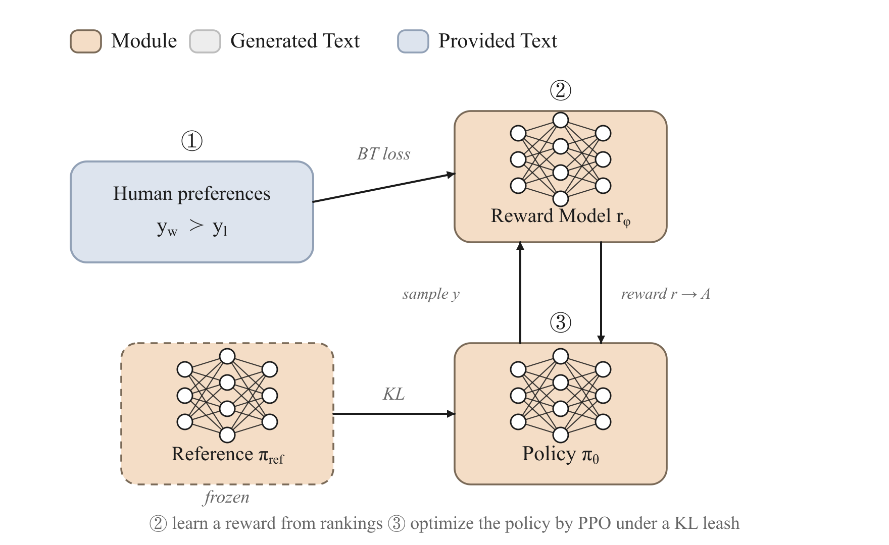

<!-- nav -->
<p align="center">
  <a href="04-preference-optimization.md">← Preference optimization</a> ·
  <a href="README.md">Index</a> ·
  <a href="../../GLOSSARY.md">Glossary</a> ·
  <a href="../05-rlhf.md">中文</a> ·
  <a href="06-rlvr-grpo.md">RLVR+GRPO →</a>
</p>
<!-- /nav -->

# RLHF / RLAIF (Reinforcement Learning from Human/AI Feedback)

> **When "good" can't be written as a loss, first learn a reward model that compresses human preference into a scalar score, then use PPO to push the policy toward higher scores while a KL leash keeps it from drifting off the rails.**



## Intuition

SFT (supervised fine-tuning) teaches a model to "imitate" — give it a reference answer and have it reproduce it token by token. But many of the things we actually want **have no reference answer you can write down**: what does "more helpful," "more honest," "better-toned," or "not preachy" even mean? These goals have no single correct string, only **relative judgments** of the form "A is better than B."

The core insight of RLHF (Reinforcement Learning from Human Feedback) is: rather than asking humans to **write** a perfect answer, let humans **pick the better of two model outputs**. Picking is far cheaper than authoring, and far more consistent too. So the whole pipeline splits into three steps (Ouyang et al., 2022, *InstructGPT*; Christiano et al., 2017):

1. **Collect preferences**: for the same prompt, sample multiple responses and have humans (or a stronger model — this is RLAIF, RL from AI Feedback) label "chosen ≻ rejected."
2. **Train a reward model (RM)**: fit a scalar function $r_\phi(x, y)$ so that the preferred response scores higher. This step distills "human taste" into a differentiable scorer.
3. **PPO reinforcement learning**: treat the language model as a policy, generate responses, score them with the RM as the reward, and use PPO to update the policy toward higher scores — but add a KL leash to stop it from gaming the RM into a monster that doesn't even recognize its own SFT starting point.

In one line: **the RM learns "what is good," PPO learns "how to get good," and KL keeps it "from going insane."**

## How it works (deep dive)

### Why we need a "learned reward"

Reinforcement learning needs a reward signal $r$. In Go the reward is obvious (win/lose); for coding problems you can run unit tests (see [RLVR](06-rlvr-grpo.md)). But conversational quality has no such programmatically decidable oracle. The key engineering compromise of RLHF is: **fit a reward function to human pairwise preferences, then use that function as the oracle.**

A reward model is usually just a language-model backbone with the LM head removed and a **scalar (value) head** swapped in: it reads $(x, y)$ and emits a real number $r_\phi(x, y)$ on the hidden state of the last non-pad token. It doesn't predict the next token, only "how good is this response."

### The data → objective → algorithm mapping

- **Data**: stage one is preference pairs `(prompt, chosen, rejected)`; stage two is a set of prompts (PPO samples its own responses online, no reference answer needed).
- **Objective**: the RM stage is the **Bradley-Terry pairwise loss**; the PPO stage is the **clipped policy-gradient surrogate objective + KL penalty**.
- **Algorithm**: the RM is ordinary supervised learning (the log-likelihood of a binary classification); PPO is an on-policy actor-critic that needs a repeated "sample → score → update" loop.

### Bradley-Terry: turning pairwise preferences into a differentiable loss

The Bradley-Terry model (Bradley & Terry, 1952) assumes: given two responses' latent scores $r_c, r_r$, the probability a human prefers chosen is

$$P(c \succ r) = \sigma(r_c - r_r), \qquad \sigma(z) = \frac{1}{1+e^{-z}}.$$

The intuition is clean: **only the score difference $r_c - r_r$ determines the preference probability**, the absolute values don't matter (shifting everything by a constant changes no preference probability, so the reward the RM learns is "scale-free" — this bites later). Training is just maximum likelihood on this Bernoulli likelihood, equivalent to minimizing $-\log\sigma(r_c - r_r)$. When the model ranks chosen ahead the margin is positive and the loss is small; when it ranks them wrong the loss is large.

### PPO: climbing the RM "mountain," but on a leash

With $r_\phi$ in hand, treat the language model $\pi_\theta$ as the policy: for a prompt $x$ sample a response $y$, and the reward is

$$R(x, y) = r_\phi(x, y) - \beta\, \mathrm{KL}\!\left[\pi_\theta(\cdot\mid x)\,\|\,\pi_{\text{ref}}(\cdot\mid x)\right].$$

The first term pushes up the RM score; the second is the **KL leash**, tethering the policy near a reference model $\pi_{\text{ref}}$ (usually just the SFT model).

PPO (Schulman et al., 2017) doesn't do naive policy gradient directly but optimizes a **clipped surrogate objective**. Its design goal: a batch of sampled data can be **reused for multiple gradient updates** without the importance ratio pushing the policy too far in one step. On each response token, define the ratio $\rho_t = \pi_\theta(a_t)/\pi_{\text{old}}(a_t)$ and optimize $\min(\rho_t A_t,\ \mathrm{clip}(\rho_t, 1{-}\epsilon, 1{+}\epsilon) A_t)$. When $\rho$ strays too far from 1, clip zeroes the gradient — effectively a "soft trust region."

The advantage $A_t$ is computed by **GAE (Generalized Advantage Estimation)** (Schulman et al., 2016), which needs a critic (value head) to estimate the expected return at each position, so it can work out "how much better than average this token is" and reduce variance. In trainall, `compute_gae(rewards, values, gamma, lam, mask)` does exactly this, and `PPOObjective` adds a value regression loss $\tfrac12(V-G)^2$ when the batch provides `values`/`returns`.

### What the model actually learns

- **The RM learns a "taste ranker"**: what it internalizes is not some gold answer, but the statistical regularity that "along these dimensions A is usually better than B." How well it generalizes directly determines what PPO will optimize toward.
- **The policy learns "how to maximize the RM's preference"** — note, the RM's preference, not the human's preference. The gap between the two is the entire story of the "Pitfalls" section below.

### Reward hacking and the KL leash

The RM is only a **proxy** for true preference; off the training distribution it makes mistakes and has exploitable blind spots. PPO is a merciless optimizer: as long as some text pattern can trick the RM into a high score (e.g. always writing super long, piling on "Of course! I'd be happy to help you," dressing up with markdown headers), it will **collapse toward that loophole**. This is **reward hacking / reward over-optimization** (Gao et al., 2023 gives scaling laws for over-optimization).

The KL penalty is the first line of defense: it penalizes the policy for straying too far from the SFT starting point, effectively saying "you may get better, but you may not become a different distribution." $\beta$ too small → too much freedom → reward hacking; $\beta$ too large → the policy barely moves → it learns nothing. Tuning $\beta$ (or an equivalent target-KL adaptive controller) is one of the central difficulties of PPO-RLHF engineering.

### Why many teams switched to DPO

PPO-RLHF needs four models in memory at once (policy, reference, reward, critic), plus an on-policy sample-score-update loop, and its hyperparameters ($\beta$, clip $\epsilon$, GAE's $\lambda$, learning rate, KL controller) are numerous and sensitive, so reproducibility is poor. [DPO](04-preference-optimization.md) (Direct Preference Optimization) proved that **under the assumptions of a Bradley-Terry RM and a KL term in the reward, the optimal policy has a closed-form solution**, letting you merge the two "RM + PPO" steps into a single **supervised loss directly on preference pairs** — no RM training, no online sampling, no critic. It "folds" the same Bradley-Terry idea into the policy itself, replacing $r_c - r_r$ with the log-ratio difference $\beta\log\frac{\pi_\theta}{\pi_{\text{ref}}}$. The cost is that DPO is off-policy, uses fixed preference data, and **cannot explore online**, so its theoretical ceiling may be lower than a well-tuned PPO.

The practical tradeoff: want fast, stable, with static preference pairs as data → DPO; want to squeeze out maximum performance, can generate online, have the capacity to tune PPO, or need more complex reward shaping → PPO-RLHF. Both share the same Bradley-Terry kernel, and understanding the RM loss is a prerequisite for understanding DPO too.

## Objective (the math)

**Stage two · Bradley-Terry reward model loss**. For a preference pair $(x, y_c, y_r)$:

$$\mathcal{L}_{\text{RM}}(\phi) = -\mathbb{E}_{(x, y_c, y_r)}\Big[\log \sigma\big(r_\phi(x, y_c) - r_\phi(x, y_r)\big)\Big].$$

- $r_\phi(x, y)$: the scalar score the reward model gives response $y$ (take the last non-pad token's hidden state through the scalar head).
- $\sigma$: sigmoid. $\sigma(r_c - r_r)$ is the probability that chosen wins.
- The loss depends only on the **score difference**, so $r_\phi$'s absolute zero is arbitrary (scale-free).
- Monitoring metrics: pairwise accuracy $= \mathbb{E}[\mathbb{1}(r_c \gt  r_r)]$, and reward margin $\mathbb{E}[r_c - r_r]$.

**Stage three · PPO clipped surrogate objective**. Write the importance ratio on response tokens as $\rho_t = \dfrac{\pi_\theta(a_t\mid s_t)}{\pi_{\theta_{\text{old}}}(a_t\mid s_t)} = \exp(\log p_\theta - \log p_{\text{old}})$, with advantage $A_t$ given by GAE, then

$$\mathcal{L}_{\text{PPO}}(\theta) = -\,\mathbb{E}_t\Big[\min\big(\rho_t A_t,\ \operatorname{clip}(\rho_t, 1-\epsilon, 1+\epsilon)\,A_t\big)\Big] \;+\; c_v\,\underbrace{\tfrac12\,\mathbb{E}_t\big[(V_\theta(s_t)-G_t)^2\big]}_{\text{value regression}} \;-\; c_e\,\mathbb{E}_t[\mathcal{H}_t] \;+\; \beta\,\mathbb{E}_t\big[\mathrm{KL}_t\big].$$

- $\epsilon$: clip range (`clip_range`, default 0.2). When the ratio leaves $[1-\epsilon, 1+\epsilon]$, this term's gradient is truncated, bounding the single-step size.
- $A_t$: GAE advantage, $A_t = \sum_{l\ge0}(\gamma\lambda)^l\,\delta_{t+l}$, $\delta_t = r_t + \gamma V(s_{t+1}) - V(s_t)$.
- $G_t = A_t + V(s_t)$: the value head's regression target (returns). $c_v$ = `vf_coef`.
- $\mathcal{H}_t$: policy entropy, encouraging exploration, $c_e$ = `ent_coef`.
- $\beta$ = `kl_coef`: the KL penalty against the reference policy (the leash).
- The reward source $r_\phi$ enters $A_t$ via GAE; in the simplest bandit setting you can also broadcast the whole response's RM score as a sequence-level advantage directly onto all response tokens.

## Data format

**RM stage** consumes a preference `Batch` (`trainall.types.Batch`), with each of the two sides carrying its own set of tokens:

```python
import torch
from trainall.types import Batch

B, T = 4, 6
cids = torch.randint(0, 37, (B, T))
rids = torch.randint(0, 37, (B, T))
batch = Batch(tensors=dict(
    chosen_input_ids=cids,                       # (B, T) preferred response
    chosen_attention_mask=torch.ones_like(cids), # (B, T)
    rejected_input_ids=rids,                     # (B, T) non-preferred response
    rejected_attention_mask=torch.ones_like(rids),
))
```

`BradleyTerryObjective` takes the score at the **last non-pad token** for chosen / rejected separately. If the backbone has no value head (`DecoderLM` does not), pass via `batch.extra["scalar_head"]` a linear head mapping the pooled hidden state to a scalar.

**PPO stage** consumes a policy-gradient-shaped `Batch`: `input_ids`, `attention_mask`, `response_mask` (marking which positions are model-generated responses vs. prompt — only response tokens count toward the loss), `advantages` (or `rewards`+`group_ids` converted by the algorithm), optionally `old_logps` (the behavior policy's log-probabilities, used for the importance ratio), `values`/`returns` (when using a critic), and `ref_logps` (when computing KL).

## Using it in trainall

Below is a minimal example that **actually ran**: use the registry to grab the Bradley-Terry objective, compute the RM loss on a chosen/rejected batch and backprop; at the end it shows the stage-three `build("ppo")` entry point (for a full PPO rollout, see the policy-gradient example in [RLVR / GRPO](06-rlvr-grpo.md)).

```python
import torch
import torch.nn as nn
import trainall
from trainall.models import DecoderLM, ArchConfig
from trainall.types import Batch

torch.manual_seed(0)

# 1) a tiny policy model, reused as the reward backbone
cfg = ArchConfig(vocab_size=37, dim=16, n_layers=2, n_heads=4, n_kv_heads=2,
                 ffn_dim=32, max_seq_len=32)
model = DecoderLM.from_config(cfg)

# 2) Bradley-Terry reward model objective (reward_model / aliases bt, rm all work)
obj = trainall.build("reward_model", category="objective")

# 3) a chosen/rejected preference batch
def ids(b=4, t=6, v=37):
    return torch.randint(0, v, (b, t))

cids, rids = ids(), ids()
batch = Batch(
    tensors=dict(
        chosen_input_ids=cids,
        chosen_attention_mask=torch.ones_like(cids),
        rejected_input_ids=rids,
        rejected_attention_mask=torch.ones_like(rids),
    ),
    # DecoderLM has no value head -> provide a scalar head mapping hidden states to a score
    extra={"scalar_head": nn.Linear(model.config.vocab_size, 1)},
)

loss, metrics = obj.compute_loss(model, batch)
print("BT loss      =", float(loss.detach()))
print("pairwise acc =", metrics["acc"])
print("reward_margin=", metrics["reward_margin"])
loss.backward()
print("grad ok      =", any(p.grad is not None for p in model.parameters()))

# Stage 3 PPO lives in the same registry: trainall.build("ppo", category="objective")
ppo = trainall.build("ppo", category="objective", clip_range=0.2)
print("ppo objective=", type(ppo).__name__)
```

Run output (CPU):

```
BT loss      = 0.6856727004051208
pairwise acc = 0.75
reward_margin= 0.015163160860538483
grad ok      = True
ppo objective= PPOObjective
```

`PPOObjective` can `compute_loss` as soon as the batch provides `advantages` / `response_mask`; the typical full chain is `Rollout` sampling → `VerifierReward`/RM scoring → `compute_group_advantages` or GAE for the advantage → `Trainer` updating with the `ppo` objective. The registry also has `recipe`-form entries directly: `trainall.build("rlvr")` / `trainall.build("frontier")`.

## When to use / when not

**A good fit for RLHF (RM + PPO):**
- The goal is **subjective/relative** (helpfulness, safety, style, honesty), no reference answer can be written, but humans can reliably "pick one of two."
- You can afford the online sampling loop, have the engineering capacity to tune PPO, and want to reach a higher ceiling than static preference data through **online exploration**.
- You need flexible reward shaping (weighting multiple RMs, mixing in rule-based rewards, a safety penalty term).

**Not a fit / consider something else first:**
- The answer has a **verifiable oracle** (math, code, SQL) → use [RLVR / GRPO](06-rlvr-grpo.md) directly, sparing you RM training and reward hacking.
- You only have **static preference pairs** and want fast, stable, reproducible → use [DPO and other preference optimization](04-preference-optimization.md), skipping the RM and online PPO.
- You haven't done solid [SFT](03-sft.md) yet → SFT first. RLHF is alignment on top of a decent SFT model, not teaching the task from scratch.

## Pitfalls & practical notes

- **Reward hacking** is the default outcome, not an accident. Be sure to watch KL, response length, and a set of held-out prompts evaluated by humans / a strong model, not just the RM score going up — RM score rising while real quality drops is the classic signal of over-optimization.
- **The KL leash $\beta$ needs tuning**. A common approach is a target-KL adaptive controller: set a per-step target KL and adjust $\beta$ dynamically. $\beta$ too small blows up into hacking, too large barely moves.
- **The RM is the ceiling**. PPO cannot optimize out a "good" the RM doesn't recognize. The RM's coverage, labeling consistency, and robustness to distribution drift determine everything; when the RM is weak, the more PPO optimizes the worse it gets.
- **Reward scale is meaningless**. Bradley-Terry only constrains the score difference, so the RM's absolute values drift; reward whitening/normalization stabilizes PPO's advantage estimates.
- **Length bias**. The RM often mistakes "longer" for "better," and PPO then writes responses ever longer. Add a length penalty or do length debiasing in RM training.
- **Four-model memory**. Policy + reference + reward + critic in memory simultaneously; use LoRA (see [LoRA / QLoRA](10-lora-qlora.md)), share the backbone, or switch to [GRPO](06-rlvr-grpo.md) (drops the critic) to save memory.
- **RLAIF's biases get inherited**. Using AI to label preferences saves money, but the judge model's taste/biases pour straight into the RM and then get amplified by PPO.

## Related

- [Preference optimization / DPO](04-preference-optimization.md) — the direct preference loss that folds RM+PPO into one step.
- [RLVR / GRPO](06-rlvr-grpo.md) — replace the learned RM with verifiable rewards; GRPO drops the critic.
- [Agentic RL](07-agentic-rl.md) — multi-step, tool-using policy optimization.
- [Process supervision / PRM](09-process-supervision.md) — reward at the step level, easing the sparsity and hacking of outcome rewards.
- [SFT](03-sft.md) — the starting point of RLHF and the source of the reference model.
- [LoRA / QLoRA](10-lora-qlora.md) — eases the multi-model memory pressure.
- Glossary: [DPO](../../GLOSSARY.md#dpo) · [PPO](../../GLOSSARY.md#ppo) · [RLHF](../../GLOSSARY.md#rlhf) · [KL](../../GLOSSARY.md#kl)
- Back to the [method index](README.md).

> References: Christiano et al. 2017 (*Deep RL from Human Preferences*); Ouyang et al. 2022 (*InstructGPT*); Schulman et al. 2017 (*PPO*); Schulman et al. 2016 (*GAE*); Bradley & Terry 1952; Gao et al. 2023 (*Scaling Laws for Reward Model Overoptimization*); Rafailov et al. 2023 (*DPO*).
