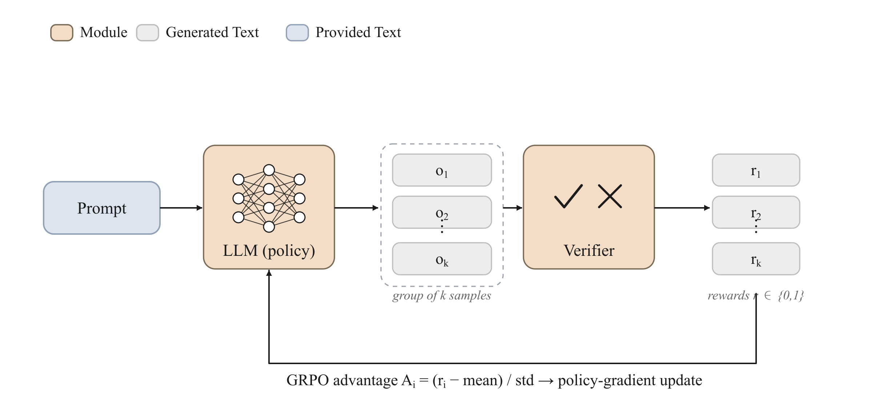

<!-- nav -->
<table width="100%"><tr><td align="left" width="30%"><a href="05-rlhf.md">← RLHF</a></td><td align="center" width="40%"><a href="README.md">📑 Index</a> · <a href="../../GLOSSARY.md">📖 Glossary</a> · <a href="../06-rlvr-grpo.md">🌐 中文</a></td><td align="right" width="30%"><a href="07-agentic-rl.md">Agentic RL →</a></td></tr></table>
<!-- /nav -->

# RLVR + GRPO (Reinforcement Learning from Verifiable Rewards + Group Relative Policy Optimization)

> **Replace the learned reward model with a "verifier" that automatically judges right from wrong, then estimate advantage by "sampling a group of answers for the same problem and comparing them within the group" — which lets you throw away the value network. This is exactly the path DeepSeek-R1 took to push reasoning ability up.**



## Intuition

In classic RLHF (see [RLHF/PPO](05-rlhf.md)), the reward comes from a **learned reward model**: you first train a scorer on human-preference data, then have the policy maximize its score. This path has two old ailments: the reward model itself can be "reward hacked," and it is only a noisy proxy for human preference — a high score does not mean the answer is actually correct.

RLVR (Reinforcement Learning from Verifiable Rewards) takes a different angle: **for tasks whose answers can be automatically judged right or wrong by a program (math, code, SQL, JSON format, ...), use a deterministic verifier directly as the reward**. `\boxed{42}` equals the reference answer `42` → reward 1; not equal → reward 0; code that passes the unit tests → 1, fails → 0. The reward is no longer "learned" but "computed" — it cannot be reward hacked, because it *is* the ground truth.

GRPO (Group Relative Policy Optimization) is the matching optimization algorithm. PPO needs a **value network** to estimate a baseline, in order to turn rewards into advantages. GRPO observes: since I can sample a whole group (say 8) of answers for the **same prompt** in one shot, the **mean reward** of that group is a natural, unbiased baseline — answers above the mean get positive advantage, those below get negative. So the value network is deleted entirely, saving half the memory and one fewer network to tune.

In one sentence: RLVR solves "where the reward comes from," GRPO solves "how to estimate the advantage." Together they form the training backbone of the 2024–2025 reasoning models (DeepSeek-R1, Tulu 3, etc.).

## How it works (deep dive)

### Breaking it down: data → reward → objective → algorithm

Split this pipeline into four layers; in trainall each layer is an independently replaceable component:

1. **data (task + reference answer)**: each sample is `(prompt, reference)`. Note that the reference is **not** a piece of demonstration text (that is the supervision signal of [SFT](03-sft.md)) but the basis for **judging** — a number, an assertion, an expected SQL result set.
2. **rollout (sample a group)**: for each prompt, sample `group_size` answers with the current policy; they share the same `group_id`. This step corresponds to `Rollout(...).group_sample(...)`.
3. **reward (verifier scoring)**: `VerifierReward` runs the verifier over each trajectory and writes back a scalar reward in `[0,1]`. This is the core of RLVR — the reward is **deterministic and parameter-free**.
4. **objective + algorithm (GRPO update)**: normalize rewards into advantages within the group, apply PPO's clipped surrogate, and do policy gradient over the response tokens.

### Why "within-group normalization" can replace the value network

The variance of the policy gradient comes mainly from the absolute scale of the reward. The REINFORCE gradient is $\nabla \log \pi \cdot r$; if all answers have rewards around 0.8, then even the worst answer gets pushed up — because its $r>0$. **Subtracting a baseline** $b$ does not change the expectation of the gradient (unbiased), yet greatly reduces variance. PPO learns this $b$ with a value network; GRPO directly uses the **within-group mean** $\bar r_g$ as $b$, then divides by the within-group standard deviation to normalize (z-score).

This replacement holds precisely because **answers in the same group come from the same prompt** — they face the same problem, so their rewards are directly comparable. The group mean is an instantaneous, unbiased estimate of that prompt's difficulty; no extra parameters are needed to fit it. The cost is: you must sample a whole group for each prompt (`group_size`× the sampling cost), and **when a group's answers are all correct or all wrong, the within-group variance is 0, the advantages are all 0, and this group produces no gradient signal at all** — which is exactly why GRPO needs prompts of moderate difficulty (a curriculum) to be efficient.

### What the model actually learns: RLVR amplifies, it does not create

This is the most easily misunderstood point. The RLVR gradient only **raises the probability of rollouts that already produce correct answers and lowers the probability of incorrect rollouts**. That is to say:

- If a prompt is **never** answered correctly across `k` samples, the group is all 0, the advantages are all 0, and **nothing is learned**.
- What RLVR **amplifies** is the correct reasoning paths that **already exist in the model's sampling distribution but at low probability** — it turns abilities the base/SFT model already "sort of has" into "reliably has," by repeatedly reinforcing the successful trajectories it sampled.
- It basically does **not create** entirely new abilities that simply do not exist in the base model's sampling space. A pass@1 improvement is often accompanied by pass@k (large $k$) staying nearly unchanged or even dropping slightly — indicating the distribution was "concentrated" onto existing good modes, rather than growing new ones.

Understanding this explains many phenomena: why high-quality SFT is usually done before RLVR (to raise the initial probability of correct paths); why the "emergent" long CoT and self-reflection ("wait, let me reconsider...") are really the result of reinforcing reflection token sequences that the base model only occasionally sampled into stable behavior, rather than learning to reflect out of thin air.

### DeepSeek-R1: taking this path to the extreme

DeepSeek-R1 (2025) demonstrated a radical version: **going straight to RLVR from the base model, without even an SFT cold start first** (R1-Zero). Using only GRPO + rule-based rewards (whether the answer is correct + whether the format is correct), the model spontaneously developed long-chain reasoning, self-checking, and backtracking. The official R1 release added a small amount of cold-start SFT on top of this to stabilize readability. Its rewards are almost all **verifiable**: math has standard answers, code has tests. From an engineering standpoint this confirms RLVR's thesis — **when the reward is verifiable, you do not need a reward model, rules are enough, and they are less prone to reward hacking**.

### The verifier zoo: a "panel of judges" for the reward signal

The ceiling of RLVR is set by the coverage of the verifiers. trainall provides a set of composable verifiers (`category='verifier'`):

| key | what it judges | what the reference is |
| --- | --- | --- |
| `math` | numeric/symbolic equivalence (extracts `\boxed{}` or the last number, with tolerance) | the standard-answer string, e.g. `"42"`, `"1/3"` |
| `code` | extracts the code block, runs the reference assertions, checks the process exit code | an `assert ...` test string |
| `sql` | builds tables and seeds data in sqlite, compares the query result set | `{schema, seed, expected_sql/expected_rows}` |
| `json` | whether it is valid JSON; optional schema validation | `None` or a JSON schema |
| `format` | whether it contains the required tags/fields (e.g. `<think>`/`<answer>`) | specified by the verifier's construction arguments |
| `regex` | whether it matches a regex | a pattern string (overridable per-call) |
| `citation` | whether quotations actually come from the given sources (anti-fabrication) | a list of source texts |
| `composite` | combines multiple verifiers with weights/logic | passed through to the sub-verifiers |

`composite` is especially important: real RLVR rewards are often a combination of **correctness × format** — R1's reward was "answer correct" plus "placed inside `<answer>`." Wiring `format` and `math` together with `CompositeVerifier(mode='weighted')` lets you shape correctness and readability at the same time.

## Objective (the math)

**Step 1: group-relative advantage.** For a group of $G$ answers $\{o_1,\dots,o_G\}$ sampled for prompt $q$, each scored by the verifier as $r_i$, the advantage is the within-group z-score:

$$A_i = \frac{r_i - \operatorname{mean}(\{r_1,\dots,r_G\})}{\operatorname{std}(\{r_1,\dots,r_G\}) + \varepsilon}$$

- $r_i$: the verifier reward of the $i$-th answer, $\in[0,1]$.
- $\operatorname{mean},\operatorname{std}$: computed **only within the same group** (trainall uses the biased std with `unbiased=False`); $\varepsilon=10^{-6}$ prevents division by zero.
- $A_i$: the within-group normalized advantage. Above the mean → positive; below → negative; a group all identical → all 0. The same $A_i$ is broadcast onto all response tokens of that answer.

**Step 2: clipped policy gradient (same form as PPO).** Let the log-probability of the $t$-th token of the $i$-th answer under the current policy be $\log\pi_\theta$, the old policy at sampling time be $\log\pi_{\text{old}}$, and the ratio $\rho_{i,t}=\exp(\log\pi_\theta - \log\pi_{\text{old}})$. The per-token loss:

$$\mathcal{L}^{\text{PG}} = -\,\mathbb{E}_{i,t}\Big[\min\big(\rho_{i,t}\,A_i,\;\operatorname{clip}(\rho_{i,t},\,1-\epsilon,\,1+\epsilon)\,A_i\big)\Big]$$

- $\epsilon$: the clip radius (`clip_range`, default 0.2), which limits the magnitude of a single update step and keeps the policy from moving too far in one step.
- $\operatorname{clip}$ together with $\min$ forms PPO's pessimistic lower bound: when the advantage is positive the upper limit is capped at $1+\epsilon$, when negative the lower limit is capped at $1-\epsilon$.
- The expectation $\mathbb{E}_{i,t}$ is averaged over the **response tokens** (selected by `response_mask`); prompt tokens are not counted.
- When no `old_logps` is provided (pure on-policy single step), $\rho\equiv 1$ and the objective degenerates to REINFORCE: $\mathcal{L}=-\mathbb{E}[A_i \log\pi_\theta]$, with the gradient still flowing normally through $\log\pi_\theta$.

**Step 3: KL penalty (k3 estimator, optional).** To prevent the policy from drifting too far from the reference policy $\pi_{\text{ref}}$, add a per-token KL term; trainall uses Schulman's **k3 unbiased low-variance estimator**:

$$\mathcal{L} = \mathcal{L}^{\text{PG}} + \beta\,\mathbb{E}_{i,t}\big[\,e^{d_{i,t}} - d_{i,t} - 1\,\big],\qquad d_{i,t}=\log\pi_{\text{ref}} - \log\pi_\theta$$

- $\beta$: `kl_coef`, the KL penalty weight (default 0, i.e. no KL).
- $e^d - d - 1$: the k3 estimator, always $\ge 0$, an unbiased estimate of $\mathrm{KL}(\pi_\theta\Vert\pi_{\text{ref}})$ with variance far smaller than the naive $-d$. When $\pi_\theta=\pi_{\text{ref}}$, $d=0$ and this term is 0.

## Data format

GRPO consumes a `trainall.types.Batch`, with the tensor layout that policy gradient conventionally expects:

- `input_ids` `(B,T)`: the token ids of the concatenated prompt + response.
- `attention_mask` `(B,T)`: the padding mask.
- `response_mask` `(B,T)`: 1 marks response tokens, 0 marks prompt tokens (the loss is computed only over the response).
- `rewards` `(B,)`: the scalar verifier reward of each trajectory.
- `group_ids` `(B,)`: the several samples of the same prompt share the same group id (the basis for normalizing the advantage within the group).
- optional `old_logps` `(B,T)`: the old policy's per-token log-probabilities at sampling time (only needed for multi-step off-policy); if not provided, the ratio is always 1.
- optional `ref_logps` `(B,T)`: the reference-policy log-probabilities, which take effect together with `kl_coef>0`.

`GRPOObjective.prepare_batch` internally computes `advantages` automatically from `rewards`+`group_ids`, so there is no need to fill them in by hand. The upstream `Trajectory` (`prompt, response, reward, group_id, advantage, meta`) is the carrier of the rollout stage — the `reference` is placed in `traj.meta["reference"]` for `VerifierReward` to pick up.

## Using it in trainall

The three segments below correspond to the three key stages of the pipeline: (a) the verifier gives a verifiable reward; (b) compute advantages within the group; (c) GRPO computes the loss + backprop on the grouped batch. All of it runs on CPU.

```python
import torch
import trainall
from trainall.types import Batch, Trajectory
from trainall.rl import compute_group_advantages
from trainall.rewards import VerifierReward

# (a) verifiable reward: right/wrong decided by a deterministic verifier (not a learned reward model)
v = trainall.build("math", category="verifier")
ok  = v.verify(r"The final answer is \boxed{42}.", reference="42")
bad = v.verify(r"\boxed{41}", reference="42")
print("math correct :", ok.reward, ok.passed)   # 1.0 True
print("math wrong   :", bad.reward, bad.passed)  # 0.0 False

# VerifierReward scores a group of Trajectory (reference goes in meta)
vr = VerifierReward("math")
trajs = [
    Trajectory(prompt="2+2?", response=r"\boxed{4}", group_id=0, meta={"reference": "4"}),
    Trajectory(prompt="2+2?", response=r"\boxed{5}", group_id=0, meta={"reference": "4"}),
]
scores = vr.score(trajs)
print("reward scores:", scores)                  # [1.0, 0.0]

# (b) group-relative advantage: within-group z-score, no value network needed
for t, r in zip(trajs, scores):
    t.reward = r
compute_group_advantages(trajs)
print("advantages   :", [round(t.advantage, 4) for t in trajs])  # [1.0, -1.0]

# (c) GRPOObjective.compute_loss on a tiny grouped Batch
from trainall.models import DecoderLM, ArchConfig
torch.manual_seed(0)
cfg = ArchConfig(vocab_size=37, dim=16, n_layers=2, n_heads=4,
                 n_kv_heads=2, ffn_dim=32, max_seq_len=32)
model = DecoderLM.from_config(cfg)

obj = trainall.build("grpo", category="objective", clip_range=0.2, kl_coef=0.0)
ids = torch.randint(0, 37, (4, 6))
response_mask = torch.ones(4, 6)
response_mask[:, :2] = 0                          # the first 2 tokens are the prompt
batch = Batch.of(
    input_ids=ids,
    attention_mask=torch.ones_like(ids),
    response_mask=response_mask,
    rewards=torch.tensor([1.0, 0.0, 1.0, 0.0]),
    group_ids=torch.tensor([0, 0, 1, 1]),        # two prompts, 2 samples each
)
loss, metrics = obj.compute_loss(model, batch)
print("grpo metrics :", {k: round(v, 4) for k, v in metrics.items()})
loss.backward()
print("has grad     :", any(p.grad is not None for p in model.parameters()))
```

Actual output:

```
math correct : 1.0 True
math wrong   : 0.0 False
reward scores: [1.0, 0.0]
advantages   : [1.0, -1.0]
grpo metrics : {'loss': 0.0, 'kl': 0.0, 'reward_mean': 0.5, 'adv_std': 1.1547}
has grad     : True
```

Note a counterintuitive but correct detail: the `loss` printed above is **0.0**, yet the gradient is nonzero all the same (the measured sum of absolute parameter gradients ≈ 27.4). The reason is that when no `old_logps` is passed the ratio is $\rho\equiv 1$, so the per-token loss equals $-A_i$; the advantages are zero-sum within each group ($+1$ and $-1$), so the per-token mean cancels exactly to 0. But the gradient path of `loss = -mean(A_i * logp_detached_ratio)` still flows through $\log\pi_\theta$ — a positive gradient pushes up the token probability of positive-advantage answers and pushes down that of negative-advantage answers. **The numeric value of the loss is not a reliable indicator of whether training is progressing; look at the gradient and the reward mean.**

## When to use / when not

**Good fit for RLVR + GRPO:**
- The correctness of the task **can be judged by a program**: math, competition problems, code (with tests), SQL, structured extraction, verifiable formats. This is the necessary and sufficient condition.
- You already have a **decent SFT/base model** that at least occasionally samples correct answers for the target task (otherwise the group is all wrong and learning stalls).
- You want to avoid the reward hacking and training cost of a reward model, and you are after DeepSeek-R1-style reasoning improvements.

**Not a fit / use with caution:**
- The reward **cannot be automatically verified**: open-ended writing, conversational style, "which response is more helpful" — these are the territory of preference/RLHF (see [Preference optimization](04-preference-optimization.md), [RLHF](05-rlhf.md)).
- Prompts are all "too hard" (pass@k≈0) or "too easy" (pass@k≈1): the former gives no gradient, the latter has zero within-group variance, and both ends waste the sampling.
- Compute is extremely tight: GRPO samples a whole group per prompt, so the sampling cost is `group_size`× that of a single sample.
- You only want to inject basic abilities rather than reinforce existing ones: in that case do [SFT](03-sft.md) or [continued pretraining](02-continued-pretraining.md) first.

## Pitfalls & practical notes

- **All-correct/all-wrong group = zero gradient.** When the within-group variance is 0 the advantages are all 0 and the group is completely wasted. Either use a curriculum to control difficulty (`Curriculum` keeps the pass rate within `target_low~target_high`), or simply discard zero-variance groups.
- **The loss value is misleading.** As shown above, a balanced within-group loss can be constantly 0 while training is fine. Monitor `reward_mean` (should rise with training), `adv_std`, and external evaluation's pass@1; do not fixate on the loss.
- **The verifier must be strict and side-effect-free.** A lax verifier will be exploited by the policy — for example, if `math` only extracts "the last number," the model may learn to pile answers at the end without truly reasoning; the `code` verifier must be sandboxed/time-limited, otherwise malicious code will drag training down. Prefer `composite` to fold format constraints into the reward as well.
- **RLVR amplifies rather than creates.** If the base model's pass@k (large $k$) for some ability is simply 0, RLVR cannot help — first use SFT to raise the probability of the correct paths. RLVR is "sharpening," not "creation from nothing."
- **KL is a stabilizer, not a necessity.** R1-Zero does not even add KL. But if you find the policy output degenerating (repetition, gibberish, language drift), raise `kl_coef` to pull it back near the reference policy. trainall uses the k3 estimator, with smaller variance than naive KL.
- **Do not miscompute `response_mask`.** Compute the loss only over response tokens; counting prompt tokens in will pollute the gradient. In the Batch, `response_mask[:, :prompt_len] = 0`.
- **The trade-off of `group_size`.** Too small (e.g. 2) makes the baseline estimate noisy; too large makes sampling expensive. In practice 8–16 is common.
- **Reward scale.** The verifier output is best kept in `[0,1]`; the within-group z-score normalizes the scale automatically, but extremely sparse rewards (almost all 0) will still degenerate most groups.

## Related

- [RLHF / PPO](05-rlhf.md): the classic route using a **learned** reward model + value network; GRPO is precisely the evolution that deletes the value network, and RLVR is precisely the one that replaces the reward model.
- [Preference optimization (DPO, etc.)](04-preference-optimization.md): the alternative when the reward is not verifiable and only pairwise preferences are available.
- [Agentic RL](07-agentic-rl.md): extending the single-step verifier reward to multi-step tool-calling environments (`AgenticRunner`, `MultiStepEnv`).
- [Process supervision (PRM)](09-process-supervision.md): a dense reward signal that scores **each step** of the reasoning rather than the final answer.
- [SFT](03-sft.md): the cold start that raises the initial probability of correct paths before RLVR.
- [Distillation and self-play](08-distillation-and-selfplay.md): using `RejectionSampler`/`SelfPlayLoop` together with a verifier to automatically generate RLVR training data.
- Glossary: [GRPO](../../GLOSSARY.md#grpo) · [RLVR](../../GLOSSARY.md#rlvr) · [advantage](../../GLOSSARY.md#advantage) · [KL penalty](../../GLOSSARY.md#kl-penalty) · [verifier](../../GLOSSARY.md#verifier)
- Back to the [method index](README.md)
