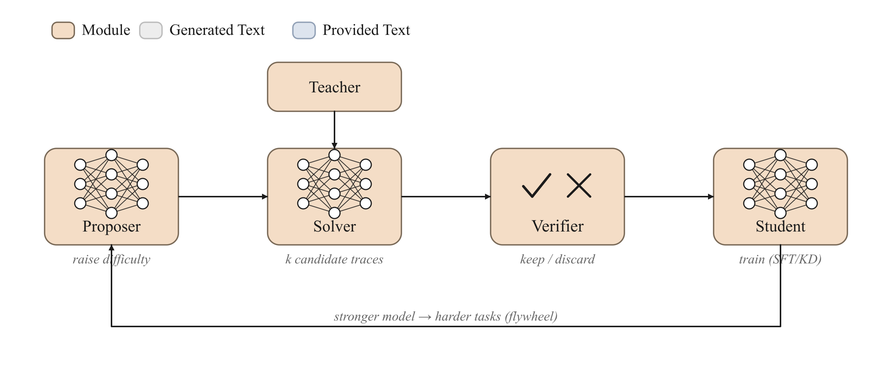

<!-- nav -->
<table width="100%"><tr><td align="left" width="30%"><a href="07-agentic-rl.md">← Agentic RL</a></td><td align="center" width="40%"><a href="README.md">📑 Index</a> · <a href="../../GLOSSARY.md">📖 Glossary</a> · <a href="../08-distillation-and-selfplay.md">🌐 中文</a></td><td align="right" width="30%"><a href="09-process-supervision.md">Process supervision →</a></td></tr></table>
<!-- /nav -->

# Distillation & the Synthetic-Data Flywheel

> **Use a stronger "teacher" or a cheap "judge" to manufacture supervision signals, so the model repeatedly learns from its own (or someone else's) verifiable successes — that is distillation and the data flywheel.**



## Intuition

The bottleneck of supervised fine-tuning (SFT) has never been the algorithm — it is the **data**: high-quality "question–answer" pairs are expensive and scarce. This chapter covers two routes that bypass human labeling and let the model manufacture its own data / grow its own skills. They often combine into a single **data flywheel**:

1. **Knowledge distillation (KD)**: you have a stronger teacher model. Rather than only telling the student "the correct answer is token #42," you hand the student the teacher's **full probability distribution** at every position (soft targets, soft labels) to imitate. Soft labels carry the teacher's **dark knowledge** — which tokens besides 42 it also considers plausible, and which are utterly impossible. This is far more informative than one-hot hard labels.

2. **Verifiable data flywheel**: you have no stronger teacher, but you do have a **cheap verifier** — a piece of code that judges right or wrong (math-answer matching, unit tests, JSON schema validation). So you let the model **sample many answers** itself, keep the correct ones via the judge, throw away the wrong ones, and the kept correct answers become new SFT data. The model fine-tunes on "the problems it occasionally gets right," and the next round it gets them right more often — that is the flywheel spinning up.

This idea has three increasingly engineered forms, each corresponding to a component in trainall:

- **Rejection sampling (best-of-N)**: the questions are fixed; for each question you sample N answers and keep the ones the judge passes.
- **SyntheticDataEngine**: even the questions are produced by the proposer itself, forming a complete `propose → solve → verify → keep` closed loop.
- **SelfPlayLoop + Curriculum**: multiple iterative rounds, with question difficulty **automatically adjusted** based on the current pass rate, keeping the model in the "reachable but not trivial" learning zone.

One sentence to tell them apart: **distillation is "copy from someone smarter," the flywheel is "self-practice repeatedly on problems you can grade."** The two are often chained — the flywheel manufactures clean data, which is then fed back to the model via SFT or KD.

## How it works (deep dive)

### Distillation: why soft labels beat hard labels

Consider a classification (or next-token-prediction) problem. The cross-entropy (CE) of hard labels only constrains the probability of the **correct class** toward 1, pressing every other wrong class indiscriminately toward 0. But the teacher knows finer structure: in "cat vs dog vs car," mistaking a cat for a dog is far more reasonable than mistaking it for a car. The teacher's output distribution $p_{\text{teacher}}=(0.9, 0.09, 0.01)$ encodes this **inter-class similarity structure**, which Hinton et al. (2015) called dark knowledge.

To surface this "non-maximum-probability" information, distillation introduces **temperature** $T$: divide the logits by $T$ before softmax. $T>1$ "softens" the distribution, amplifying the relative differences among the small probabilities that were originally near 0, so the student can learn them. The student uses the **same** $T$ to match the teacher's soft distribution. After training, inference uses $T=1$.

A key detail: because the gradient magnitude of soft labels shrinks by $1/T^2$, the distillation loss must be multiplied back by $T^2$, making its gradient magnitude comparable to the hard-CE term and easy to mix with weights. This is exactly where `kd = (T*T) * masked_mean(kl_tok, mask)` in trainall's `DistillObjective` comes from.

**Forward vs Reverse KL — an underrated choice:**

- **Forward KL** $\mathrm{KL}(p_{\text{teacher}}\Vert p_{\text{student}})$ is **mass-covering**: wherever the teacher assigns probability, the student is forced to cover it, otherwise the $\log$ term explodes. The result is that the student tends to "flatten out" to cover all of the teacher's modes — the classic default choice for offline distillation.
- **Reverse KL** $\mathrm{KL}(p_{\text{student}}\Vert p_{\text{teacher}})$ is **mode-seeking**: the student only needs to put its probability mass where the teacher also approves, tending to **lock onto one of the teacher's main modes** while ignoring the long tail. Recent on-policy / sequence-level distillation (e.g. MiniLLM) finds that for generative language models, reverse KL often avoids the "assigning probability in regions the teacher would never actually generate, producing incoherence" problem of forward KL.

trainall switches between them with `kind="forward"` (default) / `kind="reverse"`, and lets `alpha` interpolate between the KD term and the hard-CE anchor: `total = alpha*KD + (1-alpha)*CE`. Keeping a bit of CE (`alpha<1`) is like giving the student an anchor that says "don't forget the real ground truth," and is often more stable than pure distillation.

### The flywheel: a data → objective → algorithm view

Viewing the flywheel through this repo's consistent three-part framework:

- **data (where it comes from)**: no longer from human labeling, but from the product of three callable objects: `proposer/solver/verifier`. The `proposer` poses questions, the `solver` (usually just the current model) samples N answers, and the `verifier` grades them. **Verification being cheaper than generation** is the premise on which the whole paradigm stands — a math-problem answer is known right or wrong by simple comparison, code is known by running its tests once, but generating a correct solution is hard. This "easy-to-verify, hard-to-generate" asymmetry is the energy source of the flywheel.
- **objective (what to learn)**: the kept `(prompt, response)` are trajectories **verified to be correct**, and can be fed to the standard SFT objective directly; if teacher logits are available, KD is an option. What the model actually learns is to "turn the reasoning paths it occasionally gets right into stable behavior."
- **algorithm (how to update)**: full / LoRA / QLoRA all work; the flywheel only manufactures data and is orthogonal to the parameter-update algorithm.

This is exactly the core of **STaR (Zelikman et al., 2022)** and **Rejection-sampling Fine-Tuning (RFT)**: the model bootstraps a training set from its own verifiable successes. It shares the same verifiable reward signal with RLVR (see [RLVR / GRPO](06-rlvr-grpo.md)); the difference is that the flywheel turns the signal into **offline SFT data** (simple, stable, reusable), while RLVR turns the signal into an **online policy gradient** (more sample-efficient but harder to tune). Many teams use both: cold-start with the flywheel first, then refine with RLVR.

### Best-of-N: why "learn only from successes" works

For a base model, the probability $p$ of getting a hard problem right in a single sample may be very low; but the probability of getting it right at least once in N samples is $1-(1-p)^N$, which rises quickly with N. Rejection sampling exploits exactly this: **trade many inference-time samples for one correct trajectory**, then distill it into training data. `keep="best"` keeps the highest-reward one, `keep="all"` keeps all that pass (more data but more homogeneous), and `keep="first"` saves the most compute. Note that learning only from correct trajectories introduces **survivorship bias** — the model sees only successes, never failures — so the flywheel usually pairs with a bit of original-data replay, or hands the job to RLVR to explicitly exploit negative samples.

### Curriculum and anti-collapse: keeping the flywheel turning

The most dangerous failure mode of the flywheel is **distribution collapse**: the proposer repeatedly poses nearly identical questions, the solver repeatedly gives nearly identical answers, data diversity collapses, and the model overfits to a tiny handful of modes while its overall ability degrades (so-called model collapse). `Curriculum` counters this with two mechanisms:

1. **Adaptive difficulty (zone of proximal development)**: observe each round's `pass_rate`. Above `target_high` (default 0.8) means the questions are too easy → difficulty `+step`; below `target_low` (default 0.4) means too hard, with almost no correct trajectories to learn from → difficulty `-step`; in between → `hold`. Pinning the model to the "reachable but not trivial" band is the key to producing useful gradients — too easy and nothing new is learned, too hard and there are no passing samples.
2. **Diversity monitoring (anti-collapse)**: each round computes the unique fraction of prompts `diversity = #unique / #total`; below `min_diversity` it records a `collapsed` warning in `history`, prompting you to add noise to the proposer, broaden topics, or inject external seeds.

`SelfPlayLoop` chains these together: each round poses `tasks_per_round` questions at the current difficulty, samples `k` candidates per question, verifies, deduplicates, and keeps; finally it uses this round's pass rate to `update` the curriculum and moves to the next round.

## Objective (the math)

**Distillation loss (`DistillObjective`).** Let the student / teacher logits at some token position be $z^s, z^t$, with temperature $T$. The soft distributions are

$$
p^s_i = \frac{\exp(z^s_i / T)}{\sum_j \exp(z^s_j / T)}, \qquad
p^t_i = \frac{\exp(z^t_i / T)}{\sum_j \exp(z^t_j / T)}.
$$

The KD term is the temperature-scaled KL, multiplied by $T^2$ to restore the gradient magnitude:

$$
\mathcal{L}_{\text{KD}} = T^2 \cdot \mathrm{KL}\!\left(p^t \,\Vert\, p^s\right)
= T^2 \sum_i p^t_i \big(\log p^t_i - \log p^s_i\big) \quad (\text{forward}),
$$

or the reverse variant (swap roles, seek the mode):

$$
\mathcal{L}_{\text{KD}}^{\text{rev}} = T^2 \sum_i p^s_i \big(\log p^s_i - \log p^t_i\big) \quad (\text{reverse}).
$$

Mixed with hard-label CE ($y$ is the ground-truth token, $q^s$ the student probability at $T=1$):

$$
\mathcal{L} = \alpha\, \mathcal{L}_{\text{KD}} + (1-\alpha)\, \underbrace{\big(-\log q^s_{y}\big)}_{\mathcal{L}_{\text{CE}}}.
$$

Symbols: $T$ is temperature ($T>1$ softens the distribution); $\alpha\in[0,1]$ weights KD against CE ($\alpha=1$ pure distillation, $\alpha=0$ pure supervision); $\mathrm{KL}$ is computed per token and then masked-averaged by `response_mask` (default: the attention mask), distilling only over the answer region; $T^2$ cancels temperature's $1/T^2$ scaling of the gradient magnitude.

**The flywheel's "objective" — a data-filtering operator.** The flywheel itself is not a differentiable loss but a keep operator. Given a question $x$, a reference answer $r$, and a judge $V$ ($V(y,r)\in\{0,1\}$ pass or not), sample $N$ answers from the solver $\pi$; the kept set is

$$
\mathcal{D}_x = \big\{\, y^{(i)} \;:\; y^{(i)} \sim \pi(\cdot\mid x),\; V(y^{(i)}, r)=1,\; i=1\dots N \,\big\},
$$

which then enter the SFT/KD objective. The per-question pass rate $\hat p_x = \tfrac{1}{N}\sum_i V(y^{(i)},r)$ is used both to label difficulty and to drive the curriculum:

$$
d \leftarrow
\begin{cases}
\min(1,\; d + \text{step}), & \bar p > \text{target\_high} \\
\max(0,\; d - \text{step}), & \bar p < \text{target\_low} \\
d, & \text{otherwise}
\end{cases}
\qquad \bar p = \frac{\sum_{\text{round}} \mathbf{1}[\text{pass}]}{\#\text{candidates}}.
$$

## Data format

The flywheel components consume **plain Python callables**, do not depend on torch, and are fully testable:

- `proposer() -> task`: returns a question. The `task` can be a `str`, a `(prompt, reference)` tuple, a `{"prompt": ..., "reference": ...}` dict, or a `Sample`.
- `solver(prompt) -> response | [responses]`: returns 1 or more candidate answers (strings).
- `verifier(response, reference) -> VerifierResult | bool | float`: grades; trainall's `Verifier` (such as `MathVerifier`) is also usable directly and internally calls `.verify(response, reference, prompt=...)`.

The output is uniformly a list of `trainall.types.Sample`, each carrying `prompt / response / reference / meta`, with `meta` recording `pass_rate`, `difficulty`, source flags (`synthetic` / `rejection_sampled` / `self_play`), and so on. These `Sample`s can go straight into `InMemorySource` → SFT (see [SFT](03-sft.md)).

`DistillObjective` consumes a tensor `Batch` (`trainall.types.Batch`):

- `input_ids` `(B, T)`, `attention_mask` `(B, T)`,
- `labels` `(B, T)` (`-100` means ignore, used for the hard-CE anchor; can be omitted when `alpha=1`),
- **crucial**: `batch.extra["teacher_logits"]` with shape `(B, T, V)`, obtained from a frozen teacher forward pass,
- optional `response_mask` `(B, T)` specifying to distill only over the answer region (defaults to the attention mask).

## Using it in trainall

Below is a minimal example that has actually been run and passed, all on CPU, exercising the flywheel trio without needing any model (`MathVerifier` matches answers via `\boxed{}`):

```python
from trainall.data import (
    RejectionSampler, SyntheticDataEngine, SelfPlayLoop, Curriculum, TaskProposer,
)
from trainall.verifiers import MathVerifier

# solver: solves "add a+b", deliberately gives two correct and one wrong, simulating random sampling
def solver(prompt):
    a, b = prompt.replace("add ", "").split("+")
    s = int(a) + int(b)
    return [rf"\boxed{{{s}}}", r"\boxed{0}", rf"\boxed{{{s}}}"]

# 1) Rejection sampling: best-of-N, keep the trajectories the judge passes
rs = RejectionSampler(solver, MathVerifier(), n=3, keep="all")
kept = rs.run([{"prompt": "add 19+23", "reference": "42"}])
print("[RS] kept", len(kept), "| resp =", kept[0].response,
      "| pass_rate =", kept[0].meta["pass_rate"])

# 2) SyntheticDataEngine: the proposer poses its own questions, propose -> solve -> verify -> keep
counter = {"i": 0}
def proposer():
    counter["i"] += 1
    n = counter["i"]
    return {"prompt": f"add {n}+{n}", "reference": str(2 * n)}

engine = SyntheticDataEngine(proposer, solver, MathVerifier(), k=2, keep_per_task="first")
syn = engine.generate(3)
print("[SDE] generated", len(syn),
      "| difficulties =", [s.meta["difficulty"] for s in syn])

# 3) SelfPlayLoop + Curriculum: multiple rounds, difficulty auto-adjusted by pass rate
loop = SelfPlayLoop(
    TaskProposer(lambda difficulty=0.5: {"prompt": "add 1+1", "reference": "2"}),
    lambda p: r"\boxed{2}",
    MathVerifier(),
    curriculum=Curriculum(difficulty=0.2, step=0.1),
    rounds=2, tasks_per_round=2, k=2,
)
sp = loop.run()
print("[SP] retained", len(sp),
      "| decisions =", [h["decision"] for h in loop.curriculum.history],
      "| final difficulty =", loop.curriculum.difficulty)
```

Actual output:

```
[RS] kept 2 | resp = \boxed{42} | pass_rate = 0.6666666666666666
[SDE] generated 3 | difficulties = ['medium', 'medium', 'medium']
[SP] retained 1 | decisions = ['harder', 'harder'] | final difficulty = 0.4
```

Drop the `Sample`s from `kept` / `syn` / `sp` into `InMemorySource` and you can hook them to `Trainer` for SFT.

On the distillation side, use `DistillObjective` (requires torch + teacher logits); it has been measured to forward + backward:

```python
import torch, trainall
from trainall.types import Batch
from trainall.models import DecoderLM, ArchConfig

cfg = ArchConfig(vocab_size=64, dim=32, n_layers=2, n_heads=4,
                 n_kv_heads=2, ffn_dim=64, max_seq_len=64)
student = DecoderLM.from_config(cfg)

obj = trainall.build("distill", category="objective", alpha=0.5, temperature=2.0, kind="forward")
ids = torch.randint(0, cfg.vocab_size, (2, 6))
batch = Batch.of(input_ids=ids, attention_mask=torch.ones_like(ids), labels=ids.clone())
batch.extra["teacher_logits"] = torch.randn(2, 6, cfg.vocab_size)   # (B, T, V) frozen teacher
loss, metrics = obj.compute_loss(student, batch)
loss.backward()
print(f"[KD] loss={float(loss.detach()):.4f}  kd={metrics['kd']:.4f}  ce={metrics['ce']:.4f}")
# -> [KD] loss=2.3006  kd=0.4735  ce=4.1278   (varies with the random seed)
```

In a real scenario `teacher_logits` come from the forward pass of a larger frozen model; using `kind="reverse"` with `alpha=1.0` switches to pure reverse-KL on-policy distillation.

## When to use / when not

**Use distillation when**: you have a stronger teacher (a larger model, an ensemble, or a strong pipeline with tools/CoT) and want to compress its capability into a smaller/faster student; or you want model compression, faster inference, or merging multiple experts into one.

**Use the flywheel when**: you have **programmatically verifiable** tasks (math, code, SQL, structured output) but lack human labels; you want to cold-start SFT data cheaply; or you want to lift the model to a reasonable starting point with stable offline data before RLVR.

**Don't use distillation when**: there is no teacher stronger than the current model (distilling toward a same-level model only propagates its errors and is not worth it); or the teacher and student have inconsistent tokenizers / vocabularies (logits don't line up, requiring sequence-level rather than token-level distillation).

**Don't use the flywheel when**: the task **cannot be cheaply verified** (open-ended writing, subjective preference — in which case you should go to preference optimization, see [Preference optimization](04-preference-optimization.md)); the judge itself systematically misjudges (it will lock wrong answers as correct into the data); or the proposer lacks diversity and collapses within a few rounds.

## Pitfalls & practical notes

- **The judge is the ceiling**: flywheel data quality is hard-capped by the verifier's precision. A verifier's false positives lock wrong answers in as positive examples, which is worse than missing data. Always unit-test the judge before going live (see [verifier tests](../../GLOSSARY.md#verifier)); prefer strict (missing some true positives) over lax (admitting false positives).
- **Actively monitor distribution collapse**: watch `diversity` and `collapsed` in `Curriculum.history`. Once diversity drops, perturb the proposer, broaden topics, mix in external seed questions, or cap consecutive self-training rounds. Iterating indefinitely on purely self-produced data almost inevitably degrades.
- **Don't confuse temperature with inference**: distillation's $T$ is used only during training to soften soft labels, and the student learns the $T$-scaled distribution; inference uses $T=1$. Forgetting to multiply by $T^2$ makes the KD term's gradient too small at large $T$, so it barely updates.
- **Keep a bit of the hard-CE anchor**: pure distillation (`alpha=1`) easily lets the student drift toward the teacher's systematic biases; mixing in `(1-alpha)` of CE anchors it back to the true labels and is usually more stable.
- **Best-of-N survivorship bias**: learning only from correct trajectories means the model never sees failure modes. Either supplement with a bit of original mixed data, or leave negative samples for RLVR to exploit explicitly.
- **Deduplicate but don't remove diversity**: `dedup=True` removing exactly identical `(prompt, response)` pairs is correct, but if your solver always outputs the same correct solution, the remaining samples are still homogeneous — diversity comes from sampling temperature and the proposer, not from deduplication.
- **N / k are compute-quality knobs**: larger N gets more correct answers and cleaner data, but inference cost rises linearly. Increase N for hard tasks, decrease for easy ones, or use curriculum difficulty to indirectly control N's effective return.

## Related

- [SFT](03-sft.md) — the `Sample`s the flywheel produces are ultimately learned through it.
- [RLVR / GRPO](06-rlvr-grpo.md) — the online counterpart route that shares the verifiable reward signal with the flywheel.
- [Agentic RL](07-agentic-rl.md) — self-play and trajectory collection in multi-step environments.
- [Process supervision / PRM](09-process-supervision.md) — replacing the terminal judge with finer-grained step rewards.
- [Preference optimization](04-preference-optimization.md) — the alternative when programmatic verification is impossible.
- [LoRA / QLoRA](10-lora-qlora.md) — parameter-efficient fine-tuning on distillation/flywheel data.
- Glossary: [distill](../../GLOSSARY.md#distill), [verifier](../../GLOSSARY.md#verifier), [rejection-sampling](../../GLOSSARY.md#rejection-sampling), [self-play](../../GLOSSARY.md#self-play), [curriculum](../../GLOSSARY.md#curriculum).
- Back to overview: [README](README.md).
