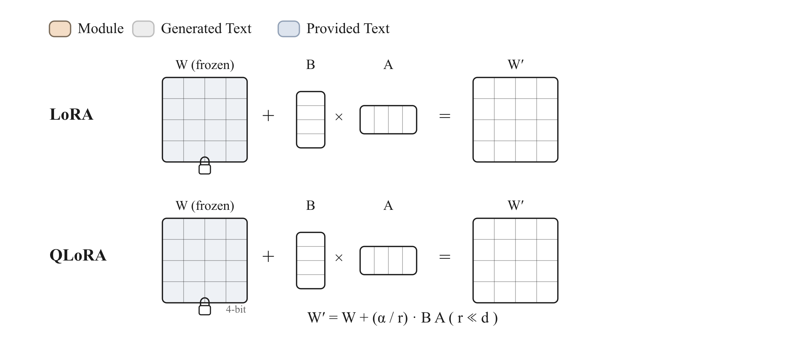

<!-- nav -->
<table width="100%"><tr><td align="left" width="30%"><a href="09-process-supervision.md">← Process supervision</a></td><td align="center" width="40%"><a href="README.md">📑 Index</a> · <a href="../../GLOSSARY.md">📖 Glossary</a> · <a href="../10-lora-qlora.md">🌐 中文</a></td><td align="right" width="30%"><a href="11-architectures.md">Architectures →</a></td></tr></table>
<!-- /nav -->

# LoRA / QLoRA / Full Finetune

> **The efficiency axis: without changing the training objective, it decides "which parameters to train and how much memory to use"—turning the frozen pretrained weights $W$ into a parallel low-rank trainable increment $\frac{\alpha}{r}BA$.**



## Intuition

Every method document so far ([SFT](03-sft.md), [preference optimization](04-preference-optimization.md), [RLVR](06-rlvr-grpo.md)…) has been about the **objective**: what the training signal looks like and how the loss is computed. This document covers an **orthogonal** axis: the **algorithm**—for the same objective, you can choose to "train all parameters" or "train only a small handful."

The intuition is simple. A 7B model has 7 billion weights. Full finetune has to store a gradient and optimizer state for every weight (Adam additionally stores first- and second-order momenta, roughly 2× the weight size), so memory easily runs to more than 4× the model itself. But both experience and theory show that **the change $\Delta W$ that finetuning makes to the weights is often "low-rank"**—it lives in a subspace whose dimension is far smaller than that of $W$. That being so, rather than directly learning a full-rank $\Delta W$, it is better to factor it into a product of two tall-thin matrices $B$ ($d\times r$) and $A$ ($r\times k$), learning only these two small matrices, with $r$ as low as 8 or 16 being enough.

- **LoRA**: freeze $W$, attach a low-rank branch $\frac{\alpha}{r}BA$ in parallel beside it, and train only $A,B$. The trainable parameters are often just 0.1%–1% of the whole model.
- **QLoRA**: on top of LoRA, further compress the frozen base to 4-bit (NF4), cutting memory by roughly another 4×—making single-GPU finetuning of 65B possible.
- **Full finetune**: nothing is saved; all parameters are trained. It is the quality ceiling, and also the memory ceiling.

The key insight: **none of these three changes the loss**. You can pair any objective (SFT, DPO, GRPO) with any algorithm (full, lora, qlora). In trainall this is precisely the two independent arguments of `Trainer(model, objective, algorithm=...)`.

## How it works (deep dive)

### The three-layer framework: data → objective → algorithm

trainall splits a training run into three mutually orthogonal layers:

1. **datasource / data**: where the data comes from and what it looks like.
2. **objective**: turns the data into a scalar loss (this is "what to learn").
3. **algorithm**: decides "which parameters this loss takes gradients for, and in what form the parameters exist" (this is "how to economize").

The `algorithm` does just one thing: `prepare_model(model) -> model`, reshaping the model into a form where "only the parameters that should be trained have `requires_grad=True`," and exposing `trainable_parameters(model)` for the optimizer to use. It is completely transparent to the semantics of the forward pass and to the shape of the loss.

### Why $\Delta W$ can be low-rank

Pretraining has already compressed general capabilities into $W$. Downstream adaptation (learning a style, a domain, a preference) is essentially a "small rotation/translation" on this high-dimensional representation; the "intrinsic dimension" that needs to change is very low (Aghajanyan et al., 2020 found empirically that many tasks can be finetuned to completion within a subspace of just a few hundred dimensions). LoRA (Hu et al., 2021) engineers this observation: it directly **constrains** the rank of $\Delta W$ to be at most $r$, forcing the optimizer to search only within this low-rank subspace.

A frozen linear layer $y=Wx$, after adding LoRA, becomes:

$$y = Wx + \frac{\alpha}{r}\,B(Ax)$$

where $W\in\mathbb{R}^{d\times k}$ is frozen, $A\in\mathbb{R}^{r\times k}$ and $B\in\mathbb{R}^{d\times r}$ are trainable, and $r \ll \min(d,k)$.

### What each of the three hyperparameters does

- **`r` (rank)**: the upper bound on the expressive capacity of the increment. The larger $r$ is, the closer to the flexibility of full finetune, but the trainable parameters grow linearly. Common values are 8/16/32; for hard tasks or large-magnitude style transfer you can go up to 64.
- **`alpha` (scaling numerator)**: the actual scaling factor is $\frac{\alpha}{r}$. It decouples the magnitude of the low-rank branch from the base—so when you change `r` you don't have to retune the learning rate. A common convention is `alpha = 2r` (trainall defaults to `r=8, alpha=16`, exactly $\alpha/r=2$).
- **`target_modules` (injection sites)**: which `nn.Linear` layers get replaced by `LoRALinear`. The default covers attention's `q/k/v/o_proj` and the FFN's `gate/up/down_proj`. The minimal configuration often attaches only to `q_proj,v_proj` (the original paper's approach); to squeeze out more quality, attach the FFN as well.

### The subtlety of initialization: $B=0$ makes training start exactly from the base

trainall's `LoRALinear` applies kaiming initialization to $A$ and **initializes $B$ to zero**. So at $t=0$, $\Delta W = \frac{\alpha}{r}BA = 0$, and the adapted layer is **bit-for-bit equal** to the original base—training is a smooth finetune starting from the "known good point" of the pretrained model, not from a random perturbation. This is exactly the property verified by the test `test_lora_starts_as_noop`.

### How "freeze and train only the adapter" is actually implemented

The flow of `prepare_model` (see `src/trainall/algorithms/lora.py`):

1. First set `requires_grad_(False)` on all model parameters—freeze everything in one stroke.
2. Walk the module tree; for every `nn.Linear` whose attribute name matches `target_modules`, replace it in place with `LoRALinear(child, r, alpha, dropout)`. Internally `LoRALinear` holds the frozen `base` (the original weights) and creates two new **trainable** parameters, `lora_A` and `lora_B`.
3. Result: the only parameters carrying gradients are each layer's `lora_A/lora_B`. The optimizer allocates state only for them, and memory drops sharply.

### QLoRA: compress the frozen base to 4-bit NF4

The insight of QLoRA (Dettmers et al., 2023): **since the base is frozen, the forward pass only reads it and never writes to it, so its precision can be very low**. The concrete approach (`qlora.py`): before attaching LoRA, quantize the weights of the target linear layers to 4-bit using bitsandbytes' `Linear4bit`:

- **NF4 (4-bit NormalFloat)**: a 4-bit data type that is information-theoretically optimal for "weights that are approximately normally distributed," fitting the actual distribution of the weights better than ordinary int4/fp4.
- **double quantization**: even the scaling constants used for quantization are themselves quantized again, saving roughly another 0.4 bit per parameter.
- **dequantize at compute time**: during the forward pass the 4-bit weights are temporarily dequantized to bf16 to participate in the matrix multiply, and **gradients flow only to the high-precision LoRA adapter**—the base is never updated, so its low precision is not amplified by the optimizer into accumulating error.

This way a single GPU with 48GB of memory can finetune a 65B model, with quality essentially on par with 16-bit LoRA. trainall's implementation is a "soft dependency": real 4-bit quantization happens only if `bitsandbytes` is installed; without it, a warning is printed and it degrades to "full-precision base + LoRA," which is still logically runnable (convenient for CPU testing).

### Merge: at deployment, fold the adapter back into the base, with zero extra overhead

During training, LoRA is "base + bypass," two paths, with one extra small matrix multiply. At deployment you don't want this overhead, so you **fold** the increment back into the weights:

$$W' \leftarrow W + \frac{\alpha}{r}BA$$

`merge_lora(model)` walks all `LoRALinear` layers and calls `.merge()`: it adds $\frac{\alpha}{r}(BA)$ into `base.weight`, then zeroes out `lora_B` (guaranteeing idempotence), and finally replaces the `LoRALinear` with this ordinary `nn.Linear`. After merging, the forward pass is **numerically equivalent** to before merging (the test `test_lora_merge_equivalence` verifies this to `atol=1e-5`), but the model returns to a standard `nn.Linear`, with no trace of LoRA left in the inference graph. Note: merging 4-bit QLoRA requires dequantizing the base first, otherwise there will be quantization error; typically you merge onto an fp16/bf16 copy and then deploy.

## Objective (the math)

LoRA by itself is **not an objective function**—it does not change the loss, only the "parameterization." Writing it out clearly takes two layers.

**The forward pass of the adapted layer** ($h=Wx$ is replaced by):

$$h = Wx + \Delta W x = Wx + \frac{\alpha}{r}\,B A\,x,\qquad B\in\mathbb{R}^{d\times r},\; A\in\mathbb{R}^{r\times k}$$

- $W\in\mathbb{R}^{d\times k}$: the frozen pretrained weights, with $\nabla_W=0$ (not involved in optimization).
- $A,B$: the only trainable parameters; $A$ is kaiming-initialized, $B$ is initialized to $0$, so the initial $\Delta W=0$.
- $r$: the rank, constraining $\mathrm{rank}(\Delta W)\le r$.
- $\frac{\alpha}{r}$: the scaling factor, decoupling the magnitude of the low-rank branch from $r$.

**The optimization objective** is then **any objective $\mathcal{L}$ you choose** (SFT's cross-entropy, DPO's preference logistic loss, etc.); the only difference is that gradients are taken only with respect to $\theta_{\text{LoRA}}=\{A,B\}$:

$$\min_{\{A,B\}}\ \mathcal{L}\big(f_{W,\,A,B}(\cdot)\big),\qquad \theta_{\text{base}}=W\ \text{frozen}$$

**The merge identity** (at deployment):

$$W' = W + \frac{\alpha}{r}BA \quad\Longrightarrow\quad W'x \equiv Wx + \frac{\alpha}{r}B A x$$

that is, the output before and after merging is strictly equal for any input $x$ (within floating-point error).

**QLoRA** on top of this replaces $W$ with its 4-bit quantized version $\mathrm{Q}_{\text{NF4}}(W)$, dequantizing $\mathrm{deQ}$ during the forward pass:

$$h = \mathrm{deQ}\big(\mathrm{Q}_{\text{NF4}}(W)\big)x + \frac{\alpha}{r}BAx,\qquad \nabla \text{ flows only to } A,B$$

## Data format

This is the special thing about this document: **the algorithm layer consumes no specific data format**. The `algorithm` only touches `model` (via `prepare_model`), never `Batch`. The shape of the Batch is entirely determined by the **objective** you configure:

- Configure [SFT](03-sft.md) → the Batch is `input_ids / attention_mask / labels`.
- Configure [DPO](04-preference-optimization.md) → the Batch is `chosen_* / rejected_*`.
- Configure [GRPO](06-rlvr-grpo.md) → the Batch is `input_ids / response_mask / rewards / group_ids`.

In other words, LoRA/QLoRA/full are **completely transparent** to the data. What they truly "reshape" is **the model itself**:

```text
原始:  parent.q_proj : nn.Linear(weight 可训练)
       │
       ▼  algo.prepare_model(model)
LoRA:  parent.q_proj : LoRALinear
                       ├─ base   : nn.Linear(weight 冻结)
                       ├─ lora_A : Parameter(r, in)   ← 可训练
                       └─ lora_B : Parameter(out, r)  ← 可训练（初始为 0）
       │
       ▼  merge_lora(model)
合并:  parent.q_proj : nn.Linear(weight = W + (α/r)BA, 可训练性恢复)
```

## Using it in trainall

The following code snippet **has actually been run successfully**: it constructs a mini module, uses `build("lora")` to inject the adapter, prints out "only A/B are trainable," perturbs $B$ to make the adapter take effect, then folds it with `merge_lora` and verifies numerical equivalence.

```python
import torch
import torch.nn as nn
import trainall
from trainall.algorithms import merge_lora, LoRALinear

# A tiny module with an attention-style projection q_proj that LoRA can target.
class Tiny(nn.Module):
    def __init__(self):
        super().__init__()
        self.q_proj = nn.Linear(8, 8, bias=False)
        self.out    = nn.Linear(8, 8, bias=False)
    def forward(self, x):
        return self.out(self.q_proj(x))

model = Tiny()

# build('lora') resolves to the LoRA algorithm; prepare_model swaps the matched
# linear layers into LoRALinear and freezes everything else.
algo  = trainall.build("lora", category="algorithm",
                       r=8, alpha=16, target_modules=["q_proj"])
model = algo.prepare_model(model)

# Only the adapters A/B are trainable; base + unmatched layers stay frozen.
trainable = [n for n, p in model.named_parameters() if p.requires_grad]
total     = sum(p.numel() for p in model.parameters())
tunable   = sum(p.numel() for p in model.parameters() if p.requires_grad)
print("trainable params:", trainable)
print(f"tunable / total = {tunable}/{total} = {100*tunable/total:.1f}%")
print("q_proj is LoRALinear:", isinstance(model.q_proj, LoRALinear))

# Initial B=0 -> the adapter is a no-op (W' == W). Perturb B to make it real.
x = torch.randn(3, 8)
with torch.no_grad():
    model.q_proj.lora_B.add_(0.1 * torch.randn_like(model.q_proj.lora_B))
adapted = model(x)

# merge folds W' = W + (alpha/r) B A back into a plain nn.Linear, for deployment.
merge_lora(model)
print("after merge q_proj is plain Linear:", type(model.q_proj).__name__)
merged = model(x)
print("merge equivalence (max abs diff):", (adapted - merged).abs().max().item())
```

Actual output:

```text
trainable params: ['q_proj.lora_A', 'q_proj.lora_B']
tunable / total = 128/256 = 50.0%
q_proj is LoRALinear: True
after merge q_proj is plain Linear: Linear
merge equivalence (max abs diff): 8.940696716308594e-08
```

(Here, in the small 8×8 module, the adapter share is on the high side; on a real 7B model the same `r=8` is usually only 0.1%–1%.)

When placed into a real training loop, the algorithm is just one argument to `Trainer`, fully decoupled from the objective:

```python
import trainall
from trainall.data import InMemorySource, mask_prompt
from trainall.models import ArchConfig, DecoderLM
from trainall.training import Trainer, TrainerConfig

# A tiny decoder-LM + a minimal dataset so "swapping the algorithm" can actually run.
V = 64
decoder_lm = DecoderLM.from_config(
    ArchConfig(vocab_size=V, dim=32, n_layers=2, n_heads=4, n_kv_heads=2,
               ffn_dim=64, max_seq_len=64))

def _make(prompt_ids, response_ids):
    input_ids, labels = mask_prompt(prompt_ids, response_ids)
    return {"input_ids": input_ids, "labels": labels}

data_source = InMemorySource([_make([3, 4, 5], [10, 11, 12]),
                              _make([6, 7], [20, 21, 22, 23])])

# Same objective; swap the algorithm to switch the efficiency tier.
trainer = Trainer(
    model=decoder_lm,
    objective=trainall.build("sft", category="objective"),
    algorithm=trainall.build("lora", category="algorithm", r=16, alpha=32),
    data=data_source,
    config=TrainerConfig(device="cpu", batch_size=2, max_steps=5, bf16=False),
)
trainer.train()
# Swap "lora" for "qlora" or "full" to switch the efficiency tier; the loss is unchanged.
```

## When to use / when not

| Scenario | Recommended tier | Reason |
|------|----------|------|
| Single GPU / tight memory, doing style or domain adaptation | **LoRA** | 0.1%–1% trainable parameters, quality close to full finetune |
| Want to finetune a 30B+ giant on a consumer single GPU | **QLoRA** | 4-bit base saves another 4× memory |
| Maintaining many "skills" at once, hot-swapped on demand | **LoRA** | each skill is a few-dozen-MB A/B sharing the same base |
| Pretraining / continued pretraining, changing the model's knowledge substantially | **Full finetune** | the low-rank constraint limits how much can be learned (see below) |
| Huge data volume, chasing absolute SOTA quality, ample memory | **Full finetune** | no rank constraint, the highest quality ceiling |
| Need to modify the behavior of nonlinear layers (embedding, norm) | **Full finetune / partial unfreeze** | LoRA by default attaches only to `nn.Linear` |

Rule of thumb: **use LoRA for adaptation, use full finetune for knowledge injection**. LoRA excels at "changing style, aligning preferences, learning formats," and is poor at "pouring in massive amounts of new facts"—the latter requires too high an effective rank, and the low-rank constraint becomes the bottleneck instead. Continued pretraining ([CPT](02-continued-pretraining.md)) usually goes full finetune.

## Pitfalls & practical notes

- **`target_modules` names must exactly match the attribute names.** trainall matches by **submodule attribute name** (e.g. `q_proj`), not by full path. Write a name wrong → not a single adapter gets attached → `trainable_parameters` is empty → the optimizer has nothing to train, and the loss does not budge. After attaching, be sure to assert `any(p.requires_grad for p in model.parameters())`.
- **`alpha/r` is the real knob, not `alpha` alone.** When increasing `r`, if you want to keep the equivalent learning rate, by convention adjust `alpha` in step (keeping `alpha=2r`). Changing only `r` without changing `alpha` incidentally changes the effective scaling, making it easy to misdiagnose "insufficient rank" as "wrong learning rate."
- **LoRA's learning rate is usually 1–2 orders of magnitude higher than full finetune's** (commonly 1e-4 ~ 3e-4). Because only a small number of parameters are trained, and $B$ starts from zero, a larger step size is needed to get things moving.
- **Attach only `q,v` or all?** The original paper's `q_proj,v_proj` already captures most of the gains; attaching the FFN (`gate/up/down_proj`) as well can further improve quality, at the cost of doubling the parameters. Attach everything if resources allow.
- **When QLoRA doesn't have `bitsandbytes` installed, it silently degrades** to full-precision base + LoRA (printing only a warning); it functions normally but **saves no memory**. For production memory savings, be sure to confirm `bitsandbytes` is installed.
- **Idempotence and precision of merging**: `merge_lora` zeroes out `lora_B` after merging, so it is safe to call repeatedly. But **do not merge QLoRA directly into the 4-bit base**—it would introduce quantization error; the correct approach is to dequantize the base to fp16/bf16 first, then merge.
- **In a multi-adapter scenario, don't rush to merge.** The value of merge lies in "zero-overhead deployment of a single final model." If you need to switch among multiple skill adapters at runtime, you should keep the `LoRALinear` form and swap only A/B, rather than merging.
- **After merging, parameters become trainable again.** What `merge_lora` returns is an ordinary `nn.Linear`, whose `weight.requires_grad` is no longer force-frozen by LoRA—if you want to keep it frozen, you need to set it yourself.

## Related

- [SFT](03-sft.md), [preference optimization](04-preference-optimization.md), [RLVR / GRPO](06-rlvr-grpo.md): **objectives** that can be combined with any efficiency tier in this document.
- [Continued pretraining (CPT)](02-continued-pretraining.md): a typical scenario that usually goes full finetune.
- [Architectures](11-architectures.md): exactly where in the Transformer the `q/k/v/o_proj`, `gate/up/down_proj` that LoRA injects into are located.
- [Distillation and self-play](08-distillation-and-selfplay.md): another cost-reduction path (shrinking the model rather than saving training memory).
- Overview: [README](README.md) · Glossary: [LoRA](../../GLOSSARY.md#lora) · [QLoRA](../../GLOSSARY.md#qlora) · [full finetune](../../GLOSSARY.md#full-finetune)

---

References:
- Hu et al., *LoRA: Low-Rank Adaptation of Large Language Models*, 2021.
- Dettmers et al., *QLoRA: Efficient Finetuning of Quantized LLMs*, 2023.
- Aghajanyan et al., *Intrinsic Dimensionality Explains the Effectiveness of Language Model Fine-Tuning*, 2020.
